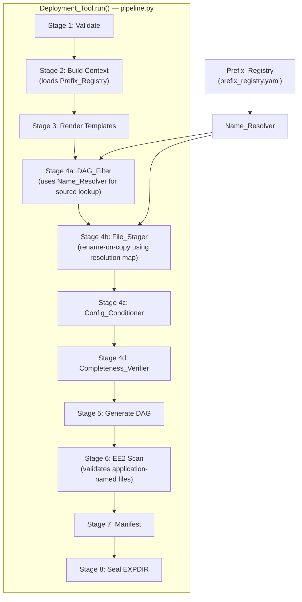
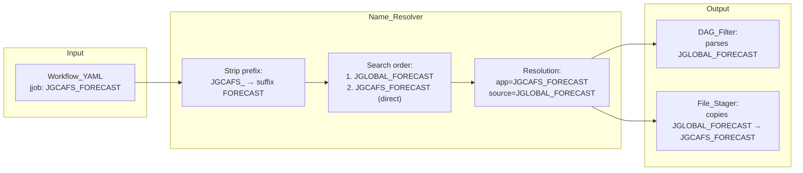
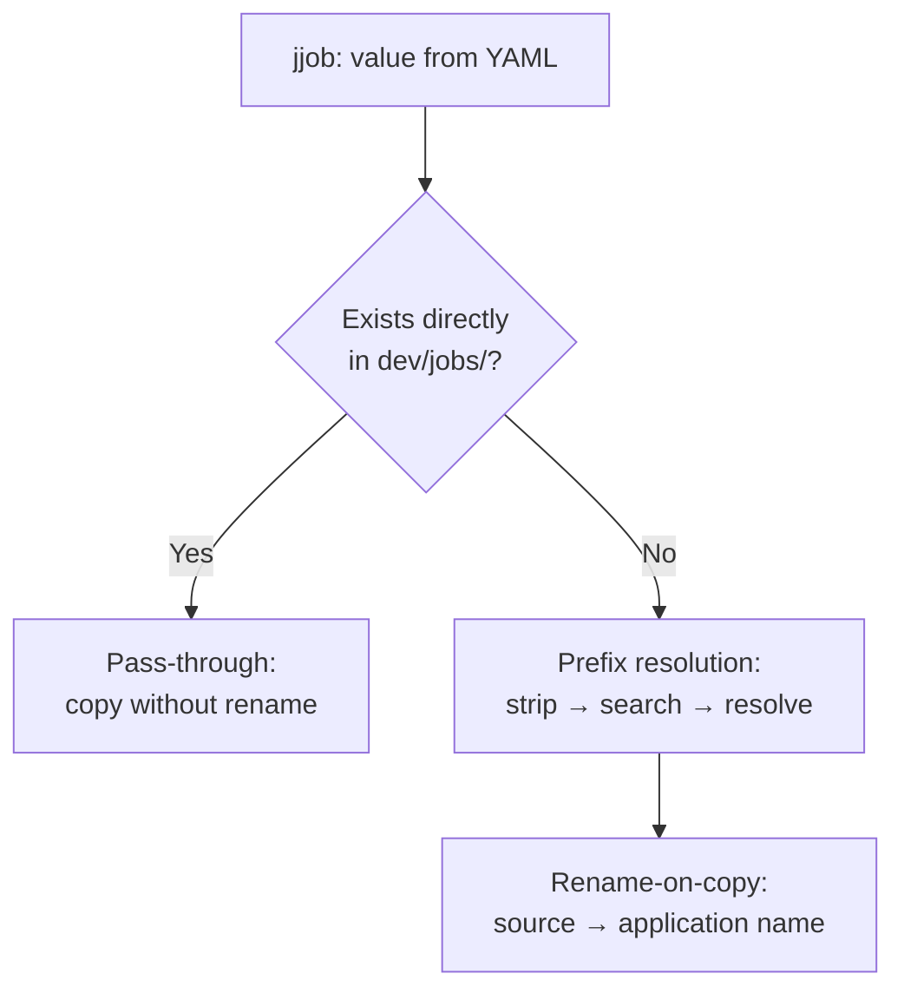

# Design Document

## Overview

This document describes the technical design for introducing **application-specific J-Job naming** into the deployment pipeline. The feature adds a **Name_Resolver** component and **Prefix_Registry** configuration that translate Application_Names (e.g., `JGCAFS_FORECAST`) in the Workflow_YAML back to Shared_Source_Names (e.g., `JGLOBAL_FORECAST`) in `dev/jobs/`, enabling the File_Stager to produce an EXPDIR where every J-Job carries its NCO-required application-specific name.

The design integrates into the existing 8-stage pipeline (`pipeline.py`) between context building (Stage 2) and file staging (Stage 4), modifying the DAG_Filter, File_Stager, and EE2_Scanner to operate with the name resolution layer.

Key design decisions:
- **Single-source-of-truth preserved**: Source J-Jobs in `dev/jobs/` remain shared (`JGLOBAL_*`). Renaming is a deployment-time operation only.
- **Registry-driven resolution**: The mapping is externalized to a YAML config file, making new applications addable without pipeline code changes.
- **Backward compatibility**: Shared names in `jjob:` fields continue to work — direct filesystem matches bypass prefix resolution.
- **Unconditional artifact staging**: `link_workflow.sh` and `link_fixdirs.sh` are staged regardless of DAG filtering.

## Architecture

### Integration into the Existing Pipeline

The Name_Resolver slots into the pipeline as a utility consumed by both the DAG_Filter (Stage 4a) and the File_Stager (Stage 4b). It does not create a new pipeline stage; instead it provides a resolution service used by existing stages.



### Name Resolution Data Flow



### Backward Compatibility Path



## Components and Interfaces

### Component 1: Prefix_Registry

**Traces to:** Requirement 5

**New file:** `dev/workflow/deployment/prefix_registry.yaml`

The Prefix_Registry is a YAML configuration file that maps each Application_Prefix to an ordered list of Shared_Prefixes to search during name resolution.

#### Configuration File Format

```yaml
# Prefix Registry: Application_Prefix → ordered search list of Shared_Prefixes
# The Name_Resolver searches these in order, returning the first match in dev/jobs/.
#
# Format: Each key is an Application_Prefix (including trailing underscore).
# Each value is an ordered list of Shared_Prefixes to try.

registry:
  JGCAFS_:
    - JGLOBAL_
  JGCDAS_:
    - JGLOBAL_
    - JGDAS_
  JGFS_:
    - JGLOBAL_
    - JGFS_
  JGDAS_:
    - JGLOBAL_
    - JGDAS_
  JGEFS_:
    - JGLOBAL_
    - JGEFS_
  JSFS_:
    - JGLOBAL_
    - JSFS_
```

#### Data Structure (Python)

```python
@dataclass(frozen=True)
class PrefixRegistry:
    """Immutable registry of Application_Prefix → Shared_Prefix search lists.

    Loaded from prefix_registry.yaml at pipeline initialization.
    """
    registry: dict[str, list[str]]  # prefix → ordered search prefixes

    @classmethod
    def load(cls, path: Path) -> "PrefixRegistry":
        """Load registry from YAML file."""
        ...

    @classmethod
    def default(cls) -> "PrefixRegistry":
        """Return the built-in default registry (for tests/fallback)."""
        ...

    def get_search_prefixes(self, app_prefix: str) -> list[str] | None:
        """Return the ordered search list for a prefix, or None if unknown."""
        return self.registry.get(app_prefix)

    def known_prefixes(self) -> frozenset[str]:
        """Return all known application prefixes."""
        return frozenset(self.registry.keys())
```

### Component 2: Name_Resolver

**Traces to:** Requirements 2, 4, 7, 8

**New file:** `dev/workflow/deployment/name_resolver.py`

The Name_Resolver takes an Application_Name and resolves it to a Shared_Source_Name by searching `dev/jobs/` following the Prefix_Registry's ordered search list.

#### Interface

```python
@dataclass(frozen=True)
class ResolvedName:
    """Result of resolving an Application_Name to a source file.

    Attributes:
        application_name: The name as it appears in Workflow_YAML (e.g., JGCAFS_FORECAST)
        source_name: The file in dev/jobs/ (e.g., JGLOBAL_FORECAST)
        is_passthrough: True if the name was found directly (no prefix resolution)
    """
    application_name: str
    source_name: str
    is_passthrough: bool


class NameResolver:
    """Resolves Application_Names to Shared_Source_Names in dev/jobs/.

    Args:
        dev_root: Path to the dev/ directory.
        registry: PrefixRegistry instance defining search orders.
    """

    def __init__(self, dev_root: Path, registry: PrefixRegistry) -> None:
        ...

    def resolve(self, application_name: str) -> ResolvedName:
        """Resolve a single Application_Name to its source file.

        Resolution algorithm:
        1. If application_name exists directly in dev/jobs/ → pass-through
        2. Identify the Application_Prefix from the registry
        3. Strip prefix to get suffix
        4. Search Shared_Prefixes in registry order:
           - For each shared_prefix, check if shared_prefix + suffix exists
        5. Fallback: check if application_name itself exists (Direct_Match)
        6. If no match: raise PipelineError (FATAL)

        Returns:
            ResolvedName with application_name, source_name, and passthrough flag.

        Raises:
            PipelineError: If no source file can be found.
        """
        ...

    def resolve_all(self, application_names: set[str]) -> dict[str, ResolvedName]:
        """Resolve a batch of Application_Names.

        Returns a dict mapping application_name → ResolvedName.
        Raises PipelineError on the first unresolvable name (production mode)
        or accumulates all errors (dry-run mode).
        """
        ...

    def resolve_all_dry_run(self, application_names: set[str]) -> DryRunReport:
        """Resolve all names, accumulating errors instead of raising.

        Returns:
            DryRunReport with resolved mappings, errors, and counts.
        """
        ...


@dataclass
class DryRunReport:
    """Report from dry-run name resolution."""
    resolved: dict[str, ResolvedName]
    errors: list[str]
    total_count: int
    resolvable_count: int
    unresolvable_count: int

    def format_table(self) -> str:
        """Format as a human-readable table for CLI output."""
        ...
```

#### Resolution Algorithm Detail

```
resolve(application_name):
    1. DIRECT CHECK: if dev/jobs/{application_name} exists:
         → return ResolvedName(application_name, application_name, is_passthrough=True)

    2. PREFIX IDENTIFICATION: for each known_prefix in registry:
         if application_name starts with known_prefix:
             app_prefix = known_prefix
             suffix = application_name[len("J" + app_prefix_without_J):]
             # e.g., JGCAFS_FORECAST → prefix=JGCAFS_, suffix=FORECAST
             break
       else:
         → FATAL: "Unknown prefix in application name '{application_name}'"

    3. ORDERED SEARCH: for each shared_prefix in registry[app_prefix]:
         candidate = shared_prefix + suffix
         # e.g., JGLOBAL_ + FORECAST = JGLOBAL_FORECAST
         if dev/jobs/{candidate} exists:
             → return ResolvedName(application_name, candidate, is_passthrough=False)

    4. DIRECT FALLBACK: if dev/jobs/{application_name} exists:
         → return ResolvedName(application_name, application_name, is_passthrough=True)

    5. FATAL: "Cannot resolve '{application_name}': searched [{candidates}] in dev/jobs/"
```

### Component 3: Modified DAG_Filter

**Traces to:** Requirement 4

**Modified file:** `dev/workflow/deployment/dag_filter.py`

The DAG_Filter is extended to use the Name_Resolver when extracting J-Jobs from the Workflow_YAML. It collects Application_Names, resolves them to source files, and parses the source files for downstream dependencies.

#### Modified Interface

```python
@dataclass(frozen=True)
class DAGReachabilitySet:
    """Extended to carry both application and source name mappings."""

    jjobs: frozenset[str]                          # Application_Names (for EXPDIR staging)
    jjob_source_map: dict[str, str]                # app_name → source_name
    ex_scripts: frozenset[str]
    ush_scripts: frozenset[str]
    config_files: frozenset[str]
    warnings: tuple[str, ...]
    # ... statistics fields unchanged


class DAGFilter:
    def __init__(
        self,
        dev_root: Path,
        workflow_yaml: dict,
        platform: str,
        name_resolver: NameResolver | None = None,  # NEW parameter
    ) -> None:
        ...

    def extract_jjobs_from_yaml(self) -> set[str]:
        """Layer 1: Extract jjob values (Application_Names) from YAML.

        Returns set of Application_Names. Does NOT validate existence
        in dev/jobs/ directly — that is the Name_Resolver's job.
        """
        ...

    def resolve_jjobs(self, app_names: set[str]) -> dict[str, ResolvedName]:
        """Resolve Application_Names to source files via Name_Resolver.

        If no Name_Resolver is configured, falls back to direct lookup
        (backward compatibility with shared-named workflows).
        """
        ...

    def extract_ex_scripts(self, resolved_sources: set[str]) -> set[str]:
        """Layer 2: Parse resolved source J-Jobs for ex-script references.

        Uses source_names (not application_names) to read the actual files.
        """
        ...
```

#### Integration Flow

1. `extract_jjobs_from_yaml()` → collects Application_Names from YAML
2. `resolve_jjobs(app_names)` → resolves each to source file via Name_Resolver
3. `extract_ex_scripts(source_names)` → parses resolved source files
4. Layers 3 & 4 unchanged (ush scripts, config files from source content)
5. `DAGReachabilitySet.jjobs` contains Application_Names (for staging)
6. `DAGReachabilitySet.jjob_source_map` maps app → source (for reference)

### Component 4: Modified File_Stager

**Traces to:** Requirements 3, 9

**Modified file:** `dev/workflow/deployment/file_stager.py`

The File_Stager gains a `stage_jjobs_with_rename()` method that copies source files to the EXPDIR using application names as destination filenames.

#### New Method

```python
class FileStager:
    ...

    def stage_jjobs_with_rename(
        self,
        resolution_map: dict[str, ResolvedName],
    ) -> StagingResult:
        """Stage J-Jobs with application-specific renaming.

        For each resolved pair:
        - Source: dev/jobs/{source_name}
        - Destination: EXPDIR/jobs/{application_name}

        Deduplication: if the same application_name appears multiple times
        in the YAML (duplicate task references), it is staged exactly once.

        Distinct files: if two application_names resolve to the same source,
        both destination files are produced (with identical content).

        Passthrough names (is_passthrough=True) are copied without rename.

        Args:
            resolution_map: Dict mapping application_name → ResolvedName.

        Returns:
            StagingResult with count of files staged.

        Raises:
            StagingError: If a source file cannot be read/copied.
        """
        ...

    def stage_unconditional_artifacts(self) -> StagingResult:
        """Stage artifacts that are always deployed regardless of DAG filter.

        Stages:
        - sorc/link_workflow.sh → EXPDIR/sorc/link_workflow.sh
        - sorc/ufs_utils.fd/fix/link_fixdirs.sh →
            EXPDIR/sorc/ufs_utils.fd/fix/link_fixdirs.sh

        Preserves executable permission bits (mode 0755).

        Returns:
            StagingResult for the unconditional artifacts.

        Raises:
            StagingError: If source files are missing.
        """
        ...
```

### Component 5: Modified EE2_Scanner

**Traces to:** Requirement 6

**Modified file:** `dev/workflow/deployment/ee2_scanner.py`

The EE2_Scanner requires no structural changes — it already validates files by examining filenames and content in the EXPDIR. Since application-named files conform to JAAAAA_Convention (they start with `J`, are all uppercase, no extension), the existing `_JJOB_PATTERN` regex already accepts them. The scanner validates content structure (shebang, jjob_header sourcing, ex-script invocation) identically regardless of filename.

The only modification is documentation clarity: the scanner's file_naming check already uses `_JJOB_PATTERN = re.compile(r"^J[A-Z][A-Z0-9_]*$")` which matches both `JGLOBAL_FORECAST` and `JGCAFS_FORECAST`.

### Component 6: Dry-Run Resolution Report

**Traces to:** Requirement 7

Integrated into the existing `--dry-run` pipeline path. When `--dry-run` is active, the pipeline calls `resolve_all_dry_run()` instead of `resolve_all()`, which accumulates all errors rather than raising on the first failure. The report is printed as a table:

```
Name Resolution Report:
┌──────────────────────────────┬─────────────────────────────────┬──────────┐
│ Application_Name             │ Shared_Source_Name              │ Status   │
├──────────────────────────────┼─────────────────────────────────┼──────────┤
│ JGCAFS_FORECAST              │ JGLOBAL_FORECAST                │ resolved │
│ JGCDAS_AERO_ANALYSIS_GENB    │ JGDAS_AERO_ANALYSIS_GENERATE_.. │ resolved │
│ JGCAFS_NONEXISTENT           │ —                               │ ERROR    │
└──────────────────────────────┴─────────────────────────────────┴──────────┘
Summary: 12 resolvable, 1 unresolvable (13 total)
```

## Data Models

### Prefix_Registry Schema

```yaml
# prefix_registry.yaml
# JSON Schema:
# type: object
# properties:
#   registry:
#     type: object
#     additionalProperties:
#       type: array
#       items:
#         type: string
#         pattern: "^J[A-Z]+_$"

registry:
  JGCAFS_:
    - JGLOBAL_
  JGCDAS_:
    - JGLOBAL_
    - JGDAS_
  JGFS_:
    - JGLOBAL_
    - JGFS_
  JGDAS_:
    - JGLOBAL_
    - JGDAS_
  JGEFS_:
    - JGLOBAL_
    - JGEFS_
  JSFS_:
    - JGLOBAL_
    - JSFS_
```

### Resolution Map Data Flow

```
Input:  set[str] of Application_Names from Workflow_YAML
Output: dict[str, ResolvedName]

Example:
{
    "JGCAFS_FORECAST":    ResolvedName("JGCAFS_FORECAST", "JGLOBAL_FORECAST", False),
    "JGCAFS_STAGE_IC":    ResolvedName("JGCAFS_STAGE_IC", "JGLOBAL_STAGE_IC", False),
    "JGCDAS_FORECAST":    ResolvedName("JGCDAS_FORECAST", "JGLOBAL_FORECAST", False),
    "JGLOBAL_FORECAST":   ResolvedName("JGLOBAL_FORECAST", "JGLOBAL_FORECAST", True),
    "JGDAS_AERO_ANALYSIS_GENERATE_BMATRIX":
        ResolvedName("JGDAS_AERO_ANALYSIS_GENERATE_BMATRIX",
                     "JGDAS_AERO_ANALYSIS_GENERATE_BMATRIX", True),
}
```

### Extended DAGReachabilitySet

```python
@dataclass(frozen=True)
class DAGReachabilitySet:
    jjobs: frozenset[str]                   # Application_Names for staging
    jjob_source_map: dict[str, str]         # app_name → source_name for tracing
    ex_scripts: frozenset[str]
    ush_scripts: frozenset[str]
    config_files: frozenset[str]
    warnings: tuple[str, ...]
    total_available_jjobs: int = 0
    total_available_ex_scripts: int = 0
    total_available_ush_scripts: int = 0
    total_available_configs: int = 0
```

## Correctness Properties

*A property is a characteristic or behavior that should hold true across all valid executions of a system — essentially, a formal statement about what the system should do. Properties serve as the bridge between human-readable specifications and machine-verifiable correctness guarantees.*

### Property 1: Name Resolution Correctness (Ordered Search, First-Match)

*For any* Application_Name with a prefix registered in the Prefix_Registry, and *for any* filesystem state of `dev/jobs/`, the Name_Resolver SHALL return the first source file found by searching Shared_Prefixes in registry-defined order, and SHALL raise a FATAL error if no source exists at any search position.

**Validates: Requirements 2.1, 2.2, 2.3, 2.4, 2.5, 5.3**

### Property 2: EXPDIR Naming Invariants

*For any* workflow deployment that uses application naming, all files in the EXPDIR `jobs/` directory SHALL have filenames that (a) conform to the `^J[A-Z][A-Z0-9_]*$` pattern and (b) contain no file with the `JGLOBAL_` prefix.

**Validates: Requirements 3.2, 3.3, 6.1**

### Property 3: Content Preservation on Rename

*For any* J-Job staged via rename-on-copy, the byte content of the destination file (EXPDIR/jobs/{application_name}) SHALL be identical to the byte content of the source file (dev/jobs/{source_name}).

**Validates: Requirements 3.1, 6.2**

### Property 4: DAG Filter Resolution Integration

*For any* Workflow_YAML containing Application_Names in `jjob:` fields, the DAG_Filter SHALL (a) collect the Application_Names from the YAML, (b) resolve each to its Shared_Source_Name via the Name_Resolver, (c) parse the source file (not the application-named file) for ex-script and config dependencies, and (d) include both Application_Name and source_name in the reachability set.

**Validates: Requirements 4.1, 4.2, 4.3**

### Property 5: Deduplication and Distinction

*For any* Workflow_YAML, (a) if the same Application_Name appears in multiple tasks, the EXPDIR SHALL contain exactly one file with that name; and (b) if two different Application_Names resolve to the same Shared_Source_Name, the EXPDIR SHALL contain two distinct files (one per Application_Name) with identical content.

**Validates: Requirements 3.4, 3.5**

### Property 6: Backward Compatibility

*For any* Workflow_YAML where a `jjob:` value matches a file directly in `dev/jobs/` (i.e., uses a Shared_Source_Name like `JGLOBAL_FORECAST`), the pipeline SHALL copy that file without renaming. Mixed-mode YAMLs containing both Application_Names and Shared_Source_Names SHALL process both types correctly in the same run.

**Validates: Requirements 8.1, 8.2, 8.3**

### Property 7: Dry-Run Completeness

*For any* Workflow_YAML with N total `jjob:` references (some resolvable, some not), the dry-run report SHALL list all N entries, report all unresolvable names (not halt on the first), and the sum of resolvable_count + unresolvable_count SHALL equal N.

**Validates: Requirements 7.1, 7.2, 7.3**

### Property 8: Unconditional Linking Script Staging

*For any* deployment (with or without `--dag-filter` enabled, and regardless of which Application_Names are in the YAML), the EXPDIR SHALL contain `sorc/link_workflow.sh` and `sorc/ufs_utils.fd/fix/link_fixdirs.sh` with executable permission bits preserved.

**Validates: Requirements 9.1, 9.2, 9.5, 9.6**

## Error Handling

| Condition | Stage | Behavior |
|-----------|-------|----------|
| Unknown Application_Prefix (not in registry) | DAG_Filter | FATAL ERROR: "Unknown prefix in application name '{name}'. Known prefixes: [...]" |
| No source file found after full search | Name_Resolver | FATAL ERROR: "Cannot resolve '{app_name}': searched [{candidates}] in dev/jobs/" |
| Prefix_Registry file missing | Validate (Stage 1) | FATAL ERROR: "Prefix registry not found at {path}" |
| Prefix_Registry invalid YAML | Validate (Stage 1) | FATAL ERROR: "Failed to parse prefix registry: {error}" |
| Source file unreadable during copy | File_Stager | StagingError: "Failed to copy {source} to {dest}: {IOError}" |
| Linking script missing (link_workflow.sh) | File_Stager | StagingError: "Unconditional artifact not found: sorc/link_workflow.sh" |
| Dry-run with unresolvable names | Dry-Run | WARNING per name, summary at end, non-zero exit code |
| Mixed YAML with partial failures | Production mode | FATAL on first unresolvable name (fail-fast) |

All FATAL errors follow the existing `PipelineError(stage, message)` pattern and halt the pipeline before any EXPDIR mutation occurs after the failed check.

## Testing Strategy

### Property-Based Testing (Hypothesis)

The feature is well-suited to property-based testing because:
- The Name_Resolver is a pure function (prefix + filesystem → result)
- Resolution behavior varies meaningfully with input (different prefixes, different filesystem states)
- The invariants (JAAAAA compliance, no JGLOBAL_ in output, content preservation) are universal

**Library:** [Hypothesis](https://hypothesis.readthedocs.io/) (Python) — already in use in this project.

**Configuration:** Each property test runs a minimum of 100 iterations (`@settings(max_examples=100)`).

**Tag format:** Each test is tagged with a comment referencing its design property:
```python
# Feature: application-jjob-naming, Property 1: Name Resolution Correctness
```

**Test file:** `dev/workflow/tests/test_application_naming_properties.py`

### Property Tests (8 properties → 8 test functions)

| Property | Test Function | Generators |
|----------|--------------|------------|
| 1: Resolution Correctness | `test_name_resolution_ordered_search` | Random prefixes, suffixes, filesystem states |
| 2: EXPDIR Naming Invariants | `test_expdir_naming_invariants` | Random workflow YAMLs with application names |
| 3: Content Preservation | `test_content_preservation_on_rename` | Random file content, random name pairs |
| 4: DAG Integration | `test_dag_filter_resolution_integration` | Random YAMLs with J-Job source files |
| 5: Dedup and Distinction | `test_deduplication_and_distinction` | YAMLs with duplicates and shared-source pairs |
| 6: Backward Compatibility | `test_backward_compatibility_passthrough` | Mixed YAMLs with shared and application names |
| 7: Dry-Run Completeness | `test_dry_run_completeness` | YAMLs with mix of resolvable/unresolvable names |
| 8: Unconditional Staging | `test_unconditional_linking_scripts` | Various DAG-filter configurations |

### Unit Tests (Example-Based)

- Verify default Prefix_Registry matches specification (Req 5.2)
- Verify JAAAAA regex accepts/rejects specific known examples
- Verify gcafs.yaml uses correct per-cycle prefixes after migration
- Verify dry-run table output format with known inputs
- Verify permission bits (0755) on staged linking scripts

### Integration Tests

- End-to-end pipeline run with gcafs.yaml producing application-named EXPDIR
- Verify EE2 scan passes on application-named EXPDIR
- Verify backward compatibility with existing gfs.yaml (shared names)
