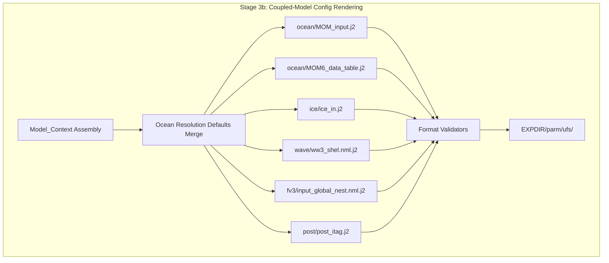

# Design Document: Coupled Model Configs

## Overview

This document describes the technical design for converting coupled-model configuration files — MOM6 ocean namelists, CICE6 sea ice namelists, WW3 wave namelists, FV3 nested grid configs, and UPP inline post-processing itags — from legacy `@[VAR]` atparse templates into Jinja2 templates rendered at deployment time.

The design extends the parent "templated-model-configs" spec's architecture to the remaining UFS coupled components. It replaces three runtime shell scripts (`parsing_namelists_MOM6.sh`, `parsing_namelists_CICE.sh`, `parsing_namelists_WW3.sh`) and four resolution-specific `MOM_input_*.IN` files with parameterized Jinja2 templates driven by the `model.ocean`, `model.ice`, `model.wave`, and `model.post` sections of the Workflow_Configuration YAML.

Key design decisions:

1. **Single MOM_input template** — One `MOM_input.j2` with resolution-dependent conditionals rather than four separate templates. Resolution defaults come from `model.ocean.defaults[resolution]`.
2. **Parsing script elimination** — Forecast ex-scripts use `cpreq` to stage pre-rendered files from `${EXPDIR}/parm/ufs/{ocean,ice,wave}/` to `${DATA}/`.
3. **Submodule exclusion** — Files owned by NEXUS and UPP submodules are copied verbatim by Stage 4, never templated.
4. **New MOM6ParamValidator** — MOM_input uses a format-specific validator (section headers with `!`, `PARAM = VALUE` assignments) distinct from the Fortran NamelistValidator.

Each rendered config lands in `<EXPDIR>/parm/ufs/<component>/` as an immutable artifact.

### Component 2: Template Designs

**Traces to:** Requirements 1, 2, 3, 4, 5, 6, 11

#### 2.1 `ocean/MOM_input.j2` — MOM6 Parameter File

Single template with resolution-conditional blocks. Uses MOM6 format: `PARAM = VALUE` with `!` comments.

```jinja2
{# dev/parm/ufs/ocean/MOM_input.j2 #}
{# Replaces: MOM_input_025.IN, MOM_input_050.IN, MOM_input_100.IN, MOM_input_500.IN #}
{# Traces to: Requirement 1, Requirement 11 AC1, Requirement 12 #}



! === module MOM ===
DT = {{ ocean.dt_ocean }}                        ! Baroclinic dynamics timestep [s]
DT_THERM = {{ ocean.dt_therm }}                  ! Thermodynamic timestep [s]
THICKNESSDIFFUSE = True
THICKNESSDIFFUSE_FIRST = True
USE_REGRIDDING = True
DIABATIC_FIRST = True

! === module MOM_domains ===

NIGLOBAL = 1440
NJGLOBAL = 1080

NIGLOBAL = 720
NJGLOBAL = 576

NIGLOBAL = 360
NJGLOBAL = 320

NIGLOBAL = 72
NJGLOBAL = 35

{{ undefined_resolution_error }}

NIHALO = 4
NJHALO = 4

! === module MOM_verticalGrid ===
NK = {{ ocean.nk | default(75) }}

! === module MOM_grid_init ===
GRID_CONFIG = "mosaic"
GRID_FILE = "ocean_mosaic.nc"
TOPO_CONFIG = "file"
TOPO_FILE = "ocean_topog.nc"
TOPO_EDITS_FILE = "${TOPOEDITS}"
MAXIMUM_DEPTH = 6500.0

! === module MOM_coord_initialization ===
COORD_CONFIG = "file"
COORD_FILE = "{{ ocean.diag_coord_def_z_file }}"

! === module MOM_diag_mediator ===
NUM_DIAG_COORDS = 1
DIAG_COORDS = "z Z ZSTAR"
DIAG_COORD_DEF_Z_FILE = "{{ ocean.diag_coord_def_z_file }}"

! === module MOM_EOS ===
EQN_OF_STATE = "WRIGHT"

! === module MOM_lateral_mixing_coeffs ===

KHTH = 10.0
KHTR = 10.0
SMAG_BI_CONST = 0.06
AH_VEL_SCALE = 0.01

KHTH = 50.0
KHTR = 50.0
SMAG_BI_CONST = 0.06
AH_VEL_SCALE = 0.01

KHTH = 600.0
KHTR = 600.0
SMAG_BI_CONST = 0.15
AH_VEL_SCALE = 0.05

KHTH = 1000.0
KHTR = 1000.0

USE_VARIABLE_MIXING = TrueFalse
SMAGORINSKY_AH = TrueFalse

! === module MOM_set_visc ===
HBBL = 10.0
DRAG_BG_VEL = 0.1
KV = 1.0E-4
KD = {{ ocean.kd | default("0.0") }}
KD_MIN = {{ ocean.kd_min | default("2.0E-6") }}

! === module MOM_surface_forcing ===
MAX_P_SURF = 0.0
CD_TIDES = 0.0018
USE_RIGID_SEA_ICE = True
SEA_ICE_RIGID_MASS = 100.0

USE_WAVES = True
WAVE_METHOD = "SURFACE_BANDS"


RIVER_RUNOFF = True
FRUNOFF = "${CHLCLIM}"


! === module MOM_diabatic_driver ===
USE_LEGACY_DIABATIC_DRIVER = False
ENERGETICS_SFC_PBL = True
USE_KPP = True

! === module MOM_oda_incupd ===

ODA_INCUPD = True
ODA_INCUPD_NHOURS = {{ ocean.oda_incupd_nhours | default(6) }}

ODA_INCUPD = False


! === module ocean_stochastics ===

DO_SPPT = True

DO_SPPT = False

```

## Architecture

### Integration with the 8-Stage Deployment Pipeline



### Rendering Flow

1. **Context Assembly** — Extract `model.ocean`, `model.ice`, `model.wave`, `model.post` from Workflow_Configuration.
2. **Schema Validation** — Validate required keys; missing keys produce FATAL ERROR.
3. **Ocean Resolution Defaults Merge** — `model.ocean.defaults[resolution]` merged; explicit values take precedence.
4. **Template Rendering** — Each `.j2` rendered via Template_Renderer with shell variable preservation.
5. **Format Validation** — Each rendered output validated against its format-specific validator.
6. **Output Placement** — Validated files written to `<EXPDIR>/parm/ufs/<component>/`.

### Forecast Script Integration

```bash
# Replaces: source "${USHglobal}/parsing_namelists_MOM6.sh"; MOM6_namelists
cpreq "${EXPDIR}/parm/ufs/ocean/MOM_input" "${DATA}/INPUT/MOM_input"
cpreq "${EXPDIR}/parm/ufs/ocean/MOM6_data_table" "${DATA}/data_table"
cpreq "${EXPDIR}/parm/ufs/ice/ice_in" "${DATA}/ice_in"
cpreq "${EXPDIR}/parm/ufs/wave/ww3_shel.nml" "${DATA}/ww3_shel.nml"
```

## Components and Interfaces

### Component 1: Ocean Templates (MOM6)

**Traces to:** Requirements 1, 2, 11, 12

`MOM_input.j2` — Single template with resolution conditionals. Uses `model.ocean.defaults[res]` for grid dims, timesteps, mixing params.

`MOM6_data_table.j2` — Data override table referencing `model.ocean.frunoff`.

### Component 2: Ice Template (CICE6)

**Traces to:** Requirements 3, 11

`ice_in.j2` — Fortran namelist. Decomposition (block_size_x/y) calculated at deploy time from `model.ice.nprocs` and `model.ice.decomposition`. Warm start conditional sets `runtype` and `use_restart_time`.

### Component 3: Wave Template (WW3)

**Traces to:** Requirements 4, 11

`ww3_shel.nml.j2` — Fortran namelist. Maps `ice_input`/`current_input` values (`CPL`→`C`, `YES`→`T`) to WW3 forcing flags.

### Component 4: FV3 Nested Grid Template

**Traces to:** Requirements 5, 11

`input_global_nest.nml.j2` — model_configure format. Adds `NEST_IMO`/`NEST_JMO` when `model.fv3.do_nest` is true.

### Component 5: UPP Post Template

**Traces to:** Requirements 6, 11

`post_itag.j2` — Simple text. Selects system-specific parameters based on `model.post.system`.

### Component 6: Format Validators

**Traces to:** Requirement 10

| Template | Validator | Format |
|----------|-----------|--------|
| `ocean/MOM_input` | `MOM6ParamValidator` (NEW) | `! section` headers, `PARAM = VALUE` |
| `ice/ice_in` | `NamelistValidator` (existing) | Fortran `&group` / `/` |
| `wave/ww3_shel.nml` | `NamelistValidator` (existing) | Fortran `&group` / `/` |
| `fv3/input_global_nest.nml` | `ModelConfigureValidator` (existing) | `key: value` |
| `post/post_itag` | None | Simple text |

### Component 7: Shell Variable Preservation

**Traces to:** Requirements 1.8, 3.7, 4.7, 5.5, 8.5

Shell variables preserved through rendering: `${TOPOEDITS}`, `${CHLCLIM}`, `${SYEAR}`, `${SMONTH}`, `${SDAY}`, `${FHMAX}`, `${FHMAX_WAV}`, `${PDY}`, `${cyc}`.

### Component 8: Submodule File Handling

**Traces to:** Requirement 13

NEXUS configs (`sorc/nexus.fd/config/`) and UPP parm files (`sorc/upp.fd/parm/`) copied verbatim by Stage 4 via `cp -rp`. Never templated.

#### 2.2 `ocean/MOM6_data_table.j2` — MOM6 Data Override Table

```jinja2
{# dev/parm/ufs/ocean/MOM6_data_table.j2 #}
{# Replaces: MOM6_data_table.IN #}
{# Traces to: Requirement 2 #}

"ATM", "p_surf", "psl", "./INPUT/gfs_ctrl.nc", "bilinear", "none"
"ATM", "p_bot",  "psl", "./INPUT/gfs_ctrl.nc", "bilinear", "none"

"OCN", "runoff", "runoff", "{{ ocean.frunoff }}", "bilinear", "none"

```

#### 2.3 `ice/ice_in.j2` — CICE6 Sea Ice Namelist

Fortran namelist format with all CICE6 namelist groups (&setup_nml, &grid_nml, &domain_nml, &tracer_nml, &thermo_nml, &dynamics_nml, &shortwave_nml, &ponds_nml, &snow_nml, &forcing_nml, &icefields_nml).

```jinja2
{# dev/parm/ufs/ice/ice_in.j2 #}
{# Replaces: ice_in.IN + ush/parsing_namelists_CICE.sh #}
{# Traces to: Requirement 3, Requirement 11 AC2 #}


&setup_nml
  days_per_year  = 365
  use_leap_years = .true.
  year_init      = ${SYEAR}
  month_init     = ${SMONTH}
  day_init       = ${SDAY}
  sec_init       = 0
  dt             = {{ ice.dt_ice }}
  npt            = ${FHMAX}
  ndtd           = 1
  runtype        = 'continueinitial'
  ice_ic         = './cice_model.resdefault'
  restart        = .true.
  use_restart_time = {{ ice.warm_start | fortran_logical }}
  restart_format = 'nc'
  restart_dir    = './RESTART/'
  restart_file   = 'iced'
  pointer_file   = './ice.restart_file'
  dumpfreq       = '{{ ice.dumpfreq | default("d") }}'
  dumpfreq_n     = {{ ice.dumpfreq_n | default(1) }}
  dump_last      = .false.
  diagfreq       = {{ ice.diagfreq | default(24) }}
  diag_type      = 'file'
  diag_file      = 'ice_diag.d'
  print_global   = .true.
  print_points   = .true.
  histfreq       = '{{ ice.histfreq | default("d") }}','x','x','x','x'
  histfreq_n     = {{ ice.histfreq_n }},0,0,0,0
  hist_avg       = {{ ice.hist_avg | fortran_logical }}
  history_dir    = './history/'
  history_file   = 'iceh'
  write_ic       = .true.
/

&grid_nml
  grid_format  = 'nc'
  grid_type    = 'tripole'
  grid_file    = '{{ ice.grid }}'
  kmt_file     = '{{ ice.mask }}'
  kcatbound    = 0
/

&domain_nml
  nprocs            = {{ ice.nprocs }}
  processor_shape   = '{{ ice.decomposition }}'
  block_size_x      = {{ ice.block_size_x | default(0) }}
  block_size_y      = {{ ice.block_size_y | default(0) }}
  max_blocks        = -1
  nx_global         = {{ ice.nx_glb }}
  ny_global         = {{ ice.ny_glb }}
  distribution_type = 'spacecurve'
  distribution_wght = 'latitude'
  ew_boundary_type  = 'cyclic'
  ns_boundary_type  = 'tripole'
/

&tracer_nml
  tr_iage      = .true.
  restart_age  = .false.
  tr_FY        = .true.
  restart_FY   = .false.
  tr_lvl       = .true.
  restart_lvl  = .false.
  tr_pond_lvl  = {{ ice.tr_pond_lvl | fortran_logical }}
  restart_pond_lvl = .false.
  tr_aero      = .false.
  restart_aero = .false.
/

&thermo_nml
  kitd    = 1
  ktherm  = {{ ice.ktherm }}
  conduct = 'MU71'
/

&dynamics_nml
  kdyn      = 1
  ndte      = 120
  revised_evp = .false.
  advection = 'remap'
/

&shortwave_nml
  shortwave   = 'dEdd'
  albedo_type = 'default'
  ahmax       = 0.3
  R_ice       = 0.0
  R_pnd       = 0.0
  R_snw       = 1.5
/

&ponds_nml
  hp1       = 0.01
  hs0       = 0.0
  hs1       = 0.03
  dpscale   = 1.0e-3
  frzpnd    = 'hlid'
  rfracmin  = 0.15
  rfracmax  = 1.0
  pndaspect = 0.8
/

&snow_nml
  snwredist = 'none'
/

&forcing_nml
  formdrag     = .false.
  atmbndy      = 'default'
  fyear_init   = ${SYEAR}
  ycycle       = 1
  calc_strair  = .true.
  calc_Tsfc    = .true.
  precip_units = 'mks'
  ustar_min    = 0.0005
  tfrz_option  = 'mushy'
/

&icefields_nml
  f_tmask    = .true.
  f_blkmask  = .true.
  f_tarea    = .true.
  f_uarea    = .true.
  f_ANGLE    = .true.
  f_ANGLET   = .true.
  f_NCAT     = .true.
  f_aice     = 'd'
  f_hi       = 'd'
  f_hs       = 'd'
  f_Tsfc     = 'd'
  f_sice     = 'd'
  f_uvel     = 'd'
  f_vvel     = 'd'
  f_fswdn    = 'd'
  f_flwdn    = 'd'
  f_sst      = 'd'
  f_sss      = 'd'
  f_strength = 'd'
  f_divu     = 'd'
  f_shear    = 'd'
  f_iage     = 'd'
  f_FY       = 'd'
/
```

## Data Models

### Model_Context Schema Extension for Coupled Components

```yaml
model:
  # ─── model.ocean ─────────────────────────────────────────────────
  ocean:
    resolution: "025"                   # Required: 025|050|100|500
    dt_ocean: 900                       # Required: positive int (seconds)
    dt_therm: 3600                      # Required: positive int (seconds)
    nx_glb: 1440                        # Required (or from defaults)
    ny_glb: 1080                        # Required (or from defaults)
    nk: 75                              # Optional: vertical levels (default: 75)
    use_waves: false                    # Required: bool
    oda_incupd: false                   # Required: bool
    oda_incupd_nhours: 6                # Optional: int (default: 6)
    do_sppt: false                      # Required: bool
    river_runoff: true                  # Required: bool
    diag_coord_def_z_file: "oceanda_zgrid_75L.nc"  # Required: string
    frunoff: "INPUT/runoff.daitren.clim.nc"        # Required: string
    kd: "0.0"                           # Optional: background diffusivity
    kd_min: "2.0E-6"                    # Optional: minimum diffusivity
    tasks: 120                          # Required: positive int (PET count)
    omp_threads: 1                      # Optional: int (default: 1)

    defaults:                           # Resolution-dependent defaults
      "025":
        nx_glb: 1440
        ny_glb: 1080
        dt_ocean: 900
        dt_therm: 3600
        KHTH: 10.0
        KHTR: 10.0
        SMAG_BI_CONST: 0.06
      "050":
        nx_glb: 720
        ny_glb: 576
        dt_ocean: 1800
        dt_therm: 3600
        KHTH: 50.0
        KHTR: 50.0
        SMAG_BI_CONST: 0.06
      "100":
        nx_glb: 360
        ny_glb: 320
        dt_ocean: 3600
        dt_therm: 7200
        KHTH: 600.0
        KHTR: 600.0
        SMAG_BI_CONST: 0.15
      "500":
        nx_glb: 72
        ny_glb: 35
        dt_ocean: 7200
        dt_therm: 14400
        KHTH: 1000.0
        KHTR: 1000.0

  # ─── model.ice ──────────────────────────────────────────────────
  ice:
    nprocs: 48                          # Required: positive int
    decomposition: "slenderX2"          # Required: string
    dt_ice: 900                         # Required: positive int (seconds)
    grid: "grid_cice_NEMS_mx025.nc"     # Required: string
    mask: "kmtu_cice_NEMS_mx025.nc"     # Required: string
    nx_glb: 1440                        # Required: positive int
    ny_glb: 1080                        # Required: positive int
    warm_start: true                    # Required: bool
    histfreq_n: 1                       # Required: positive int
    hist_avg: true                      # Required: bool
    dumpfreq: "d"                       # Required: string (d|h|m|y)
    dumpfreq_n: 1                       # Required: positive int
    ktherm: 2                           # Required: int (0|1|2)
    tr_pond_lvl: true                   # Required: bool
    block_size_x: 0                     # Optional: int (0 = auto)
    block_size_y: 0                     # Optional: int (0 = auto)
    diagfreq: 24                        # Optional: int
    omp_threads: 1                      # Optional: int

  # ─── model.wave ─────────────────────────────────────────────────
  wave:
    ice_input: "CPL"                    # Required: YES|CPL
    current_input: "CPL"                # Required: YES|CPL
    output_params: "HS FP DP PHS PTP PDIR CHA"  # Required: string
    dt_field_output: 10800              # Required: positive int (seconds)
    dt_point_output: 3600               # Required: positive int (seconds)
    dt_restart: 21600                   # Optional: positive int (seconds)
    grid_output_dir: "./"               # Required: string
    point_output_dir: "./"              # Required: string
    restart_output_dir: "./RESTART/"    # Required: string
    tasks: 100                          # Optional: positive int
    omp_threads: 1                      # Optional: int

  # ─── model.post ─────────────────────────────────────────────────
  post:
    system: "gfs"                       # Required: gfs|gcafs|gefs|sfs
```

### Ocean Resolution Default Merge Logic

```python
def merge_ocean_resolution_defaults(model_context: dict) -> dict:
    """Merge ocean resolution-dependent defaults into model.ocean.

    Explicit model.ocean values always override defaults.
    """
    ocean = model_context.get('ocean', {})
    resolution = ocean.get('resolution')

    if resolution not in ('025', '050', '100', '500'):
        raise FatalDeploymentError(
            f"Unsupported ocean resolution '{resolution}'. "
            f"Supported: 025, 050, 100, 500"
        )

    defaults = ocean.get('defaults', {}).get(resolution, {})
    for key, value in defaults.items():
        if key not in ocean:
            ocean[key] = value

    model_context['ocean'] = ocean
    return model_context
```

### Schema Validation

```python
REQUIRED_KEYS = {
    'ocean': ['resolution', 'dt_ocean', 'dt_therm', 'use_waves',
              'oda_incupd', 'do_sppt', 'river_runoff',
              'diag_coord_def_z_file', 'frunoff', 'tasks'],
    'ice': ['nprocs', 'decomposition', 'dt_ice', 'grid', 'mask',
            'nx_glb', 'ny_glb', 'warm_start', 'histfreq_n',
            'hist_avg', 'dumpfreq', 'dumpfreq_n', 'ktherm', 'tr_pond_lvl'],
    'wave': ['ice_input', 'current_input', 'output_params',
             'dt_field_output', 'dt_point_output',
             'grid_output_dir', 'point_output_dir', 'restart_output_dir'],
    'post': ['system'],
}

def validate_coupled_model_context(model_context: dict) -> list[str]:
    """Validate required keys for coupled-model sections."""
    errors = []
    for section, keys in REQUIRED_KEYS.items():
        section_data = model_context.get(section)
        if section_data is None:
            errors.append(f"Missing required section 'model.{section}'")
            continue
        for key in keys:
            if key not in section_data:
                errors.append(f"Missing required key 'model.{section}.{key}'")
    return errors
```

## Correctness Properties

*A property is a characteristic or behavior that should hold true across all valid executions of a system — essentially, a formal statement about what the system should do. Properties serve as the bridge between human-readable specifications and machine-verifiable correctness guarantees.*

### Property 1: Template Equivalence (Coupled-Model Configs)

*For any* supported ocean resolution and valid Model_Context variable values, rendering the Jinja2 template (`MOM_input.j2`, `MOM6_data_table.j2`, `ice_in.j2`, `ww3_shel.nml.j2`, `input_global_nest.nml.j2`) SHALL produce output functionally equivalent to what `atparse` would produce from the corresponding legacy `.IN` file given the same variable values.

**Validates: Requirements 1.2, 1.3, 1.4, 1.5, 2.3, 5.3, 11.5**

### Property 2: Format Validity (All Rendered Configs)

*For any* valid Model_Context (any supported ocean resolution × ice decomposition × wave coupling mode × post system), every rendered coupled-model config file SHALL pass its format-specific validator without errors:
- `MOM_input` passes MOM6ParameterValidator
- `ice_in` passes NamelistValidator
- `ww3_shel.nml` passes NamelistValidator
- `input_global_nest.nml` passes NamelistValidator

**Validates: Requirements 3.5, 4.5, 10.1, 10.2, 10.3, 10.4**

### Property 3: Shell Variable Preservation

*For any* rendered coupled-model config file, all `${VAR}` shell variable patterns (matching `\$\{[A-Z_][A-Z0-9_]*\}`) present in the source template SHALL appear verbatim in the rendered output, unmodified by Jinja2 resolution.

**Validates: Requirements 1.8, 2.4, 3.7, 4.7, 5.5, 8.5**

### Property 4: No Legacy atparse Tokens

*For any* valid Model_Context, no rendered coupled-model config file SHALL contain the legacy `@[...]` atparse substitution pattern.

**Validates: Requirements 11.1, 11.2, 11.3, 11.4**

### Property 5: Schema Validation (Missing Keys Cause FATAL ERROR)

*For any* required key in the coupled-model Model_Context schema, removing that key from the context SHALL cause the Template_Renderer to emit a FATAL ERROR identifying the missing key. Additionally, *for any* unsupported `ocean.resolution` value (not in `{025, 050, 100, 500}`), the renderer SHALL emit a FATAL ERROR.

**Validates: Requirements 1.6, 7.1, 7.2, 7.3, 7.4, 7.5**

### Property 6: Ocean Resolution Default Override

*For any* key present in both `model.ocean` (explicit) and `model.ocean.defaults[resolution]`, the merged context SHALL contain the explicit `model.ocean` value. Conversely, *for any* key present only in defaults, the merged context SHALL contain the default value.

**Validates: Requirements 12.1, 12.2, 12.3**

### Property 7: Warm Start Conditional Rendering

*For any* valid ice Model_Context where `model.ice.warm_start` is true, the rendered `ice_in` SHALL contain `runtype = 'continue'` and `use_restart_time = .true.`. When false, it SHALL contain `runtype = 'initial'` and `use_restart_time = .false.`.

**Validates: Requirements 3.3, 3.4**

### Property 8: WW3 Forcing Mode Mapping

*For any* valid wave Model_Context, the rendered `ww3_shel.nml` SHALL map forcing input modes correctly:
- `wave.ice_input == "CPL"` → `FORCING%ICE_CONC = 'C'`
- `wave.ice_input == "YES"` → `FORCING%ICE_CONC = 'T'`
- `wave.current_input == "CPL"` → `FORCING%CURRENTS = 'C'`
- `wave.current_input == "YES"` → `FORCING%CURRENTS = 'T'`

**Validates: Requirements 4.2, 4.3, 4.4**

### Property 9: Submodule Copy Integrity

*For any* file designated as submodule-owned in the copy manifest, the file copied into EXPDIR SHALL be byte-identical to the source file in `sorc/`. No Jinja2 rendering SHALL be attempted on these files.

**Validates: Requirements 13.3, 13.4, 13.5**

### Property 10: No Symlinks in EXPDIR

*For any* valid deployment, the EXPDIR SHALL NOT contain symlinks to `sorc/ufs_model.fd/tests/parm/` for any coupled-model configuration file. All config files SHALL be regular files.

**Validates: Requirements 14.1, 14.2**

### Property 11: Output Placement and Manifest Completeness

*For any* valid deployment, all rendered coupled-model config files SHALL appear at their specified EXPDIR paths and SHALL be included in the EXPDIR manifest with SHA-256 hashes matching the on-disk file content.

**Validates: Requirements 9.1, 9.2, 9.3, 9.4, 9.5, 9.6, 9.8**

## Error Handling

### Deployment-Time Errors

| Condition | Response |
|-----------|----------|
| Missing required `model.ocean` key | FATAL ERROR: "Missing required key 'model.ocean.dt_ocean'" |
| Missing required `model.ice` key | FATAL ERROR: "Missing required key 'model.ice.nprocs'" |
| Missing required `model.wave` key | FATAL ERROR: "Missing required key 'model.wave.ice_input'" |
| Unsupported `ocean.resolution` | FATAL ERROR: "Unsupported ocean resolution 'xyz'. Supported: 025, 050, 100, 500" |
| Unsupported `wave.ice_input` | FATAL ERROR: "Invalid wave.ice_input 'xyz'. Must be: YES, CPL" |
| Unsupported `post.system` | FATAL ERROR: "Invalid post.system 'xyz'. Must be: gfs, gcafs, gefs, sfs" |
| MOM6 format validation failure | FATAL ERROR: "MOM6 parameter format error at MOM_input:42" |
| Namelist format validation failure | FATAL ERROR: "Namelist validation failed for ice_in:15" |
| Undefined template variable | FATAL ERROR: "Undefined variable 'model.ocean.dt_ocean' in MOM_input.j2:12" |
| Submodule source not found | FATAL ERROR: "Submodule file 'sorc/nexus.fd/config/...' not found" |

### Runtime Errors (Eliminated by Design)

Since all coupled-model config files are rendered at deployment time:
- `atparse` variable not set → caught at deploy time by strict undefined
- `parsing_namelists_MOM6.sh` failure → eliminated (no runtime generation)
- `parsing_namelists_CICE.sh` failure → eliminated (no runtime generation)
- `parsing_namelists_WW3.sh` failure → eliminated (no runtime generation)
- Symlink to missing `sorc/` file → eliminated (regular files in EXPDIR)

## Testing Strategy

### Unit Tests

- **MOM6ParameterValidator**: Known-good and known-bad MOM6 parameter file inputs
- **Schema validation**: Required keys, type checking, enum constraints for ocean/ice/wave/post
- **Ocean resolution defaults merge**: Explicit values override defaults for all 4 resolutions
- **Warm start conditional**: ice_in runtype/use_restart_time mapping
- **WW3 forcing mode mapping**: ice_input/current_input → flag character mapping
- **Submodule copy manifest**: File copy integrity and path mapping
- **atparse conversion**: `@[VAR]` → `{{ var }}` mapping for coupled-model templates

### Integration Tests

- **Full rendering pipeline**: Render all templates for each ocean resolution (025, 050, 100, 500)
- **Legacy equivalence**: Compare rendered output against legacy `.IN` files
- **Stage 4 copy**: Verify NEXUS/UPP files copied verbatim into EXPDIR
- **No symlinks**: Verify EXPDIR contains only regular files after deployment
- **Ex-script compatibility**: Verify forecast ex-script reads from correct paths

### Property-Based Tests

Property-based testing is appropriate for this feature because:
- Template rendering is a pure function (context → rendered string)
- The input space is large (4 ocean resolutions × ice configs × wave modes × post systems)
- Universal properties hold across all valid inputs (format validity, shell var preservation)
- Cost is low (in-memory rendering, no external services)

**Library:** Python `hypothesis` (already present in `.hypothesis/` directory)

**Configuration:** Minimum 100 iterations per property test.

**Tag format:** `Feature: coupled-model-configs, Property {N}: {property_text}`

## File Structure (New/Modified)

```
dev/
├── parm/
│   └── ufs/
│       ├── ocean/
│       │   ├── MOM_input.j2               # NEW: Replaces 4 MOM_input_*.IN
│       │   └── MOM6_data_table.j2          # NEW: Replaces MOM6_data_table.IN
│       ├── ice/
│       │   └── ice_in.j2                   # NEW: Replaces ice_in.IN
│       ├── wave/
│       │   └── ww3_shel.nml.j2             # NEW: Replaces ww3_shel.nml.IN
│       ├── post/
│       │   └── post_itag.j2                # NEW: Replaces post_itag_gfs/gcafs
│       └── fv3/
│           └── input_global_nest.nml.j2    # NEW: Replaces input_global_nest.nml.IN
├── workflow/
│   └── deployment/
│       └── validators/
│           └── mom6_parameter.py           # NEW: MOM6 parameter file validator
└── test/
    └── test_coupled_model_configs/
        ├── test_mom_input.py               # NEW
        ├── test_ice_in.py                  # NEW
        ├── test_ww3_shel.py                # NEW
        ├── test_mom6_validator.py          # NEW
        ├── test_schema_validation.py       # NEW
        ├── test_submodule_copy.py          # NEW
        └── test_properties.py             # NEW: Property-based tests
```

### Files Deleted (after validation)

| Path | Reason |
|------|--------|
| `parm/ufs/MOM_input_025.IN` | Replaced by `ocean/MOM_input.j2` |
| `parm/ufs/MOM_input_050.IN` | Replaced by `ocean/MOM_input.j2` |
| `parm/ufs/MOM_input_100.IN` | Replaced by `ocean/MOM_input.j2` |
| `parm/ufs/MOM_input_500.IN` | Replaced by `ocean/MOM_input.j2` |
| `parm/ufs/MOM6_data_table.IN` | Replaced by `ocean/MOM6_data_table.j2` |
| `parm/ufs/ice_in.IN` | Replaced by `ice/ice_in.j2` |
| `parm/ufs/ww3_shel.nml.IN` | Replaced by `wave/ww3_shel.nml.j2` |
| `parm/ufs/input_global_nest.nml.IN` | Replaced by `fv3/input_global_nest.nml.j2` |
| `parm/ufs/post_itag_gfs` | Replaced by `post/post_itag.j2` |
| `parm/ufs/post_itag_gcafs` | Replaced by `post/post_itag.j2` |

### Files Modified

| File | Change |
|------|--------|
| `sorc/link_workflow.sh` | Remove coupled-model `.IN` files from `ufs_templates` array |
| `scripts/exglobal_forecast.sh` | Remove runtime config generation; read pre-rendered files |
| `dev/workflow/deployment/model_config_renderer.py` | Extend template discovery to `ocean/`, `ice/`, `wave/`, `post/` |
| `dev/workflow/deployment/validators/__init__.py` | Register `MOM6ParameterValidator` |
