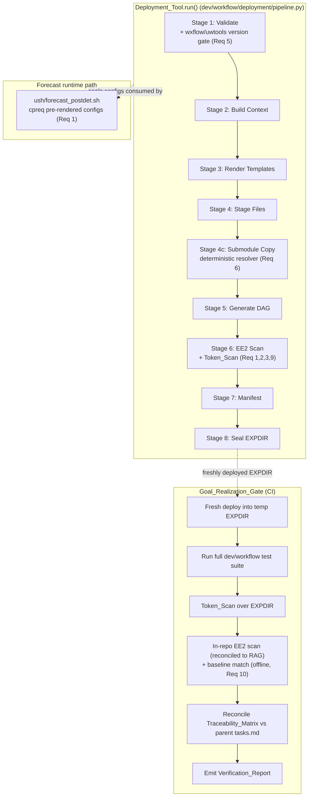

# Design Document

## Overview

This design closes the gap between the parent **immutable-dag-workflow-modernization** spec's "65 tasks complete" status and the goal being *provably realized*. It is a completion-and-verification design: most of the deployment machinery already exists under `dev/workflow/deployment/`, with a ~575-test suite under `dev/workflow/tests/`. The work here is to (a) remediate the specific places where the implementation diverges from the parent requirements, and (b) add a single authoritative gate that proves all 14 parent correctness Properties against a freshly deployed EXPDIR.

Grounded evidence (gathered by reading the repository and running the test suite) drives the design:

- **Runtime atparse still live.** `ush/forecast_postdet.sh` still `source`s `parsing_namelists_{WW3,MOM6,CICE,GOCART}.sh` (lines ~590, ~755, ~905, ~974) even though deploy-time Jinja2 templates already exist under `dev/parm/ufs/{wave,ocean,ice,gocart}/`. Legacy `@[...]` files remain on disk (`parm/ufs/fv3/diag_table`, `parm/ufs/gocart/AERO_HISTORY.rc`).
- **Rocoto decommission incomplete.** `dev/workflow/setup_workflow.py` retains 7 case-insensitive `rocoto` occurrences. A `RocotoDecommissionedError` guard is present (and should stay), but Req 14.3 requires the subparser and conditioned branches gone.
- **Version pinning not enforced.** `validation.check_pinned_versions()` exists but `_stage_validate()` never calls it, and `wxflow` is not importable in the environment, so `tests/test_configuration.py` and `tests/test_hosts.py` fail at collection.
- **Pipeline FATALs on missing submodules.** `_stage_submodule_copy()` raises `PipelineError` when `sorc/nexus.fd/config/gocart/` or `sorc/upp.fd/parm/` are absent, blocking clean-deploy fixtures and the determinism/self-containment/platform-isolation property tests.
- **Test suite reality:** 6 failed, 25 errors, 2 import errors, 569 passed, 2 skipped.

The design reuses parent components (`Deployment_Tool`, `Template_Renderer`, `DAG_Generator`, EE2 scanner, manifest, seal) and adds narrowly-scoped new components: a **Token_Scan**, an **Atparse_Exemption_Registry**, a **Submodule_Fixture / source resolver**, the **RAG_EE2_Compliance_Scan** adapter (authoritative EE2 checking via the agentcore MCP RAG server), and the **Goal_Realization_Gate** with its **Traceability_Matrix** and **Verification_Report**.

**Tooling note — agentcore MCP RAG.** The agentcore RAG index is built from the *legacy* global-workflow tree, so its dependency graph (callers/callees, import edges) is treated as historical reference only and every current-state claim in this design was re-verified against the live filesystem. The RAG server's **EE2 compliance tooling** (`scan_repository_compliance`, `analyze_ee2_compliance`, `extract_code_for_analysis`, `search_ee2_standards`, `generate_compliance_report`) is backed by the official NCEP WCOSS EE2 v11 standards with Phase 2 SME-corrected patterns and is version-independent — it analyzes file *content*. It was empirically validated against the proposed `forecast_postdet.sh` `cpreq` block (scanned clean, 0 issues) and is adopted as the authoritative EE2 judge (Requirement 10). **Critical constraint:** the RAG server is reachable **only in this development environment**, never in CI. EE2 authority is therefore captured at development time as committed **EE2_Baseline_Recordings** and used to reconcile the in-repo `ee2_scanner.py`; the CI gate enforces EE2 **offline** against the reconciled scanner plus those recordings, with no live RAG call.

## Architecture

### Where the changes land in the 8-stage pipeline



### Design principles

1. **Reuse, don't rebuild.** Every remediation targets an existing function. New code is additive (Token_Scan, gate, fixture) or a small wiring change (calling `check_pinned_versions` from validate; making submodule copy resolvable).
2. **Verification is the product.** The deliverable that proves "done" is the Goal_Realization_Gate producing a green Verification_Report with all 14 Properties passing and zero suite failures/errors/collection-errors.
3. **No silent exceptions.** Any remaining runtime templating must be either eliminated or recorded in a version-controlled registry that the scans read.
4. **EE2 fidelity.** Runtime config staging uses `cpreq` (essential-file copy that FATALs on failure) per EE2 standards, matching the pattern already used in `dev/scripts/exglobal_forecast.sh`.

## Components and Interfaces

### Component 1: Forecast Runtime Config Staging (Req 1)

**File modified:** `ush/forecast_postdet.sh`

The four `source "${USHgfs}/parsing_namelists_*.sh"` calls plus their `*_namelists` function invocations are replaced with `cpreq` from the sealed EXPDIR, mirroring the already-modernized FV3 block (lines ~380-414) and the `dev/scripts/exglobal_forecast.sh` ocean/ice/wave block (lines ~159-168).

| Component | Current (runtime atparse) | New (deploy-time, sealed) |
|-----------|---------------------------|---------------------------|
| WW3 (line ~590) | `source parsing_namelists_WW3.sh; WW3_namelists` | `cpreq "${EXPDIR}/parm/ufs/wave/ww3_shel.nml" "${DATA}/ww3_shel.nml"` |
| MOM6 (line ~755) | `source parsing_namelists_MOM6.sh; MOM6_namelists` | `cpreq "${EXPDIR}/parm/ufs/ocean/MOM_input" "${DATA}/INPUT/MOM_input"`<br/>`cpreq "${EXPDIR}/parm/ufs/ocean/MOM6_data_table" "${DATA}/data_table"` |
| CICE (line ~905) | `source parsing_namelists_CICE.sh; CICE_namelists` | `cpreq "${EXPDIR}/parm/ufs/ice/ice_in" "${DATA}/ice_in"` |
| GOCART (line ~974) | `source parsing_namelists_GOCART.sh; GOCART_namelists` | `cpreq` loop over `"${EXPDIR}/parm/ufs/gocart"/*.rc` and `ExtData` into `${DATA}/` |

**EE2 note (RAG-confirmed):** `cpreq` is the correct utility for essential input files — per the EE2 v11 standards (confirmed via the RAG `search_ee2_standards` tool), it prints a FATAL ERROR and aborts on copy failure, so no extra error handling is required. The EE2 standards also require that scripts depending on input data **check for that data's existence before running and report an informative fatal error if missing**. A pre-flight existence check is therefore added before each block so a missing pre-rendered file fails with a descriptive `FATAL ERROR:` message rather than a bare `cpreq` abort:

```bash
# WW3 configuration — pre-rendered at deployment time (replaces parsing_namelists_WW3.sh)
if [[ ! -f "${EXPDIR}/parm/ufs/wave/ww3_shel.nml" ]]; then
    echo "FATAL ERROR: Pre-rendered ww3_shel.nml not found at ${EXPDIR}/parm/ufs/wave/ww3_shel.nml"
    exit 1
fi
cpreq "${EXPDIR}/parm/ufs/wave/ww3_shel.nml" "${DATA}/ww3_shel.nml"
```

Per the Phase 2 SME correction (Req 10.6), this block must **not** add `set -eu`/`set -e` to satisfy error handling — the `cpreq` + pre-flight-check + descriptive FATAL ERROR pattern is the EE2-compliant approach, and the RAG_EE2_Compliance_Scan validated exactly this block as clean across all five categories.

**Risk:** RAG `get_change_impact` rates this LOW (0.10). The only consumers are `scripts/exglobal_forecast.sh` and `dev/scripts/exglobal_forecast.sh`, both already on the cpreq model for the other components.

### Component 2: Obsolete Script & Legacy File Removal (Req 2)

**Files deleted (guarded by reference check):**

| Path | Replaced by | Deletion guard |
|------|-------------|----------------|
| `ush/parsing_namelists_WW3.sh` | `dev/parm/ufs/wave/ww3_shel.nml.j2` | no remaining `source` |
| `ush/parsing_namelists_MOM6.sh` | `dev/parm/ufs/ocean/MOM_input.j2`, `MOM6_data_table.j2` | no remaining `source` |
| `ush/parsing_namelists_CICE.sh` | `dev/parm/ufs/ice/ice_in.j2` | no remaining `source` |
| `ush/parsing_namelists_GOCART.sh` | `dev/parm/ufs/gocart/*.rc.j2` | no remaining `source` |
| `ush/parsing_namelists_FV3.sh`, `parsing_namelists_FV3_nest.sh`, `parsing_model_configure_FV3.sh`, `parsing_ufs_configure.sh` | FV3 templates (already rendered) | no remaining `source` |
| `ush/atparse.bash` | n/a (engine retired) | no remaining `source` outside exemptions |
| `parm/ufs/fv3/diag_table` | `dev/parm/ufs/fv3/diag_table.j2` | no remaining reference |
| `parm/ufs/gocart/AERO_HISTORY.rc` | `dev/parm/ufs/gocart/AERO_HISTORY.rc.j2` | no remaining reference |

**Deletion-guard algorithm** (Req 2.5): before deleting file `F`, grep the repository (excluding `.git`, `__pycache__`, the file itself, and the Atparse_Exemption_Registry) for references to `basename(F)`. If any retained script references it, the file is **retained** and a verification error names the referencing script. This makes deletions safe and order-independent: `atparse.bash` is only deletable after all `parsing_*.sh` and exempted consumers stop sourcing it.

### Component 3: Token_Scan and Atparse_Exemption_Registry (Req 1, 2, 3, 9)

**New file:** `dev/workflow/deployment/token_scan.py`
**New file:** `dev/parm/atparse_exemptions.yaml` (the registry)

```python
# dev/workflow/deployment/token_scan.py
ATPARSE_PATTERN = re.compile(r"@\[[A-Za-z_][A-Za-z0-9_]*\]")
JINJA_PATTERNS = (re.compile(r"\{\{"), re.compile(r"\{%"), re.compile(r"\{#"))

@dataclass
class TokenScanResult:
    atparse_violations: list[tuple[str, int, str]]   # (path, lineno, token)
    jinja_violations: list[tuple[str, int, str]]
    stale_exemptions: list[str]                       # registry entries with no tokens
    parsing_source_violations: list[tuple[str, str]]  # (script, sourced_name)

    @property
    def passed(self) -> bool:
        return not (self.atparse_violations or self.jinja_violations
                    or self.parsing_source_violations)
        # NOTE: stale_exemptions are warnings only (Req 3.4) — they do NOT fail the scan.

def load_exemptions(registry_path: Path) -> set[str]: ...

def scan_rendered_expdir(expdir: Path) -> TokenScanResult:
    """Req 7.5 / 9: no {{ {% {# and no @[...] in any rendered EXPDIR file."""

def scan_repo_runtime(repo_root: Path, registry: set[str]) -> TokenScanResult:
    """Req 1.5, 2.6, 3.3: @[...] only allowed in registry paths;
       forecast_postdet.sh must not source parsing_namelists_*.sh."""
```

**Registry format:**

```yaml
# dev/parm/atparse_exemptions.yaml
# Each entry: a repo-relative path permitted to retain runtime @[...] templating.
# The Token_Scan and EE2 scan treat this as the single source of truth (Req 3.5).
exemptions:
  - path: parm/prep_sfc/snow2mdl.nml.tmpl
    justification: "Rendered by ush/prep_sfc_snow.sh; snow analysis not yet on deploy-time path. Tracked for future migration."
  - path: ush/regrid_gsiSfcIncr_to_tile.sh
    justification: "Builds regrid.nml at runtime from per-tile values resolved only at run time."
  - path: scripts/exgfs_wave_nawips.sh
    justification: "Renders gempak.parm.tmpl per-grid at product time; downstream GEMPAK product job."
```

**Scan semantics:**
- A file containing `@[...]` **passes only if** its path is in the registry (Req 3.3); otherwise a violation naming the file.
- A registry entry whose file no longer contains `@[...]` produces a **warning** (`stale_exemptions`) but the scan still passes (Req 3.4) — manual cleanup expected.
- Rendered EXPDIR files must contain **no** `{{`, `{%`, `{#`, or `@[...]` (Req 7.5, 9). The registry does **not** exempt EXPDIR files — exemptions apply only to repo runtime source files, never to sealed artifacts.

The decision to keep the three non-UFS usages as registry exemptions (rather than migrating them now) is deliberate: they are out of the UFS-config scope of the parent/child specs, and migrating them would expand blast radius without advancing the core goal. They are recorded, enforced, and tracked.

### Component 4: Rocoto Decommission Completion (Req 4)

**File modified:** `dev/workflow/setup_workflow.py`

Remove the `rocoto` subparser registration and any `rocoto_xml_factory` / rocoto-conditioned branches. **Retain** the `RocotoDecommissionedError` class and `rocoto_deprecation_guard()` / `_check_for_rocoto_invocation()` functions — these enforce Req 1.5.

**Structural-guard recognition (Req 4.4):** The static scan does not merely count occurrences. It passes only when every residual case-insensitive `rocoto` occurrence belongs to the documented deprecation-guard structure. The guard is structurally identifiable because it contains *multiple* `rocoto` references clustered in a single recognizable construct (class `RocotoDecommissionedError`, function `rocoto_deprecation_guard`, `_check_for_rocoto_invocation`, and the FATAL-ERROR message). A lone, isolated `rocoto` occurrence that does not match the documented guard pattern **fails** the scan.

```python
# dev/workflow/deployment/rocoto_guard_check.py  (new, small)
GUARD_ALLOWLIST_SYMBOLS = {
    "RocotoDecommissionedError",
    "rocoto_deprecation_guard",
    "_check_for_rocoto_invocation",
}

def check_setup_workflow_rocoto_free(path: Path) -> list[str]:
    """Return violation messages. Pass only if every 'rocoto' occurrence
    is inside the documented deprecation guard block; a lone occurrence
    outside the guard is a violation (Req 4.4)."""
```

This is covered by the existing `tests/test_setup_workflow_rocoto_guard.py`, extended to assert the structural rule.

### Component 5: Version Pinning Precondition (Req 5)

**File modified:** `dev/workflow/deployment/pipeline.py` (`_stage_validate`)
**File reused:** `dev/workflow/deployment/validation.py` (`check_pinned_versions`)

`_stage_validate` currently never calls `check_pinned_versions`. The fix wires it in **before any EXPDIR file is written** (Stage 1 runs before `expdir.mkdir`), and converts a "not installed" outcome from a soft warning into a hard FATAL when running in enforcing mode:

```python
def _stage_validate(config_path, platform, expdir, version, dev_root, *, enforce_versions=True):
    ...
    req_path = dev_root / "workflow" / "requirements.txt"
    vres = check_pinned_versions(req_path)
    if enforce_versions:
        # Treat "not importable" as a hard error too (Req 5.1, 5.2)
        for pkg in ("wxflow", "uwtools"):
            if _get_installed_version(pkg) is None:
                vres.add_error(
                    f"FATAL ERROR: required package '{pkg}' is not importable; "
                    f"deployment refuses to write any EXPDIR file."
                )
    if vres.errors:
        raise PipelineError("validate", "; ".join(vres.errors))
```

**Environment fix (Req 5.3, 5.4):** The Verification_Environment must actually provide `wxflow==0.3.0` and `uwtools==2.16.0` so the full suite imports. Because the offline sandbox lacks these, the design specifies an environment-provisioning step (documented in the spec's setup and the CI workflow) — `pip install -r dev/workflow/requirements.txt` into the `.venv` — and a guarded fallback for `tests/test_configuration.py` / `tests/test_hosts.py`: they `pytest.importorskip("wxflow")` only when versions are *not* enforced, and run for real under the gate. The Manifest already records both versions (`manifest.py` `wxflow_version`/`uwtools_version`); Stage 7 is updated to source them from the resolved installed versions rather than empty strings.

### Component 6: Deterministic Submodule Handling (Req 6)

**File modified:** `dev/workflow/deployment/pipeline.py` (`_stage_submodule_copy`)
**New file:** `dev/workflow/tests/fixtures/submodule_fixture.py`

The `SUBMODULE_COPY_MANIFEST` maps `sorc/nexus.fd/config/gocart/` → `parm/chem/nexus/gocart/` and `sorc/upp.fd/parm/` → `parm/post/`. Today a missing source raises `PipelineError`. The design introduces a **resolution policy** parameter:

```python
class SubmodulePolicy(enum.Enum):
    REQUIRE = "require"      # FATAL if missing (production default — submodules must be checked out)
    FIXTURE = "fixture"      # use a provided fixture root for missing sources (verification)
    SKIP_OPTIONAL = "skip"   # skip entries flagged optional, warn (non-production EXPDIR)

def _stage_submodule_copy(project_root, expdir, *, policy=SubmodulePolicy.REQUIRE,
                          fixture_root: Optional[Path] = None) -> list[Path]:
```

- **REQUIRE** (default): unchanged behavior — production deploys must have submodules fetched (Req 6.1 first option).
- **FIXTURE**: the verification harness passes a `fixture_root` containing minimal stand-in trees for `nexus.fd/config/gocart/` and `upp.fd/parm/`. The fixture is a documented, version-controlled directory under `dev/workflow/tests/fixtures/submodules/` so any developer reproduces the clean deploy (Req 6.7).
- The property tests (`test_deployment_determinism_property`, `test_integration_self_containment`, `test_property_platform_isolation`, `test_no_unresolved_tokens_property`) are updated to deploy with `policy=FIXTURE`, eliminating the "Submodule source not found" FATAL that currently produces the 25 errors.

The `Submodule_Fixture` content is byte-stable (checked into the repo), preserving Property 1 determinism: two fixture-backed deploys at the same commit produce identical manifests.

### Component 7: Goal_Realization_Gate, Traceability_Matrix, Verification_Report (Req 7, 8, 9)

**New file:** `dev/workflow/goal_realization_gate.py`
**New file:** `dev/workflow/traceability_matrix.yaml`
**New CI job:** `.github/workflows/goal_realization.yaml`

The gate is a single orchestrator that:

1. Provisions the Verification_Environment (installs pinned deps) and asserts `wxflow`/`uwtools` import.
2. Performs a fresh deploy into a temp EXPDIR using `policy=FIXTURE`.
3. Runs the **full** `dev/workflow` test suite with a machine-readable report: `pytest dev/workflow/tests --junitxml=verification_report.xml`.
4. Runs `Token_Scan.scan_rendered_expdir(expdir)` and `scan_repo_runtime(repo, registry)`.
5. Runs `run_compliance_scan(expdir)` (EE2) across `error_handling`, `environment_variables`, `file_naming`, `shebang_compliance`.
6. Reconciles the Traceability_Matrix against parent `tasks.md`.
7. Emits the Verification_Report and an overall pass/fail.

```python
# dev/workflow/goal_realization_gate.py
PROPERTY_TESTS = {
    1:  "tests/test_deployment_determinism.py::test_deployment_determinism_property",
    2:  "tests/test_manifest_integrity_property.py",
    3:  "tests/test_integration_immutability.py",
    4:  "tests/test_integration_self_containment.py",
    5:  "tests/test_property_atomicity.py",          # + test_atomicity_property.py
    6:  "tests/test_idempotence_property.py",
    7:  "tests/test_statelessness_property.py",
    8:  "tests/test_property_platform_isolation.py",
    9:  "tests/test_parser_roundtrip.py",
    10: "tests/test_printer_roundtrip.py",
    11: "tests/test_ecflow_roundtrip_property.py",
    12: "tests/test_dag_acyclicity_property.py",
    13: "tests/test_definition_fidelity_property.py",
    14: "tests/test_no_unresolved_tokens.py",
}

@dataclass
class GateResult:
    properties: dict[int, bool]      # all 14 must be True (Req 7.1, 7.2)
    suite_failed: int                # must be 0 (Req 7.3)
    suite_errors: int                # must be 0
    collection_errors: int           # must be 0
    token_scan_passed: bool          # Req 7.5, 9
    ee2_passed: bool                 # Req 9 (in-repo scanner)
    rag_ee2_passed: bool             # Req 10 (offline: reconciled scanner + baseline match)
    unmapped_parent_items: list[str] # Req 8.4
    task_test_mismatches: list[str]  # Req 8.6 (reported, non-fatal to overall)

    @property
    def realized(self) -> bool:
        return (all(self.properties.values())
                and self.suite_failed == 0
                and self.suite_errors == 0
                and self.collection_errors == 0
                and self.token_scan_passed
                and self.ee2_passed
                and self.rag_ee2_passed)
```

**Satisfaction rule (Req 7.1):** the gate is satisfied **only when all 14 Properties pass** — running the Property_Suite without all 14 green is insufficient. Any suite failure, error, or collection error forces a non-passing status (Req 7.7).

**Traceability_Matrix** maps every parent requirement (1-14) and every parent Property (1-14) to its proving test(s) and the current pass status from the latest gate run:

```yaml
# dev/workflow/traceability_matrix.yaml
properties:
  1: {name: "Deployment Determinism", tests: ["tests/test_deployment_determinism.py::test_deployment_determinism_property"], status: pending}
  2: {name: "Manifest Integrity",     tests: ["tests/test_manifest_integrity_property.py"], status: pending}
  # ... 3-14
requirements:
  R1:  {title: "ecFlow-Only Orchestration", tests: ["tests/test_setup_workflow_rocoto_guard.py"], status: pending}
  R3:  {title: "Immutable EXPDIR",           tests: ["tests/test_integration_immutability.py", "tests/test_manifest_integrity_property.py"], status: pending}
  R9:  {title: "wxflow/uwtools Integration", tests: ["tests/test_configuration.py", "tests/test_validation.py"], status: pending}
  # ... all parent requirements
```

**Reconciliation (Req 8.4, 8.5, 8.6):**
- If a parent requirement or Property has no proving test, emit a verification error naming the unmapped item; verification still proceeds (Req 8.4 — detection is what matters).
- For every parent `tasks.md` task marked complete, assert at least one mapped proving test is passing; a completed-task-with-failing-test mismatch is recorded (Req 8.6) but does **not** force overall failure — overall pass is governed by `GateResult.realized`.

### Component 8: RAG_EE2_Compliance_Scan Adapter (Req 10)

**New file:** `dev/workflow/deployment/rag_ee2_adapter.py`
**New artifact:** `dev/workflow/tests/fixtures/ee2/` (committed EE2_Baseline_Recordings)

The authoritative EE2 judge is the agentcore MCP RAG server's EE2 tooling, backed by the official NCEP WCOSS EE2 v11 standards with Phase 2 SME-corrected patterns (`set -eu`/`set -e` NOT required; `err_chk`/`err_exit`/`cpreq`/`cpfs` are the correct patterns). Because that tooling analyzes file *content* passed to it — not the legacy RAG dependency graph — its judgment is valid against the current `dev/` tree even though the RAG's structural graph reflects the legacy workflow.

**Hard availability constraint:** the agentcore MCP RAG server is reachable **only inside this development environment** — never in CI or any other environment. The design therefore splits EE2 authority into two phases:

1. **Development-time authoring (RAG live):** a developer runs the adapter against the changed/created scripts using the live RAG tools. The adapter records the authoritative per-file/per-category result as a committed **EE2_Baseline_Recording** under `dev/workflow/tests/fixtures/ee2/`, and is used to reconcile `ee2_scanner.py` so the offline scanner reproduces the same verdicts.
2. **CI / gate time (offline, RAG absent):** the Goal_Realization_Gate does **not** call the RAG server. It enforces EE2 using the reconciled in-repo `ee2_scanner.py` plus a check that the current scan still matches the committed EE2_Baseline_Recording.

```python
# dev/workflow/deployment/rag_ee2_adapter.py
SCAN_CATEGORIES = ["error_handling", "environment_variables",
                   "file_naming", "shebang_compliance", "production_utilities"]
EXTRACT_CATEGORIES = ["output_file_naming", "shebang_compliance", "env_var_validation"]

@dataclass
class RagEE2Result:
    files_with_issues: int
    issues_by_category: dict[str, list[dict]]
    extract_findings: dict[str, list[dict]]   # from extract_code_for_analysis

    @property
    def passed(self) -> bool:
        return self.files_with_issues == 0 and not any(self.extract_findings.values())

class RagEE2Client(Protocol):
    """Implemented only in the dev environment (wraps the MCP RAG tools)."""
    def scan_repository_compliance(self, files: list[dict], categories: list[str]) -> dict: ...
    def extract_code_for_analysis(self, files: list[dict], categories: list[str]) -> dict: ...

def run_rag_ee2_scan(client: RagEE2Client, changed_files: list[Path]) -> RagEE2Result:
    """DEV-ONLY (Req 10.1, 10.2): scan created/modified scripts across the five
    SCAN_CATEGORIES AND run extract_code_for_analysis for the three
    EXTRACT_CATEGORIES the standard scan does not auto-check."""

def record_baseline(result: RagEE2Result, out_dir: Path) -> Path:
    """Req 10.3: persist the authoritative result as a committed
    EE2_Baseline_Recording (JSON) for offline reuse."""

def check_against_baseline(scanner_result, baseline_path: Path) -> list[str]:
    """OFFLINE (Req 10.6): compare the reconciled ee2_scanner.py result to the
    committed baseline; return divergence messages (empty == match)."""
```

**Changed-file derivation:** the dev-time set is `git diff --name-only` against the feature merge base, filtered to `*.sh`, J-Jobs (`J[A-Z_]*`), ex-scripts (`ex*.sh`/`ex*.py`), and `ush/` scripts — at minimum the modified `ush/forecast_postdet.sh`.

**Authority and reconciliation (Req 10.4):** when the RAG result and the in-repo `ee2_scanner.py` disagree for the same file/category, the RAG result is authoritative and `ee2_scanner.py` is reconciled to match (e.g., ensuring it does not flag the SME-corrected `cpreq`/`err_chk` pattern or demand `set -e`). This was already validated: the RAG scan of the proposed `cpreq` block returned 0 issues across all five categories.

**Gate integration (Req 10.6):** the Goal_Realization_Gate runs `ee2_scanner.py` over the changed/rendered scripts and `check_against_baseline()` against the committed recording. Any violation or divergence sets `GateResult.rag_ee2_passed = False`, forcing a non-passing gate status — all without a live RAG call. Per Req 10.7, no `set -eu`/`set -e` is added solely to satisfy error handling.

## Data Models

### Atparse_Exemption_Registry (`dev/parm/atparse_exemptions.yaml`)
- `exemptions: list[{path: str, justification: str}]` — authoritative permitted runtime `@[...]` files.

### Traceability_Matrix (`dev/workflow/traceability_matrix.yaml`)
- `properties: {1..14: {name, tests[], status}}`
- `requirements: {R1..R14: {title, tests[], status}}`
- `status ∈ {pending, pass, fail, unmapped}`

### Verification_Report (`verification_report.xml` + `verification_summary.json`)
- JUnit XML from pytest (per-test) plus a JSON summary: `{realized: bool, properties: {N: bool}, suite_failed, suite_errors, collection_errors, token_scan, ee2, unmapped[], mismatches[]}`.

## Error Handling

| Condition | Stage / Component | Response |
|-----------|-------------------|----------|
| `wxflow`/`uwtools` missing or version mismatch | Stage 1 validate | FATAL ERROR naming package/expected/found; no EXPDIR file written (Req 5.1, 5.2) |
| Pre-rendered config absent at runtime | `forecast_postdet.sh` | `echo "FATAL ERROR: ..."; exit 1` before `cpreq` (Req 1.6) |
| Submodule source missing, policy=REQUIRE | Stage 4c | FATAL ERROR (production) |
| Submodule source missing, policy=FIXTURE, no fixture | Stage 4c | FATAL ERROR naming the missing fixture path |
| `@[...]` in non-exempt repo file | Token_Scan | Violation; gate non-pass (Req 3.3) |
| `{{`/`{%`/`{#` or `@[...]` in rendered EXPDIR file | Token_Scan | Violation; gate non-pass (Req 7.5, 9) |
| Stale exemption (no tokens) | Token_Scan | Warning only; scan still passes (Req 3.4) |
| Lone `rocoto` outside guard in setup_workflow.py | rocoto_guard_check | Violation (Req 4.4) |
| EE2 violation in any of 4 categories | Stage 6 / gate | FATAL ERROR naming file+category (Req 9.5) |
| Offline EE2 scan diverges from EE2_Baseline_Recording | gate / Component 8 | `rag_ee2_passed=False`; gate non-pass (Req 10.6) |
| RAG vs in-repo `ee2_scanner.py` disagreement (dev-time) | Component 8 | RAG authoritative; reconcile `ee2_scanner.py`; re-record baseline (Req 10.4) |
| RAG server unreachable | Component 8 | Expected outside dev env; gate uses committed baseline, never calls RAG (Req 10.6) |
| Unmapped parent requirement/Property | gate reconciliation | Verification error; proceed (Req 8.4) |
| Completed task with failing proving test | gate reconciliation | Recorded mismatch; non-fatal to overall (Req 8.6) |

## Testing Strategy

### Unit tests (new / extended)
- `test_token_scan.py` — atparse/jinja detection, registry honoring, stale-exemption warning-not-failure, `forecast_postdet.sh` parsing-source detection.
- `test_rocoto_guard_check.py` — lone occurrence fails; guard cluster passes (extends `test_setup_workflow_rocoto_guard.py`).
- `test_version_gate.py` — validate stage FATALs on missing/mismatched `wxflow`/`uwtools` before any write.
- `test_submodule_policy.py` — REQUIRE/FIXTURE/SKIP_OPTIONAL behavior; fixture-backed deploy succeeds.
- `test_goal_realization_gate.py` — `GateResult.realized` truth table (including `rag_ee2_passed`); reconciliation detects unmapped items and task/test mismatches.
- `test_rag_ee2_adapter.py` — RagEE2Result.passed semantics; changed-file derivation; reconciliation of `ee2_scanner.py` against an authoritative RAG result (using recorded RAG fixtures so the test runs offline).

### Integration tests (existing, made green via fixture)
- `test_integration_self_containment.py`, `test_integration_immutability.py`, `test_property_platform_isolation.py`, `test_deployment_determinism.py`, `test_no_unresolved_tokens.py` — deploy with `policy=FIXTURE`; the 6 failures + 25 errors must resolve to zero.

### Property tests (parent Properties 1-14)
All 14 must pass under the gate. Property 14 (No Unresolved Tokens) is additionally enforced by Token_Scan over both the rendered EXPDIR and `forecast_postdet.sh`.

### Forecast-path verification
- A shell-level test asserts `forecast_postdet.sh` contains zero `source .*parsing_namelists_{WW3,MOM6,CICE,GOCART}.sh` and uses `cpreq` from `${EXPDIR}/parm/ufs/<component>/`.

### EE2 compliance verification
- At development time (RAG reachable), the RAG_EE2_Compliance_Scan (Component 8) is run against every created/modified script across the five scan categories plus the three extract categories; the proposed `forecast_postdet.sh` `cpreq` block was already validated clean. Disagreements with `ee2_scanner.py` are reconciled in favor of the RAG result, and the authoritative outcome is committed as an EE2_Baseline_Recording.
- At gate/CI time (RAG absent), `test_rag_ee2_adapter.py` and the gate use the committed EE2_Baseline_Recording and the reconciled `ee2_scanner.py` so EE2 authority is reproducible offline.

## File Structure (New / Modified)

```
dev/
├── parm/
│   └── atparse_exemptions.yaml           # NEW: exemption registry
├── workflow/
│   ├── setup_workflow.py                 # MOD: remove rocoto subparser/branches (keep guard)
│   ├── requirements.txt                  # (pins already present; env must install them)
│   ├── traceability_matrix.yaml          # NEW: parent req/property → proving test → status
│   ├── goal_realization_gate.py          # NEW: the single gate
│   └── deployment/
│       ├── pipeline.py                   # MOD: wire version gate; submodule policy
│       ├── validation.py                 # REUSE: check_pinned_versions (now enforced)
│       ├── ee2_scanner.py                # MOD: reconcile to RAG-authoritative result (Req 10.3)
│       ├── token_scan.py                 # NEW: Token_Scan
│       ├── rag_ee2_adapter.py            # NEW: authoritative RAG EE2 scan adapter
│       └── rocoto_guard_check.py         # NEW: structural rocoto scan
└── workflow/tests/
    ├── fixtures/submodules/              # NEW: documented Submodule_Fixture trees
    ├── fixtures/ee2/                     # NEW: committed EE2_Baseline_Recordings (offline RAG authority)
    ├── test_token_scan.py                # NEW
    ├── test_rocoto_guard_check.py        # NEW
    ├── test_version_gate.py              # NEW
    ├── test_submodule_policy.py          # NEW
    ├── test_rag_ee2_adapter.py           # NEW
    └── test_goal_realization_gate.py     # NEW
ush/
├── forecast_postdet.sh                   # MOD: cpreq pre-rendered WW3/MOM6/CICE/GOCART
├── parsing_namelists_WW3.sh              # DELETE (after reference check)
├── parsing_namelists_MOM6.sh             # DELETE
├── parsing_namelists_CICE.sh             # DELETE
├── parsing_namelists_GOCART.sh           # DELETE
├── parsing_namelists_FV3.sh              # DELETE
├── parsing_namelists_FV3_nest.sh         # DELETE
├── parsing_model_configure_FV3.sh        # DELETE
├── parsing_ufs_configure.sh              # DELETE
└── atparse.bash                          # DELETE (after all references removed)
parm/ufs/
├── fv3/diag_table                        # DELETE (legacy @[...])
└── gocart/AERO_HISTORY.rc                # DELETE (legacy @[...])
.github/workflows/
└── goal_realization.yaml                 # NEW: CI gate
```

## Correctness Properties

This feature's success is defined by the parent's 14 Properties all passing; it does not introduce new universal properties so much as *prove* the existing ones. Two feature-local invariants are added (numbered to continue from the parent's set).

### Property 15: Sealed Runtime (no runtime templating)
*For any* freshly deployed EXPDIR, executing the forecast path performs zero atparse substitutions: `forecast_postdet.sh` sources no `parsing_namelists_*.sh`, and every config it stages via `cpreq` contains zero `@[...]` tokens.

**Validates: Requirements 1.5, 1.6, 2.6**

### Property 16: Exemption Soundness
*For any* repository state, every file containing `@[...]` is either in the Atparse_Exemption_Registry or produces a Token_Scan violation; and no rendered EXPDIR file is ever exempt.

**Validates: Requirements 3.3, 9.1**

### Property 17: Goal Realization Gate Completeness
*For any* gate run, the overall status is "realized" if and only if all 14 parent Properties pass, the full suite reports zero failures, zero errors, and zero collection errors, the Token_Scan passes, and the offline EE2 check (reconciled `ee2_scanner.py` plus EE2_Baseline_Recording match) passes — with no live RAG call.

**Validates: Requirements 7.1, 7.3, 7.7**
