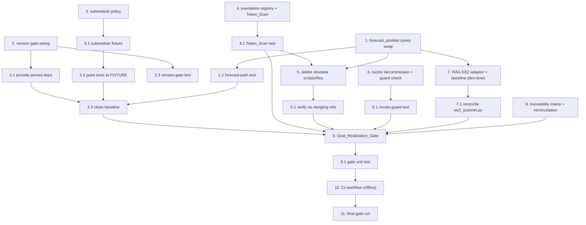

# Implementation Plan

## Overview

This is a completion-and-verification feature on an existing implementation under `dev/workflow/deployment/` with a ~575-test suite under `dev/workflow/tests/`. Tasks remediate the proven gaps first (to drive the baseline of **6 failed / 25 errors / 2 import errors** to zero), then add the verification components, then the single gate.

**Conventions for every task:**
- Run tests with the venv interpreter from `dev/workflow`: `.venv/bin/python -m pytest tests/ -q` (the bare `python`/`python3` on PATH will not work).
- Follow EE2 SME-corrected patterns: use `err_chk`/`err_exit`/`cpreq`/`cpfs`; do NOT add `set -eu`/`set -e` solely for error handling.
- The agentcore MCP RAG server is available ONLY in this dev environment. Any RAG-backed EE2 step is a dev-time action that produces a committed `EE2_Baseline_Recording`; CI/gate code must never call the RAG.

## Tasks

---

- [x] 1. Remediate the forecast runtime path to consume pre-rendered configs (eliminate runtime atparse)
  - In `ush/forecast_postdet.sh`, replace the WW3 block (~line 590): remove `source "${USHglobal}/parsing_namelists_WW3.sh"` + `WW3_namelists`; add a pre-flight existence check that emits `FATAL ERROR:` and aborts, then `cpreq "${EXPDIR}/parm/ufs/wave/ww3_shel.nml" "${DATA}/ww3_shel.nml"`. Mirror the existing FV3 block (~lines 380-414).
  - Replace the MOM6 block (~line 755) with `cpreq` of `${EXPDIR}/parm/ufs/ocean/MOM_input` → `${DATA}/INPUT/MOM_input` and `${EXPDIR}/parm/ufs/ocean/MOM6_data_table` → `${DATA}/data_table`.
  - Replace the CICE block (~line 905) with `cpreq` of `${EXPDIR}/parm/ufs/ice/ice_in` → `${DATA}/ice_in`.
  - Replace the GOCART block (~line 974) with a `cpreq` loop over `${EXPDIR}/parm/ufs/gocart/*.rc` and `ExtData` → `${DATA}/`.
  - Do not add `set -e`; rely on `cpreq` (FATALs on failure) + the pre-flight check.
  - _Requirements: 1.1, 1.2, 1.3, 1.4, 1.6, 10.5_

- [x] 1.1 Add a shell-level verification test for the forecast path
  - Create `dev/workflow/tests/test_forecast_postdet_cpreq.py` asserting `ush/forecast_postdet.sh` contains zero `source .*parsing_namelists_(WW3|MOM6|CICE|GOCART)\.sh` and contains `cpreq "${EXPDIR}/parm/ufs/<component>/..."` for each component, plus a `FATAL ERROR:` pre-flight guard.
  - Run `.venv/bin/python -m pytest tests/test_forecast_postdet_cpreq.py -q` and confirm pass.
  - _Requirements: 1.5, 1.6, 10.5_

- [x] 2. Wire the wxflow/uwtools version gate into Stage 1 (hard precondition)
  - In `dev/workflow/deployment/pipeline.py` `_stage_validate()`, call `validation.check_pinned_versions(dev_root/"workflow"/"requirements.txt")` before any EXPDIR file is written; add an `enforce_versions=True` path that treats "not importable" as a FATAL (not a warning) for `wxflow` and `uwtools`, raising `PipelineError` with package/expected/found.
  - In `_stage_manifest()`, source the resolved installed versions for the Manifest `wxflow_version`/`uwtools_version` fields instead of empty strings.
  - _Requirements: 5.1, 5.2, 5.5_

- [x] 2.1 Provide pinned wxflow/uwtools in the Verification_Environment
  - Ensure `.venv` provides `wxflow==0.3.0` and `uwtools==2.16.0` (install into the venv; document the step in `dev/workflow/README.md` and reference `dev/workflow/requirements.txt`).
  - Update `tests/test_configuration.py` and `tests/test_hosts.py` to import successfully when the packages are present; when not enforcing, guard with `pytest.importorskip("wxflow")` so collection never errors.
  - Run `.venv/bin/python -m pytest tests/ -q --collect-only` and confirm 0 collection/import errors.
  - _Requirements: 5.3, 5.4_

- [x] 2.2 Add the version-gate unit test
  - Create `dev/workflow/tests/test_version_gate.py`: monkeypatch installed versions to assert FATAL on missing/mismatched `wxflow`/`uwtools` and that no EXPDIR file is written; assert pass when versions match.
  - _Requirements: 5.1, 5.2_

- [x] 3. Add deterministic submodule handling to the deployment pipeline
  - In `dev/workflow/deployment/pipeline.py`, add `class SubmodulePolicy(enum.Enum)` with `REQUIRE`, `FIXTURE`, `SKIP_OPTIONAL`; thread a `policy` (and optional `fixture_root`) parameter through `_stage_submodule_copy()` and `run()`.
  - `REQUIRE` keeps current FATAL-on-missing behavior; `FIXTURE` resolves missing `SUBMODULE_COPY_MANIFEST` sources from `fixture_root`; `SKIP_OPTIONAL` warns and skips entries flagged optional.
  - _Requirements: 6.1, 6.2_

- [x] 3.1 Create the committed Submodule_Fixture trees
  - Add minimal, byte-stable stand-ins under `dev/workflow/tests/fixtures/submodules/` for `nexus.fd/config/gocart/` and `upp.fd/parm/` so a fixture-backed deploy completes without "Submodule source not found".
  - Document the fixture layout in `dev/workflow/tests/fixtures/submodules/README.md` so any developer can reproduce a clean deploy.
  - _Requirements: 6.2, 6.7_

- [x] 3.2 Point the affected integration/property tests at the FIXTURE policy
  - Update `test_integration_self_containment.py`, `test_integration_immutability.py`, `test_property_platform_isolation.py`, `test_deployment_determinism.py`, and `test_no_unresolved_tokens.py` to deploy with `policy=SubmodulePolicy.FIXTURE` and `fixture_root` pointing at the committed fixture.
  - Add `dev/workflow/tests/test_submodule_policy.py` covering REQUIRE/FIXTURE/SKIP_OPTIONAL behavior.
  - _Requirements: 6.2, 6.3, 6.4, 6.5, 6.6_

- [x] 3.3 Drive the existing suite to a clean baseline
  - Run `.venv/bin/python -m pytest tests/ -q` from `dev/workflow`; confirm the prior 6 failures + 25 errors + 2 import errors are resolved (0 failed, 0 errors, 0 collection errors).
  - _Requirements: 6.5, 6.6, 7.3, 7.4_

- [x] 4. Create the Atparse_Exemption_Registry and Token_Scan
  - Create `dev/parm/atparse_exemptions.yaml` listing `parm/prep_sfc/snow2mdl.nml.tmpl`, `ush/regrid_gsiSfcIncr_to_tile.sh`, and `scripts/exgfs_wave_nawips.sh` with justifications.
  - Create `dev/workflow/deployment/token_scan.py` implementing `TokenScanResult`, `load_exemptions()`, `scan_rendered_expdir()` (no `{{`/`{%`/`{#`/`@[...]` in rendered EXPDIR files; registry does NOT exempt EXPDIR artifacts), and `scan_repo_runtime()` (`@[...]` only in registry paths; `forecast_postdet.sh` sources no `parsing_namelists_*.sh`).
  - Stale registry entries (no tokens) emit a warning but the scan still passes.
  - _Requirements: 3.1, 3.2, 3.3, 3.4, 3.5, 1.5, 2.6_

- [x] 4.1 Add the Token_Scan unit test
  - Create `dev/workflow/tests/test_token_scan.py`: atparse/jinja detection, registry honoring (pass only when exempt), stale-exemption warning-not-failure, rendered-EXPDIR never exempt, and `forecast_postdet.sh` parsing-source detection.
  - _Requirements: 3.3, 3.4, 1.5, 2.6_

- [x] 5. Remove obsolete atparse scripts and legacy token files (reference-guarded)
  - Implement a deletion-guard helper that, before deleting file `F`, greps the repo (excluding `.git`, `__pycache__`, `F` itself, and the exemption registry) for `basename(F)`; if referenced by a retained script, retain `F` and emit a verification error naming the referencer.
  - Delete (once unreferenced): `ush/parsing_namelists_{WW3,MOM6,CICE,GOCART,FV3,FV3_nest}.sh`, `ush/parsing_model_configure_FV3.sh`, `ush/parsing_ufs_configure.sh`, then `ush/atparse.bash`.
  - Delete legacy `@[...]` files `parm/ufs/fv3/diag_table` and `parm/ufs/gocart/AERO_HISTORY.rc`.
  - _Requirements: 2.1, 2.2, 2.3, 2.4, 2.5_

- [x] 5.1 Verify no dangling references after deletion
  - Run the Token_Scan repo-runtime pass and `.venv/bin/python -m pytest tests/test_token_scan.py -q`; confirm zero `@[...]` outside the registry and zero references to deleted scripts.
  - _Requirements: 2.5, 2.6, 3.3_

- [x] 6. Complete the Rocoto decommission in setup_workflow.py
  - In `dev/workflow/setup_workflow.py`, remove the `rocoto` subparser, `rocoto_xml_factory`, and any rocoto-conditioned branches; KEEP `RocotoDecommissionedError`, `rocoto_deprecation_guard()`, and `_check_for_rocoto_invocation()`.
  - Create `dev/workflow/deployment/rocoto_guard_check.py` with `check_setup_workflow_rocoto_free(path)` that passes only when every residual case-insensitive `rocoto` occurrence belongs to the documented guard structure (the allowlisted guard symbols), and fails on a lone non-guard occurrence.
  - _Requirements: 4.1, 4.2, 4.3, 4.4, 4.5_

- [x] 6.1 Add/extend the rocoto-guard test
  - Add `dev/workflow/tests/test_rocoto_guard_check.py` (and extend existing `test_setup_workflow_rocoto_guard.py`): a lone `rocoto` outside the guard fails; the guard cluster passes; invoking a rocoto path raises the FATAL guard.
  - _Requirements: 4.4, 4.5_

- [x] 7. Build the RAG EE2 adapter and capture the offline baseline (dev-time)
  - Create `dev/workflow/deployment/rag_ee2_adapter.py` with `RagEE2Result`, `RagEE2Client` (Protocol; implemented only in the dev env), `run_rag_ee2_scan()`, `record_baseline()`, and `check_against_baseline()`. Derive changed files from `git diff --name-only` filtered to `*.sh`, `J[A-Z_]*`, `ex*.sh|ex*.py`, and `ush/`.
  - In the dev environment, run the RAG EE2 scan (`scan_repository_compliance` over the 5 categories + `extract_code_for_analysis` over `output_file_naming`, `shebang_compliance`, `env_var_validation`) on the modified `ush/forecast_postdet.sh` and any new scripts; resolve or justify findings.
  - Commit the authoritative result as an `EE2_Baseline_Recording` under `dev/workflow/tests/fixtures/ee2/`.
  - _Requirements: 10.1, 10.2, 10.3, 10.7_

- [x] 7.1 Reconcile the in-repo ee2_scanner.py to the RAG verdict
  - Adjust `dev/workflow/deployment/ee2_scanner.py` so it reproduces the authoritative RAG verdicts (notably: do not flag the SME-corrected `cpreq`/`err_chk`/`err_exit` pattern; do not demand `set -e`).
  - Add `dev/workflow/tests/test_rag_ee2_adapter.py` using the committed `EE2_Baseline_Recording` fixtures (no live RAG): `RagEE2Result.passed` semantics, changed-file derivation, and `check_against_baseline()` matching the reconciled scanner output.
  - _Requirements: 10.4, 10.6_

- [x] 8. Build the Traceability_Matrix and reconciliation check
  - Create `dev/workflow/traceability_matrix.yaml` mapping every parent requirement (R1-R14) and every parent Property (1-14) to its proving test(s) with a `status` field.
  - Implement reconciliation in the gate module: emit a verification error for any unmapped parent item (proceed regardless); for each parent `tasks.md` task marked complete, assert ≥1 mapped proving test passes, recording mismatches (non-fatal to overall).
  - _Requirements: 8.1, 8.2, 8.3, 8.4, 8.5, 8.6_

- [x] 9. Implement the Goal_Realization_Gate (offline EE2)
  - Create `dev/workflow/goal_realization_gate.py` with the `PROPERTY_TESTS` map (Properties 1-14 → proving tests) and `GateResult` whose `realized` is True iff all 14 Properties pass, suite failed/errors/collection-errors are 0, `token_scan_passed`, `ee2_passed`, and `rag_ee2_passed` (offline: reconciled `ee2_scanner.py` + `check_against_baseline`).
  - Orchestrate: provision env + assert imports → fresh deploy into temp EXPDIR with `policy=FIXTURE` → run full suite with `--junitxml` → Token_Scan over EXPDIR → offline EE2 (scanner + baseline match) → traceability reconciliation → emit Verification_Report (JUnit XML + JSON summary). Never call the RAG.
  - _Requirements: 7.1, 7.2, 7.3, 7.5, 7.6, 7.7, 8.3, 10.6_

- [x] 9.1 Add the gate unit test
  - Create `dev/workflow/tests/test_goal_realization_gate.py`: `GateResult.realized` truth table (including `rag_ee2_passed`), and reconciliation detecting unmapped items and completed-task/failing-test mismatches.
  - _Requirements: 7.1, 7.7, 8.4, 8.6_

- [x] 10. Add the CI workflow for the gate (offline)
  - Create `.github/workflows/goal_realization.yaml` that installs pinned deps from `dev/workflow/requirements.txt`, runs `goal_realization_gate.py`, uploads the Verification_Report, and fails the job when `GateResult.realized` is False. The workflow must NOT depend on the RAG server.
  - _Requirements: 7.6, 7.7, 9.6, 10.6_

- [x] 11. Final gate run — confirm goal realization
  - From `dev/workflow`, run the gate end-to-end and `.venv/bin/python -m pytest tests/ -q`; confirm all 14 parent Properties pass, the full suite reports 0 failed / 0 errors / 0 collection errors, Token_Scan passes, and the offline EE2 check matches the committed baseline.
  - Update `dev/workflow/traceability_matrix.yaml` statuses from the Verification_Report.
  - _Requirements: 7.1, 7.2, 7.3, 7.4, 9.1, 9.2, 9.3, 9.4, 9.6, 10.6_

## Task Dependency Graph



```json
{
  "waves": [
    {
      "wave": 1,
      "title": "Remediation — unblock the existing suite",
      "tasks": ["1", "1.1", "2", "2.1", "2.2", "3", "3.1", "3.2", "3.3"],
      "parallel": false
    },
    {
      "wave": 2,
      "title": "Verification components",
      "tasks": ["4", "4.1", "5", "5.1", "6", "6.1", "7", "7.1", "8"],
      "parallel": true
    },
    {
      "wave": 3,
      "title": "Gate assembly, CI, and final proof",
      "tasks": ["9", "9.1", "10", "11"],
      "parallel": false
    }
  ]
}
```

## Notes

- **Ordering rationale:** Tasks 1-3 are remediation that unblocks the existing suite (driving 6 failed / 25 errors / 2 import errors to zero at task 3.3). Tasks 4-8 add the verification components. Task 9 assembles the gate, task 10 wires CI, task 11 proves goal realization.
- **RAG availability:** Task 7 is the only step that uses the live agentcore RAG, and only to produce the committed `EE2_Baseline_Recording`. Tasks 9-11 and all CI run offline against the reconciled `ee2_scanner.py` + baseline.
- **Test interpreter:** always `.venv/bin/python -m pytest` from `dev/workflow`; the property tests use `hypothesis` (already present under `.hypothesis/`).
- **Parent traceability:** the `dev/workflow/traceability_matrix.yaml` (task 8) maps parent requirements R1-R14 and Properties 1-14 to proving tests; task 11 updates statuses from the Verification_Report.
- **Out of scope:** the three non-UFS atparse usages remain enforced registry exemptions (task 4), not migrations.
