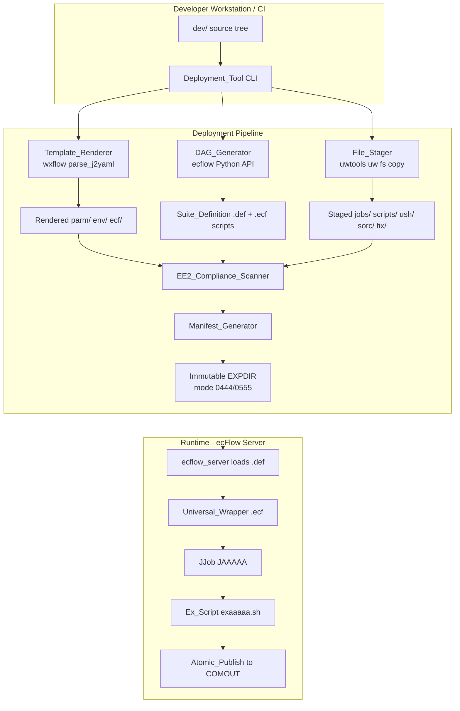
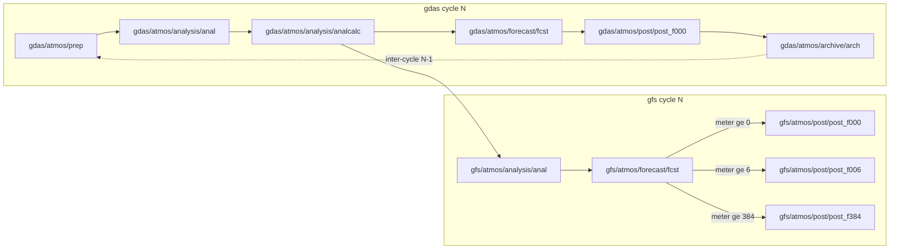

# Design Document

## Overview

This document describes the technical design for transforming the NOAA EMC global-workflow into an immutable, ecFlow-only DAG orchestration system. All authoring lives under `dev/`; deployment renders sources into a self-contained, versioned EXPDIR matching the NCO production layout.

The system comprises seven components: **Deployment_Tool**, **Template_Renderer**, **DAG_Generator**, **Universal_Wrapper**, **Atomic_Publish**, **EE2_Compliance_Scanner**, and **Observability_Layer**. Each traces directly to one or more requirements from the approved requirements document.

## Architecture



## Components and Interfaces

### Component 1: Deployment_Tool

**Traces to:** Requirements 1, 3, 8, 9, 11, 12

#### CLI Surface

```
deploy_workflow \
  --config dev/parm/workflow/gfs_cycled.yaml \
  --platform HERA \
  --expdir /path/to/EXPDIR \
  --version v17.0.0 \
  [--allowlist dev/ctests/] \
  [--dry-run]
```

| Flag | Description |
|------|-------------|
| `--config` | Path to the Workflow_Configuration YAML under `dev/parm/workflow/` |
| `--platform` | Target HPC: WCOSS2, HERA, HERCULES, ORION, GAEAC6, DERECHO, URSA, AWSPW, AZUREPW, GOOGLEPW, CONTAINER |
| `--expdir` | Destination EXPDIR path |
| `--version` | Semantic version string for the Snapshot_ID |
| `--allowlist` | Optional comma-separated dev/ paths to include (e.g. `dev/ctests/`) |
| `--dry-run` | Validate without writing |

#### Pipeline Stages

1. **Validate Inputs** — Check git state, wxflow/uwtools versions match pinned versions in `dev/workflow/requirements.txt` (Req 9 AC5). Refuse if EXPDIR already exists and contains a manifest (Req 3 AC5).
2. **Build Context** — Assemble the deployment-time Jinja2 context dict from the Workflow_Configuration YAML, platform, version, git metadata.
3. **Render Templates** — Invoke Template_Renderer on all `.j2` files under `dev/parm/`, `dev/workflow/`, `dev/ecf/` (Req 4 AC5).
4. **Stage Files** — Use uwtools `uw fs copy` to copy non-template files from `dev/` into the EXPDIR staging area (Req 9 AC2).
5. **Generate DAG** — Invoke DAG_Generator to emit `.def` and `.ecf` scripts (Req 1 AC2, Req 2).
6. **EE2 Compliance Scan** — Run scanner over rendered J-Jobs, ex-scripts, ush (Req 11 AC6).
7. **Generate Manifest** — Compute SHA-256 of every file, write `manifest.yaml` (Req 3 AC3).
8. **Seal EXPDIR** — Set file modes to 0444, directory modes to 0555 (Req 3 AC4). Write `provenance.yaml` (Req 13 AC4).

#### Source-to-Target Mapping

| Source (`dev/`) | Target (`<EXPDIR>/`) | Transform |
|-----------------|---------------------|-----------|
| `dev/jobs/JAAAAA` | `jobs/JAAAAA` | Copy verbatim (EE2 naming enforced) |
| `dev/scripts/exaaaaa.sh` | `scripts/exaaaaa.sh` | Copy verbatim (EE2 naming enforced) |
| `dev/ush/*.sh` | `ush/*.sh` | Copy verbatim |
| `dev/parm/config/<app>/*.j2` | `parm/config/<app>/*` | Render via Template_Renderer |
| `dev/parm/workflow/*.yaml` | `parm/workflow/*.yaml` | Render via Template_Renderer |
| `dev/workflow/ecflow/*.j2` | `ecf/scripts/*.ecf` | Render via Template_Renderer |
| (generated) | `ecf/defs/<app>.def` | DAG_Generator output |
| `dev/workflow/ecflow/include/` | `ecf/include/` | Copy verbatim |
| `dev/env/${PLATFORM}.env` | `env/${PLATFORM}.env` | Render via Template_Renderer |
| `dev/sorc/` (executables) | `sorc/` | Copy (build artifacts) |
| `fix/` (symlinks or staged) | `fix/` | uwtools `uw fs copy` |
| `dev/versions/` | `versions/` | Copy verbatim |
| `dev/modulefiles/` | `modulefiles/` | Copy verbatim |
| (generated) | `manifest.yaml` | Manifest_Generator |
| (generated) | `workflow/provenance.yaml` | Deployment_Tool |
| (generated) | `workflow/state.db` | Created empty at deploy |

### Component 2: Template_Renderer

**Traces to:** Requirements 4, 9

#### Architecture

The Template_Renderer wraps `wxflow.parse_j2yaml` with enforcement layers:

```python
class TemplateRenderer:
    def __init__(self, context: dict, searchpath: list[str], strict: bool = True):
        self.context = context
        self.searchpath = searchpath
        self.strict = strict

    def render_file(self, src: Path, dst: Path) -> None:
        rendered = parse_j2yaml(
            path=str(src), data=self.context,
            searchpath=self.searchpath, allow_missing=not self.strict
        )
        self._write(dst, rendered)
        self._verify_no_unresolved(dst)

    def render_tree(self, src_dir: Path, dst_dir: Path) -> list[Path]:
        """Render all .j2 files in a directory tree."""
```

#### Key Design Decisions

1. **Searchpath** — `[dev/parm/config/<app>/, dev/parm/config/, dev/parm/, dev/workflow/]` — most specific first (Req 4 AC2, AC7).
2. **Template inheritance** — Base templates declare `` regions; app-specific templates use `` (Req 4 AC3).
3. **Strict undefined** — `allow_missing=False` raises FATAL ERROR with file, line, variable name (Req 4 AC4).
4. **Shell variable preservation** — `${VAR}` patterns matching `\$\{[A-Z_][A-Z0-9_]*\}` are excluded from resolution (Req 4 AC10).
5. **Round-trip** — `wxflow.save_as_yaml` with `sort_keys=False` provides canonical serialization (Req 4 AC8, AC9).

### Component 3: DAG_Generator

**Traces to:** Requirements 1, 2, 10

#### Workflow_Configuration YAML Schema

```yaml
suite:
  name: "gfs_v17"
  ecf_home: "{{ EXPDIR }}/ecf"
  ecf_files: "{{ EXPDIR }}/ecf/scripts"
  ecf_include: "{{ EXPDIR }}/ecf/include"
defaults:
  ECF_TRIES: 2
  ECF_JOB_CMD: "uwtools submit %ECF_JOB% %ECF_JOBOUT%"
cycles:
  - name: "gdas"
    repeat: { type: "date", variable: "YMD", start: "{{ idate }}", end: "{{ edate }}", step: 1 }
    time: "00:00 06:00 12:00 18:00"
families:
  - path: "gdas/atmos/analysis"
    tasks:
      - name: "anal"
        trigger: "gdas/atmos/prep == complete"
        jjob: "JGDAS_ATMOS_ANALYSIS"
      - name: "analcalc"
        trigger: "anal == complete"
        jjob: "JGDAS_ATMOS_ANALYSIS_CALC"
  - path: "gfs/atmos/post"
    tasks:
      - name: "post_f{{ '%03d' % fhr }}"
        trigger: "gfs/atmos/forecast/fcst:forecast_hour ge {{ fhr }}"
        jjob: "JGFS_ATMOS_POST"
        variables: { FHOUR: "{{ fhr }}" }
        for_each:
          fhr: [0, 6, 12, 24, 48, 72, 120, 180, 240, 384]
inter_cycle_dependencies:
  - task: "gdas/atmos/prep"
    depends_on: "gdas/atmos/archive/arch == complete"
    cycle_offset: -1
```

#### ecFlow Suite_Definition Emission

Uses the ecFlow Python API (`ecflow.Defs`, `Suite`, `Family`, `Task`, `Trigger`, `Event`, `Meter`, `RepeatDate`). The `.def` file is written to `<EXPDIR>/ecf/defs/<suite_name>.def`.

#### ecf Script Generation

Per-task `.ecf` from Jinja2 template:

```bash
%include <head.h>
%include <envsetup.h>
# Task: {{ task.name }} | JJob: {{ task.jjob }}
${EXPDIR}/ush/universal_wrapper.sh {{ task.jjob }}
%include <tail.h>
```

#### Parser and Pretty-Printer

- `parse(path) -> DAG` — YAML to in-memory DAG
- `pretty_print(dag) -> str` — DAG to canonical YAML (deterministic)
- Round-trip: `pretty_print(parse(f))` ≡ `parse(f)` and `parse(pretty_print(d))` ≡ `d`
- Definition fidelity: TaskNodes in DAG == `(family-path, task-name)` pairs in emitted `Defs`

#### Sample DAG



### Component 4: Universal_Wrapper

**Traces to:** Requirements 5, 6, 11, 12

Single file at `<EXPDIR>/ush/universal_wrapper.sh` (source: `dev/ush/universal_wrapper.sh.j2`).

Responsibilities:
- `set -x`, `PS4='+ $SECONDS + '`, `umask 022`, trap ERR/EXIT
- Platform detection via `${MACHINE}` or `detect_machine.sh`
- Source `<EXPDIR>/env/${MACHINE}.env`
- WCOSS2 `envir` guard (prod/para/test only)
- Create ephemeral `${DATAROOT}/${jobid}`, export `DATA`, `pgmout=OUTPUT.$$`
- Structured lifecycle JSON logging (task, cycle, jobid, attempt, state, timestamp, duration)
- Execute JJob; on failure call `err_exit`
- Cleanup `${DATA}` unless `KEEPDATA=YES`

Consolidates `jjob_header.sh`, `jjob_standard_vars.sh`, `jjob_shell_setup.sh` (retained as thin shims for backward compat).

### Component 5: Atomic_Publish

**Traces to:** Requirement 7

Pattern: stage to `${COMOUT}/.staging/${jobid}/` → verify all files non-empty → atomic `mv` to final location → `dbn_alert` only after move. If any file fails verification, `err_exit` and COMOUT unchanged.

### Component 6: EE2_Compliance_Scanner

**Traces to:** Requirement 11

Runs as Stage 6 of the pipeline. Checks: `error_handling`, `environment_variables`, `file_naming`, `shebang_compliance`. FATAL ERROR on any violation.

### Component 7: Observability_Layer

**Traces to:** Requirement 13

- `<EXPDIR>/workflow/provenance.yaml` — git remote, commit, branch, user, host, timestamp, config
- `<EXPDIR>/workflow/state.db` — SQLite with `task_events` table (snapshot_id, git_commit, cycle, family_path, task_name, attempt, scheduler_job_id, state, exit_status, timestamp, duration_seconds)
- Universal_Wrapper embeds Snapshot_ID in log headers

## Data Models

### Snapshot_ID

```
Format: "<semver>+<sha256_prefix_12>"
Example: "v17.0.0+a3f8c1d2e4b6"
```

### Manifest (`manifest.yaml`)

```yaml
snapshot_id: "v17.0.0+a3f8c1d2e4b6"
git_commit: "abc123def456..."
git_remote: "https://github.com/NOAA-EMC/global-workflow.git"
git_branch: "develop"
deployed_by: "Barry.Baker"
deployed_on: "hera-login1.fairmont.rdhpcs.noaa.gov"
deployed_at: "2025-01-15T14:30:00Z"
platform: "HERA"
wxflow_version: "0.3.0"
uwtools_version: "2.16.0"
files:
  jobs/JGFS_ATMOS_FORECAST:
    sha256: "e3b0c44298fc1c149afb..."
    size: 4096
```

### In-Memory DAG

```python
@dataclass
class TaskNode:
    name: str
    family_path: str
    jjob: str
    trigger: Optional[str]
    complete: Optional[str]
    events: list[str]
    meters: list[MeterDef]
    variables: dict[str, str]
    resources: dict[str, Any]

@dataclass
class DAG:
    suite_name: str
    nodes: dict[str, TaskNode]
    edges: list[Edge]
    def validate_acyclic(self) -> None: ...
    def downstream(self, task: str) -> set[str]: ...
    def upstream(self, task: str) -> set[str]: ...
```

### state.db Schema

```sql
CREATE TABLE task_events (
    id INTEGER PRIMARY KEY AUTOINCREMENT,
    snapshot_id TEXT NOT NULL,
    git_commit TEXT NOT NULL,
    cycle TEXT NOT NULL,
    family_path TEXT NOT NULL,
    task_name TEXT NOT NULL,
    attempt INTEGER NOT NULL,
    scheduler_job_id TEXT,
    state TEXT NOT NULL,
    exit_status INTEGER,
    timestamp TEXT NOT NULL,
    duration_seconds INTEGER
);
CREATE INDEX idx_task_events_cycle ON task_events(cycle, task_name);
CREATE INDEX idx_task_events_state ON task_events(state);
```

### Deployment-Time Context (passed to Template_Renderer)

```yaml
NET: "gfs"
RUN: "gdas"
MODE: "cycled"
app: "gfs"
MACHINE: "HERA"
model_ver: "v17.0.0"
EXPDIR: "/path/to/EXPDIR"
COMROOT: "/path/to/com"
# PDY, cyc remain as ${PDY}, ${cyc} for runtime shell expansion
```

## Error Handling

### Deployment-Time Errors

| Condition | Response |
|-----------|----------|
| EXPDIR already sealed (manifest exists) | FATAL ERROR: "EXPDIR already published with Snapshot_ID X" |
| wxflow/uwtools version mismatch | FATAL ERROR: "wxflow X.Y.Z != pinned A.B.C" |
| Undefined Jinja2 variable (strict mode) | FATAL ERROR: "Undefined variable 'VAR' in FILE:LINE" |
| EE2 compliance violation | FATAL ERROR: "EE2 violation [category]: FILE — description" |
| EE2 naming convention violation | FATAL ERROR: "File X violates JAAAAA convention for jobs/" |
| Cycle detected in DAG | FATAL ERROR: "Cycle detected: A → B → C → A" |
| Rocoto engine requested | FATAL ERROR: "Rocoto is decommissioned (Requirement 1)" |

### Runtime Errors

| Condition | Response |
|-----------|----------|
| Env file missing | FATAL ERROR from Universal_Wrapper, task aborts |
| WCOSS2 envir invalid | FATAL ERROR, task aborts |
| JJob non-zero exit | `err_exit` with JJob name, jobid, exit status |
| Executable `$err != 0` | `err_chk` aborts immediately |
| Atomic publish file empty | `err_exit`, COMOUT unchanged |
| ecFlow task exceeds ECF_TRIES | Task stays `aborted`, downstream blocked |

## Testing Strategy

### Unit Tests

- **WorkflowConfigParser**: round-trip property tests with hypothesis (random valid YAML configs)
- **DAG.validate_acyclic**: known cyclic and acyclic graphs
- **TemplateRenderer**: strict mode undefined detection, shell variable preservation, nested includes
- **EE2ComplianceScanner**: known-good and known-bad scripts
- **Manifest generation**: determinism (same input → same hash)

### Integration Tests

- **Full deployment pipeline**: `deploy_workflow` on a minimal config, verify EXPDIR structure
- **Platform isolation**: deploy for HERA and WCOSS2, diff only platform-conditioned files
- **Immutability**: attempt write to sealed EXPDIR, expect EPERM
- **Self-containment**: `chmod 000 dev/`, run ecFlow smoke test from EXPDIR alone
- **ecFlow round-trip**: `save_as_defs` → `read_from_path` → structural equality

### CI Cases

Replace existing Rocoto CI cases with ecFlow equivalents under `dev/ci/cases/`:
- `C48_ATM_gfs_fcst_only.yaml` → ecFlow deployment + ecflow_client smoke
- `C48_S2SW_gfs_cycled.yaml` → full cycled DAG validation
- Each case: deploy → load def → verify task count matches config

## Correctness Properties

### Property 1: Deployment Determinism

Same git commit + same config YAML + same platform → EXPDIRs with identical manifest file hashes.

**Verification:** CI deploys twice from same state, asserts `manifest.yaml` files are byte-identical.

### Property 2: Manifest Integrity

For all files listed in `manifest.yaml`, the on-disk SHA-256 equals the recorded hash.

**Verification:** `verify_manifest.py` recomputes hashes and compares.

### Property 3: Immutability

After sealing, no regular file in EXPDIR is writable by non-owner.

**Verification:** CI attempts `echo x >> <file>`, expects EPERM.

### Property 4: Self-Containment

The EXPDIR executes without reading any file from `dev/`.

**Verification:** CI sets `chmod 000 dev/`, runs ecFlow smoke test.

### Property 5: Atomicity

A partial failure during product staging leaves `${COMOUT}` unchanged for that deliverable set.

**Verification:** Integration test kills process mid-stage, verifies no partial files in COMOUT.

### Property 6: Idempotence

Re-running a task with identical inputs and EXPDIR produces COMOUT files with identical SHA-256 hashes (excluding declared nondeterministic files).

**Verification:** Run task twice, diff output hashes.

### Property 7: Statelessness

A task succeeds with a completely empty `${DATAROOT}` (no leftover state from prior runs).

**Verification:** `rm -rf ${DATAROOT}/*` before re-run, assert success.

### Property 8: Platform Isolation

EXPDIRs deployed for two different platforms differ only in `env/`, `parm/config/<app>/config.resources.*`, `modulefiles/`, and `.ecf` scheduler directives.

**Verification:** Deploy for HERA and WCOSS2, diff file trees excluding platform-conditioned paths.

### Property 9: Parser Round-Trip

`pretty_print(parse(f))` parses to a DAG structurally equal to `parse(f)`.

**Verification:** Property-based test with hypothesis-generated valid configs.

### Property 10: Printer Round-Trip

`parse(pretty_print(d))` is structurally equal to `d`.

**Verification:** Property-based test with hypothesis-generated DAG objects.

### Property 11: ecFlow Round-Trip

`Defs.save_as_defs(path)` followed by `Defs(path)` produces a structurally equal `Defs` object.

**Verification:** Unit test comparing node sets before and after serialization.

### Property 12: DAG Acyclicity

The dependency graph contains no cycles.

**Verification:** `validate_acyclic()` runs topological sort; raises `CycleDetectedError` on failure.

### Property 13: Definition Fidelity

The set of `(family-path, task-name)` pairs in the emitted ecFlow `Defs` equals the set of TaskNodes in the source DAG.

**Verification:** Unit test comparing sets after emission.

### Property 14: No Unresolved Tokens

No rendered file in the EXPDIR contains `{{`, `{%`, or `{#` sequences.

**Verification:** CI grep scan over all rendered files post-deployment.

## Rocoto Decommission Plan

**Traces to:** Requirements 1, 14

### Files Deleted

| Path | Reason |
|------|--------|
| `dev/workflow/rocoto/` (entire tree) | Rocoto XML generation code |
| `dev/job_cards/rocoto/` (entire tree) | Rocoto job card templates |
| `dev/workflow/rocoto_viewer.py` | Rocoto-only monitoring tool |
| `dev/workflow/setup_buildxml.py` | Rocoto XML builder |

### Code Modified

| File | Change |
|------|--------|
| `dev/workflow/setup_workflow.py` | Remove `rocoto` subparser and all Rocoto branches. Add deprecation guard. |
| `dev/workflow/generate_workflows.sh` | Remove `-c` crontab option. Replace with ecFlow CI runner. |
| `dev/ci/cases/` | Replace Rocoto CI cases with ecFlow equivalents. |
| `dev/workflow/README_ecflow.md` | Rename to `README.md`. Document ecFlow-only model. |

## Multi-Platform Design

**Traces to:** Requirement 12

Platform-specific content is confined to:
- `env/${PLATFORM}.env`
- `parm/config/<app>/config.resources.${PLATFORM}`
- `modulefiles/${PLATFORM}/`
- Scheduler directives in `.ecf` scripts (PBS for WCOSS2, Slurm for Hera/Hercules/Orion/Gaea/Derecho)

All other files are platform-independent. The Universal_Wrapper detects platform at runtime via `${MACHINE}` or `detect_machine.sh`.

## File Structure (New/Modified)

```
dev/
├── workflow/
│   ├── deploy.py                    # NEW: Deployment_Tool CLI
│   ├── deployment/
│   │   ├── __init__.py
│   │   ├── pipeline.py              # NEW: Pipeline orchestration
│   │   ├── template_renderer.py     # NEW: wxflow renderer
│   │   ├── dag_generator.py         # NEW: ecFlow emission
│   │   ├── workflow_config.py       # NEW: Parser + Pretty-Printer
│   │   ├── file_stager.py           # NEW: uwtools fs copy
│   │   ├── manifest.py              # NEW: SHA-256 manifest
│   │   ├── ee2_scanner.py           # NEW: EE2 compliance
│   │   └── seal.py                  # NEW: chmod + immutability
│   ├── ecflow/
│   │   └── templates/
│   │       ├── head.h.j2            # NEW
│   │       ├── tail.h.j2            # NEW
│   │       ├── envsetup.h.j2        # NEW
│   │       └── task.ecf.j2          # NEW
│   ├── setup_workflow.py            # MODIFIED (Rocoto removed)
│   ├── README.md                    # RENAMED
│   └── requirements.txt            # EXISTING (pinned versions)
├── ush/
│   ├── universal_wrapper.sh.j2      # NEW
│   ├── log_task_event.py            # NEW
│   ├── atomic_publish.sh            # NEW
│   └── (existing files unchanged)
├── parm/workflow/
│   ├── gfs_cycled.yaml              # NEW
│   ├── gfs_forecast_only.yaml       # NEW
│   ├── gefs.yaml                    # NEW
│   ├── sfs.yaml                     # NEW
│   └── gcafs.yaml                   # NEW
└── (jobs/, scripts/, env/, versions/ unchanged)
```

## Requirement Traceability Matrix

| Requirement | Components | Key Design Sections |
|-------------|-----------|-------------------|
| Req 1: ecFlow-Only | DAG_Generator, Deployment_Tool | Component 3, Rocoto Decommission |
| Req 2: DAG Orchestration | DAG_Generator | Component 3 (Schema, DAG Model) |
| Req 3: Immutable EXPDIR | Deployment_Tool | Component 1 (Pipeline, Manifest) |
| Req 4: Templating | Template_Renderer | Component 2 |
| Req 5: Ephemeral Execution | Universal_Wrapper | Component 4 |
| Req 6: Universal Wrappers | Universal_Wrapper | Component 4 |
| Req 7: Atomic Delivery | Atomic_Publish | Component 5 |
| Req 8: dev/ as Source | Deployment_Tool | Component 1 (Source-to-Target) |
| Req 9: wxflow/uwtools | Template_Renderer, Deployment_Tool | Components 1, 2 |
| Req 10: Parser/Printer | DAG_Generator | Component 3 (Parser/Printer) |
| Req 11: EE2 Compliance | EE2_Scanner, Universal_Wrapper | Components 4, 6 |
| Req 12: Multi-Platform | Deployment_Tool, DAG_Generator | Multi-Platform Design |
| Req 13: Observability | Observability_Layer | Component 7 |
| Req 14: Rocoto Decommission | Deployment_Tool | Rocoto Decommission Plan |
