# Design Document

## Overview

This document describes the technical design for producing a **minimal, sealed, production-ready EXPDIR** from the existing 8-stage deployment pipeline. The feature adds four new components — **DAG_Filter**, **Config_Conditioner**, **Model_Input_Renderer** (enhanced), and **Completeness_Verifier** — that integrate into the pipeline's Stage 4 (Stage Files) to:

1. **DAG-filter** all staged artifacts (J-Jobs, ex-scripts, ush scripts, config files) so only files transitively reachable from the Workflow_YAML task DAG are deployed
2. **Condition** config files by evaluating deploy-time-known conditionals and eliminating dead branches
3. **Pre-render** UFS model input templates (namelists, configurations) at deploy time so the forecast runtime performs only `cpreq` copies
4. **Verify completeness** of the filtered EXPDIR before sealing

The design operates within the parent `immutable-dag-workflow-modernization` pipeline architecture. The `--dag-filter` CLI flag controls activation, defaulting to off for backward compatibility during transition.

## Architecture

### Integration into the 8-Stage Pipeline

The new components slot into Stage 4 as sub-stages, with the Completeness_Verifier running as a new Stage 4d between staging and DAG generation:

```mermaid
flowchart TD
    subgraph Pipeline["Deployment_Tool.run() — pipeline.py"]
        S1["Stage 1: Validate<br/>(+ --dag-filter flag check)"]
        S2["Stage 2: Build Context<br/>(+ Deploy_Time_Variable registry)"]
        S3["Stage 3: Render Templates<br/>(+ Model_Input_Renderer enhanced)"]
        S4a["Stage 4a: DAG_Filter<br/>Extract reachability set"]
        S4b["Stage 4b: Stage Files<br/>(filtered or full)"]
        S4c["Stage 4c: Config_Conditioner<br/>Resolve deploy-time conditionals"]
        S4d["Stage 4d: Completeness_Verifier<br/>Cross-reference check"]
        S5["Stage 5: Generate DAG"]
        S6["Stage 6: EE2 Scan"]
        S7["Stage 7: Manifest"]
        S8["Stage 8: Seal EXPDIR"]
    end

    S1 --> S2 --> S3 --> S4a --> S4b --> S4c --> S4d --> S5 --> S6 --> S7 --> S8
```



### DAG Reachability Trace

The reachability algorithm traces from the Workflow_YAML through four layers:

```mermaid
flowchart LR
    subgraph "Layer 1: Workflow YAML"
        WY[families[].tasks[].jjob]
    end
    subgraph "Layer 2: J-Jobs"
        JJ["dev/jobs/JGLOBAL_FORECAST"]
    end
    subgraph "Layer 3: Ex-Scripts"
        EX["dev/scripts/exglobal_forecast.sh"]
    end
    subgraph "Layer 4: Ush Scripts"
        USH1["dev/ush/forecast_predet.sh"]
        USH2["dev/ush/forecast_det.sh"]
        USH3["dev/ush/forecast_postdet.sh"]
    end
    subgraph "Layer 5: Config Files"
        CFG1["config.base.j2"]
        CFG2["config.fcst.j2"]
        CFG3["config.com"]
    end

    WY -->|"jjob field"| JJ
    JJ -->|"SCRglobal/ex..."| EX
    JJ -->|"jjob_header -c 'base fcst'"| CFG1
    JJ -->|"jjob_header -c 'base fcst'"| CFG2
    EX -->|"source USHglobal/..."| USH1
    EX -->|"source USHglobal/..."| USH2
    EX -->|"source USHglobal/..."| USH3
    USH3 -.->|"transitive source"| USH1
```

### Data Flow Summary

| Input | Component | Output |
|-------|-----------|--------|
| Workflow_YAML | DAG_Filter | DAG_Reachability_Set |
| DAG_Reachability_Set + dev/ | File_Stager (filtered) | Staged EXPDIR (minimal) |
| Staged configs + Deploy_Time_Variables | Config_Conditioner | Conditioned configs |
| UFS .j2 templates + deploy context | Model_Input_Renderer | Pre-rendered namelists |
| Staged EXPDIR | Completeness_Verifier | Pass/FATAL |

## Components and Interfaces

### Component 1: DAG_Filter

**Traces to:** Requirements 1, 2, 3, 4

**New file:** `dev/workflow/deployment/dag_filter.py`

The DAG_Filter performs a multi-layer reachability analysis starting from the Workflow_YAML task definitions and transitively discovering all required artifacts.

#### Interface

```python
@dataclass
class DAGReachabilitySet:
    """Complete set of artifacts reachable from the Task_DAG.
    
    All sets contain basenames (not full paths) for portability.
    """
    jjobs: set[str]           # e.g. {"JGLOBAL_FORECAST", "JGFS_ATMOS_POST"}
    ex_scripts: set[str]      # e.g. {"exglobal_forecast.sh"}
    ush_scripts: set[str]     # e.g. {"forecast_predet.sh", "forecast_det.sh"}
    config_files: set[str]    # e.g. {"config.base.j2", "config.fcst.j2"}
    warnings: list[str]       # Non-fatal issues (missing optional ush, cycles)
    
    @property
    def is_valid(self) -> bool:
        """True if no fatal errors were encountered."""
        return len(self.jjobs) > 0


class DAGFilter:
    """Extracts the DAG_Reachability_Set from a Workflow_YAML.
    
    Args:
        dev_root: Path to the dev/ directory.
        workflow_yaml: Parsed workflow configuration dict.
        platform: Target platform for resource file selection.
    """
    
    def __init__(self, dev_root: Path, workflow_yaml: dict, platform: str):
        self.dev_root = dev_root
        self.workflow_yaml = workflow_yaml
        self.platform = platform.upper()
    
    def compute_reachability(self) -> DAGReachabilitySet:
        """Compute the full transitive reachability set.
        
        Raises:
            PipelineError: If a referenced J-Job or ex-script is missing.
        """
        ...
    
    def extract_jjobs_from_yaml(self) -> set[str]:
        """Layer 1: Extract jjob values from all task definitions."""
        ...
    
    def extract_ex_scripts(self, jjobs: set[str]) -> set[str]:
        """Layer 2: Parse J-Jobs to find invoked ex-scripts."""
        ...
    
    def extract_ush_scripts(self, ex_scripts: set[str]) -> set[str]:
        """Layer 3: Transitively resolve sourced ush scripts."""
        ...
    
    def extract_config_files(self, jjobs: set[str]) -> set[str]:
        """Layer 4: Parse jjob_header -c flags for config requirements."""
        ...
```

#### DAG Reachability Algorithm

**Layer 1 — J-Job Extraction:**

Walk `families[].tasks[].jjob` in the Workflow_YAML (handling `for_each` expansion). Collect the unique set of J-Job names. Validate each exists in `dev/jobs/`; emit FATAL ERROR for missing ones.

```python
def extract_jjobs_from_yaml(self) -> set[str]:
    jjobs: set[str] = set()
    for family in self.workflow_yaml.get("families", []):
        for task in family.get("tasks", []):
            jjob = task.get("jjob")
            if jjob:
                jjobs.add(jjob)
    # Validate existence
    for jjob in jjobs:
        path = self.dev_root / "jobs" / jjob
        if not path.exists():
            raise PipelineError(
                "dag_filter",
                f"J-Job '{jjob}' referenced in Workflow_YAML does not "
                f"exist at {path}"
            )
    return jjobs
```

**Layer 2 — Ex-Script Extraction:**

Parse each J-Job file to find the ex-script invocation. The pattern in global-workflow J-Jobs is:

```bash
: "${FORECASTSH:=${SCRglobal}/exglobal_forecast.sh}"
"${FORECASTSH}" && true
```

Or the direct pattern:
```bash
${SCRglobal}/exaaaaa.sh
${HOMEglobal}/scripts/exaaaaa.sh
```

The extraction uses regex patterns:

```python
# Patterns for ex-script invocation in J-Jobs
_EX_SCRIPT_PATTERNS = [
    # ${SCRglobal}/exaaaaa.sh or ${SCRmodel}/exaaaaa.sh
    re.compile(r'\$\{(?:SCR\w+|HOMEglobal/scripts)\}/(?P<script>ex[a-z_]+\.(?:sh|py))'),
    # FORECASTSH:= assignment pattern
    re.compile(r':\s*"\$\{(?:\w+SH):=\$\{(?:SCR\w+)\}/(?P<script>ex[a-z_]+\.(?:sh|py))\}"'),
    # Direct path in variable assignment
    re.compile(r'export\s+\w+SH="?\$\{(?:SCR\w+|HOMEglobal/scripts)\}/(?P<script>ex[a-z_]+\.(?:sh|py))"?'),
]
```

**Layer 3 — Ush Script Transitive Resolution:**

Parse each reachable ex-script for `source` statements referencing ush scripts. Then recursively parse discovered ush scripts for further `source` statements. Uses a visited set to handle circular dependencies.

```python
_USH_SOURCE_PATTERNS = [
    # source "${USHglobal}/script_name.sh"
    re.compile(r'source\s+"?\$\{USH(?:\w+)\}/(?P<script>[a-z_][a-z0-9_.]+)"?'),
    # . "${USHglobal}/script_name.sh"  (dot-source)
    re.compile(r'\.\s+"?\$\{USH(?:\w+)\}/(?P<script>[a-z_][a-z0-9_.]+)"?'),
]

def extract_ush_scripts(self, ex_scripts: set[str]) -> set[str]:
    visited: set[str] = set()
    queue: deque[str] = deque()
    
    # Seed with ush scripts sourced by ex-scripts
    for ex_script in ex_scripts:
        path = self.dev_root / "scripts" / ex_script
        for ush in self._parse_source_refs(path):
            if ush not in visited:
                queue.append(ush)
                visited.add(ush)
    
    # BFS transitive closure
    while queue:
        current = queue.popleft()
        ush_path = self.dev_root / "ush" / current
        if not ush_path.exists():
            self._warnings.append(
                f"WARNING: Ush script '{current}' referenced but not "
                f"found at {ush_path} (may be conditionally sourced)"
            )
            continue
        for dep in self._parse_source_refs(ush_path):
            if dep in visited:
                if dep in queue:
                    self._warnings.append(
                        f"WARNING: Circular dependency detected: "
                        f"{current} -> {dep}"
                    )
                continue
            visited.add(dep)
            queue.append(dep)
    
    return visited
```

**Layer 4 — Config File Extraction:**

Parse J-Jobs for the `jjob_header.sh -c` flag which lists config file basenames to source. The pattern in global-workflow is:

```bash
source "${HOMEglobal}/ush/jjob_header.sh" -e "fcst" -c "base fcst"
```

The `-c` argument is a space-separated list of config basenames (without the `config.` prefix). Each basename maps to `config.<name>` (or `config.<name>.j2`) under `dev/parm/config/<app>/`.

```python
_JJOB_HEADER_PATTERN = re.compile(
    r'jjob_header\.sh.*-c\s+"(?P<configs>[^"]+)"'
)

# Always-included configs regardless of DAG
_UNCONDITIONAL_CONFIGS = {"config.base.j2", "config.base", "config.com"}

def extract_config_files(self, jjobs: set[str]) -> set[str]:
    configs: set[str] = set(_UNCONDITIONAL_CONFIGS)
    app = self._detect_app()
    config_dir = self.dev_root / "parm" / "config" / app
    
    for jjob in jjobs:
        path = self.dev_root / "jobs" / jjob
        content = path.read_text()
        match = _JJOB_HEADER_PATTERN.search(content)
        if match:
            basenames = match.group("configs").split()
            for base in basenames:
                # Map basename to actual config file
                candidates = [
                    f"config.{base}.j2",
                    f"config.{base}",
                ]
                for candidate in candidates:
                    if (config_dir / candidate).exists():
                        configs.add(candidate)
                        break
    
    # Add platform-specific resource file
    platform_resource = f"config.resources.{self.platform}"
    if (config_dir / platform_resource).exists():
        configs.add(platform_resource)
    configs.add("config.resources")
    
    return configs
```

### Component 2: Config_Conditioner

**Traces to:** Requirement 5

**New file:** `dev/workflow/deployment/config_conditioner.py`

The Config_Conditioner evaluates deploy-time-known conditionals in shell config files and eliminates dead branches. It uses a **regex-based approach** (not a full bash AST) for pragmatic reasons: config files use a limited subset of bash conditional patterns, and a regex approach is simpler to maintain and validate.

#### Design Decision: Regex vs Bash AST

A full bash AST parser (e.g., `bashlex`, `tree-sitter-bash`) was considered but rejected because:
1. Config files use only `case`/`if` patterns with simple string comparisons
2. A full AST parser would need to handle all bash syntax including heredocs, arrays, etc.
3. The conservative approach (preserve anything we can't fully evaluate) makes regex safe
4. Regex is deterministic and has no external dependencies

#### Interface

```python
@dataclass
class ConditionerResult:
    """Result of conditioning a single config file."""
    output: str                    # Conditioned file content
    eliminated_branches: int       # Count of dead branches removed
    preserved_conditionals: int    # Count of runtime conditionals kept
    is_valid_shell: bool          # bash -n validation result


class ConfigConditioner:
    """Evaluates deploy-time conditionals in config files.
    
    Args:
        deploy_time_vars: Dict of variable name -> resolved value.
            Sourced from the Deploy_Time_Variable registry.
    """
    
    def __init__(self, deploy_time_vars: dict[str, str]):
        self.deploy_time_vars = deploy_time_vars
    
    def condition_file(self, content: str) -> ConditionerResult:
        """Process a config file, resolving deploy-time conditionals.
        
        Rules:
        1. if/case testing ONLY deploy-time vars → evaluate, keep matching branch
        2. if/case testing ANY runtime var → preserve unchanged
        3. Mixed deploy-time + runtime in same expression → preserve unchanged
        4. Eliminated branches get a comment: # Resolved: VAR=value at deploy time
        """
        ...
    
    def _is_deploy_time_expression(self, expr: str) -> bool:
        """Check if an expression tests only deploy-time variables."""
        ...
    
    def _evaluate_condition(self, expr: str) -> bool:
        """Evaluate a simple bash conditional with known values."""
        ...
    
    def validate_shell_syntax(self, content: str) -> bool:
        """Run bash -n on the content to verify syntactic validity."""
        ...
```

#### Conditional Patterns Handled

The conditioner recognizes these bash conditional patterns:

```bash
# Pattern 1: if [[ "${VAR}" == "value" ]]; then ... fi
# Pattern 2: if [[ "${VAR}" != "value" ]]; then ... fi
# Pattern 3: case ${VAR} in value) ... ;; esac
# Pattern 4: if [[ "${VAR}" == "value" ]] && [[ "${VAR2}" == "value2" ]]; then
```

**Regex for deploy-time variable detection in conditionals:**

```python
_CONDITIONAL_VAR_PATTERN = re.compile(
    r'\$\{(?P<var>[A-Z_][A-Z0-9_]*)\}'
)

_IF_BLOCK_PATTERN = re.compile(
    r'^(\s*)if\s+\[\[(.+?)\]\];\s*then\s*$',
    re.MULTILINE
)

_CASE_BLOCK_PATTERN = re.compile(
    r'^(\s*)case\s+\$\{?(?P<var>[A-Z_][A-Z0-9_]*)\}?\s+in\s*$',
    re.MULTILINE
)
```

#### Example Transformation

**Input** (`config.fcst.j2` with `RUN=gfs` at deploy time):
```bash
case ${RUN} in
  *gfs)
    export FHOUT=${FHOUT_GFS}
    export FHOUT_HF=${FHOUT_HF_GFS}
    ;;
  *gdas)
    export FHMAX_HF=0
    export FHOUT_HF=0
    ;;
  *)
    echo "FATAL ERROR: Unsupported RUN '${RUN}'"
    exit 1
esac
```

**Output** (conditioned for `RUN=gfs`):
```bash
# Resolved: case ${RUN} → *gfs at deploy time (RUN=gfs)
export FHOUT=${FHOUT_GFS}
export FHOUT_HF=${FHOUT_HF_GFS}
```

### Component 3: Model_Input_Renderer (Enhanced)

**Traces to:** Requirements 6, 7, 14

**File modified:** `dev/workflow/deployment/model_config_renderer.py`

The existing `ModelConfigRenderer` already handles Jinja2 template rendering for UFS model inputs. This enhancement ensures:
1. All templates under `dev/parm/ufs/{fv3,ocean,ice,wave,gocart}/` are rendered
2. Output contains zero unresolved Jinja2 tokens
3. Shell variable references (`${DATA}`, `${ROTDIR}`) are preserved
4. Format-specific validators (Fortran namelist, MOM6 parameter, ESMF config) run post-render
5. Integration with uwtools `uw template render` for Fortran namelist handling

#### Enhanced Interface

```python
class ModelInputRenderer(ModelConfigRenderer):
    """Extended renderer with DAG-awareness and completeness checking.
    
    Adds:
    - DAG-filtered rendering (only render inputs needed by reachable tasks)
    - Zero-token verification post-render
    - Round-trip fidelity validation against legacy parsing scripts
    """
    
    def render_for_dag(
        self,
        model_context: dict[str, Any],
        expdir: Path,
        reachability_set: DAGReachabilitySet,
    ) -> list[RenderedFile]:
        """Render only model inputs required by DAG-reachable tasks.
        
        Determines which UFS components are active based on the
        reachability set (e.g., if no wave tasks are reachable,
        skip wave/ templates).
        """
        ...
    
    def verify_no_unresolved_tokens(self, rendered_files: list[RenderedFile]) -> None:
        """Scan all rendered files for {{ {% {# patterns.
        
        Raises:
            PipelineError: If any unresolved Jinja2 token is found,
                naming the file, line number, and token.
        """
        ...
    
    def verify_shell_vars_preserved(
        self, rendered_files: list[RenderedFile], runtime_vars: set[str]
    ) -> None:
        """Verify that runtime shell variables survived rendering."""
        ...
```

#### uwtools Integration

For Fortran namelist files (`input.nml`, `ice_in`, `ww3_shel.nml`), the renderer delegates to uwtools:

```python
from uwtools.api.template import render as uw_render

def _render_fortran_namelist(self, template_path: Path, context: dict, output_path: Path):
    """Use uwtools for Fortran namelist rendering with proper formatting."""
    uw_render(
        input_file=template_path,
        output_file=output_path,
        values_src=context,
    )
    # Post-render validation with NamelistValidator
    validator = NamelistValidator()
    errors = validator.validate(output_path.read_text(), str(output_path))
    if errors:
        raise PipelineError("model_input_render", "; ".join(errors))
```

For MOM6 parameter files and ESMF configs, wxflow's `parse_j2yaml` handles rendering with the existing `TemplateRenderer`.

### Component 4: Completeness_Verifier

**Traces to:** Requirement 8

**New file:** `dev/workflow/deployment/completeness_verifier.py`

Runs after all staging is complete (Stage 4d) but before DAG generation (Stage 5). Performs cross-reference validation to ensure the filtered EXPDIR is self-consistent.

#### Interface

```python
@dataclass
class CompletenessResult:
    """Result of completeness verification."""
    passed: bool
    missing_ex_scripts: list[tuple[str, str]]   # (jjob, missing_script)
    missing_ush_scripts: list[tuple[str, str]]  # (referencing_script, missing_ush)
    missing_configs: list[tuple[str, str]]      # (jjob, missing_config)


class CompletenessVerifier:
    """Verifies cross-reference integrity of a staged EXPDIR.
    
    Args:
        expdir: Path to the staged (but not yet sealed) EXPDIR.
    """
    
    def __init__(self, expdir: Path):
        self.expdir = expdir
    
    def verify(self) -> CompletenessResult:
        """Run all completeness checks.
        
        Checks:
        1. Every J-Job in jobs/ references an ex-script in scripts/
        2. Every ush script sourced by staged ex-scripts exists in ush/
        3. Every config file referenced by staged J-Jobs exists in parm/config/
        
        Raises:
            PipelineError: If any missing dependency is detected (FATAL).
        """
        ...
    
    def _check_jjob_ex_script_refs(self) -> list[tuple[str, str]]:
        """Verify J-Job → ex-script references resolve."""
        ...
    
    def _check_ex_script_ush_refs(self) -> list[tuple[str, str]]:
        """Verify ex-script → ush script references resolve."""
        ...
```

#### Verification Algorithm

The verifier re-parses the staged files (not the source tree) to confirm that the filtering didn't break any cross-references:

1. For each file in `<EXPDIR>/jobs/`: parse for ex-script reference → check `<EXPDIR>/scripts/` contains it
2. For each file in `<EXPDIR>/scripts/`: parse for `source` of ush scripts → check `<EXPDIR>/ush/` contains them
3. Any missing reference → FATAL ERROR naming the missing file and the referencing script

### Component 5: CLI Integration (`--dag-filter` flag)

**Traces to:** Requirement 13

**File modified:** `dev/workflow/deployment/pipeline.py`, `dev/workflow/deploy.py`

#### CLI Surface

```
deploy_workflow \
  --config dev/parm/workflow/gfs_forecast_only.yaml \
  --platform HERA \
  --expdir /path/to/EXPDIR \
  --version v17.0.0 \
  [--dag-filter]          # NEW: enable DAG-filtered staging
  [--dry-run]
```

| Flag | Default | Description |
|------|---------|-------------|
| `--dag-filter` | Disabled | Enable DAG-filtered staging (Reqs 1-4) |

When `--dag-filter` is disabled (default during transition), the pipeline uses the existing full-copy behavior from `file_stager.py`. When enabled, it invokes the DAG_Filter before staging.

**Backward compatibility:** Config conditioning (Req 5) and model input pre-rendering (Req 6) apply regardless of the `--dag-filter` flag. Only the file-selection logic changes.

#### Pipeline Integration

```python
def run(
    config_path: Path,
    platform: str,
    expdir: Path,
    version: str,
    *,
    dag_filter: bool = False,   # NEW parameter
    dry_run: bool = False,
    enforce_versions: bool = False,
    submodule_policy: SubmodulePolicy = SubmodulePolicy.REQUIRE,
    fixture_root: Optional[Path] = None,
) -> None:
    """Main pipeline entry point."""
    # Stage 1: Validate
    _stage_validate(config_path, platform, expdir, version, dev_root,
                    enforce_versions=enforce_versions)
    
    # Stage 2: Build context (includes Deploy_Time_Variable registry)
    context = _stage_build_context(config_path, platform, version, expdir, dev_root)
    
    # Log DAG filter status (Req 13.4)
    if dag_filter:
        logger.info("DAG filtering: ENABLED — staging only reachable artifacts")
    else:
        logger.info("DAG filtering: DISABLED — staging all artifacts (full mode)")
    
    # Stage 3: Render templates (includes model inputs)
    rendered_files, model_files = _stage_render_templates(dev_root, expdir, context, platform)
    
    # Stage 4a: Compute reachability (if dag_filter enabled)
    reachability: Optional[DAGReachabilitySet] = None
    if dag_filter:
        dag_filter_obj = DAGFilter(dev_root, context, platform)
        reachability = dag_filter_obj.compute_reachability()
    
    # Stage 4b: Stage files (filtered or full)
    _stage_stage_files(dev_root, expdir, allowlist=None,
                       context=context, reachability=reachability)
    
    # Stage 4c: Config conditioning (always runs)
    _stage_condition_configs(expdir, context)
    
    # Stage 4d: Completeness verification (if dag_filter enabled)
    if dag_filter:
        verifier = CompletenessVerifier(expdir)
        result = verifier.verify()
        if not result.passed:
            raise PipelineError("completeness", ...)
        _log_size_reduction(dev_root, reachability)  # Req 9
    
    # Stages 5-8: unchanged
    ...
```

### Component 6: Forecast Runtime Sealed-Copy Path

**Traces to:** Requirement 7

**File modified:** `ush/forecast_postdet.sh` (or `dev/ush/forecast_postdet.sh`)

The forecast ex-script's model input staging is modified to use `cpreq` from the sealed EXPDIR instead of runtime template rendering. Per EE2 v11 standards (confirmed via agentcore RAG `search_ee2_standards`), `cpreq` is the correct utility for essential input files — it prints a FATAL ERROR and aborts on copy failure.

#### Pattern

```bash
# Pre-rendered model inputs — sealed at deployment time
# Replaces: source "${USHgfs}/parsing_namelists_WW3.sh"; WW3_namelists
if [[ ! -f "${EXPDIR}/parm/ufs/wave/ww3_shel.nml" ]]; then
    echo "FATAL ERROR: Pre-rendered ww3_shel.nml not found at ${EXPDIR}/parm/ufs/wave/ww3_shel.nml"
    exit 1
fi
cpreq "${EXPDIR}/parm/ufs/wave/ww3_shel.nml" "${DATA}/ww3_shel.nml"
```

This pattern (pre-flight existence check + descriptive FATAL ERROR + `cpreq`) satisfies EE2 requirements for:
- Descriptive error messages beginning with "FATAL ERROR:"
- Scripts checking for input data existence before running
- Using `cpreq` for essential files (abort-on-failure semantics)

## Data Models

### Deploy_Time_Variable Registry

**File:** `dev/workflow/deployment/deploy_time_vars.py`

A single, version-controlled source of truth for which variables are considered deploy-time-known.

```python
@dataclass
class DeployTimeVariable:
    """A variable resolvable at deployment time."""
    name: str
    source: str  # "workflow_yaml" | "platform" | "derived"
    description: str

# The authoritative registry (Req 11)
DEPLOY_TIME_REGISTRY: list[DeployTimeVariable] = [
    DeployTimeVariable("RUN", "workflow_yaml", "Primary run identifier from cycles[0].name"),
    DeployTimeVariable("NET", "workflow_yaml", "Model network from suite.name prefix"),
    DeployTimeVariable("CASE", "workflow_yaml", "Atmosphere resolution (e.g. C384)"),
    DeployTimeVariable("CASE_ENS", "workflow_yaml", "Ensemble resolution"),
    DeployTimeVariable("MACHINE", "platform", "Target HPC platform"),
    DeployTimeVariable("CDUMP", "derived", "Cycle dump identifier (alias for RUN)"),
    DeployTimeVariable("NMEM_ENS", "workflow_yaml", "Number of ensemble members"),
    DeployTimeVariable("APP", "workflow_yaml", "Application identifier"),
    DeployTimeVariable("CCPP_SUITE", "workflow_yaml", "CCPP physics suite name"),
    DeployTimeVariable("DO_COUPLED", "workflow_yaml", "Coupled model flag"),
    DeployTimeVariable("DO_WAVE", "workflow_yaml", "Wave component flag"),
    DeployTimeVariable("DO_OCN", "workflow_yaml", "Ocean component flag"),
    DeployTimeVariable("DO_ICE", "workflow_yaml", "Ice component flag"),
    DeployTimeVariable("DO_AERO", "workflow_yaml", "Aerosol component flag"),
    DeployTimeVariable("REPLAY_ICS", "workflow_yaml", "Replay initial conditions flag"),
]

def get_deploy_time_values(context: dict[str, Any]) -> dict[str, str]:
    """Extract deploy-time variable values from the pipeline context.
    
    Used by both Config_Conditioner and Model_Input_Renderer.
    """
    values = {}
    for var in DEPLOY_TIME_REGISTRY:
        if var.name in context:
            values[var.name] = str(context[var.name])
    return values
```

### DAG_Reachability_Set

```python
@dataclass
class DAGReachabilitySet:
    """The complete set of artifacts transitively reachable from the Task_DAG.
    
    Immutable after computation. Used by:
    - File_Stager to filter which files to copy
    - Model_Input_Renderer to determine which components need inputs
    - Completeness_Verifier as the expected set
    - Size reduction reporter for statistics
    """
    jjobs: frozenset[str]
    ex_scripts: frozenset[str]
    ush_scripts: frozenset[str]
    config_files: frozenset[str]
    warnings: tuple[str, ...]
    
    # Statistics for reporting (Req 9)
    total_available_jjobs: int = 0
    total_available_ex_scripts: int = 0
    total_available_ush_scripts: int = 0
    total_available_configs: int = 0
    
    def contains_jjob(self, name: str) -> bool:
        return name in self.jjobs
    
    def contains_ex_script(self, name: str) -> bool:
        return name in self.ex_scripts
    
    def contains_ush_script(self, name: str) -> bool:
        return name in self.ush_scripts
    
    def contains_config(self, name: str) -> bool:
        return name in self.config_files
```

### Size Reduction Report

```python
@dataclass
class SizeReductionReport:
    """Statistics comparing filtered vs full deployment (Req 9)."""
    staged_jjobs: int
    total_jjobs: int
    staged_ex_scripts: int
    total_ex_scripts: int
    staged_ush_scripts: int
    total_ush_scripts: int
    staged_configs: int
    total_configs: int
    
    def log(self) -> None:
        logger.info(f"  DAG Filter Results:")
        logger.info(f"    J-Jobs:     {self.staged_jjobs}/{self.total_jjobs} staged")
        logger.info(f"    Ex-Scripts: {self.staged_ex_scripts}/{self.total_ex_scripts} staged")
        logger.info(f"    Ush Scripts:{self.staged_ush_scripts}/{self.total_ush_scripts} staged")
        logger.info(f"    Configs:    {self.staged_configs}/{self.total_configs} staged")
```

## Correctness Properties

*A property is a characteristic or behavior that should hold true across all valid executions of a system — essentially, a formal statement about what the system should do. Properties serve as the bridge between human-readable specifications and machine-verifiable correctness guarantees.*

### Property 1: DAG Filter Soundness (no false exclusions)

*For any* valid Workflow_YAML and corresponding `dev/` source tree, every J-Job referenced by a task in the Workflow_YAML SHALL appear in the DAG_Reachability_Set's `jjobs` field, and every ex-script invoked by those J-Jobs SHALL appear in the `ex_scripts` field.

**Validates: Requirements 1.1, 1.3, 2.1, 2.3**

### Property 2: DAG Filter Completeness (no false inclusions)

*For any* valid Workflow_YAML and corresponding `dev/` source tree, the DAG_Reachability_Set SHALL contain NO J-Job that is not referenced by any task in the Workflow_YAML, and NO ex-script that is not invoked by any reachable J-Job.

**Validates: Requirements 1.2, 2.2**

### Property 3: Transitive Ush Reachability

*For any* dependency graph of source relationships among shell scripts, the DAG_Filter's ush script extraction SHALL produce exactly the transitive closure of scripts reachable from the seed ex-scripts, terminating correctly even in the presence of cycles.

**Validates: Requirements 3.1, 3.2, 3.3, 3.4**

### Property 4: Config Conditioner Preserves Runtime Conditionals

*For any* config file content containing conditional blocks that test runtime variables (PDY, cyc, FHOUR, DATA, etc.), the Config_Conditioner output SHALL contain those conditional blocks unchanged (byte-identical).

**Validates: Requirements 5.3, 5.6, 5.7**

### Property 5: Config Conditioner Evaluates Deploy-Time Conditionals

*For any* config file content containing a conditional block that tests ONLY deploy-time variables with known values, the Config_Conditioner output SHALL contain only the matching branch content (with the conditional structure removed) and a comment indicating the resolution.

**Validates: Requirements 5.1, 5.2, 5.5**

### Property 6: Config Conditioner Output Validity

*For any* config file processed by the Config_Conditioner, the output SHALL be syntactically valid shell (accepted by `bash -n` without errors).

**Validates: Requirements 5.8**

### Property 7: Model Input Zero-Token Guarantee

*For any* Jinja2 template under `dev/parm/ufs/` rendered with a complete deploy-time context, the output file SHALL contain zero occurrences of `{{`, `{%`, or `{#` (unresolved Jinja2 tokens).

**Validates: Requirements 6.4, 14.1**

### Property 8: Model Input Round-Trip Fidelity

*For any* valid model context, rendering a UFS model input template with the deploy-time context and then parsing the output with a format-specific parser (Fortran namelist parser for `.nml`, MOM6 parameter parser for `MOM_input`) SHALL produce a valid, parseable file without errors.

**Validates: Requirements 14.1, 14.2, 14.3, 14.4**

### Property 9: Completeness Verifier Detects All Missing Dependencies

*For any* staged EXPDIR where a J-Job references an ex-script not present in `scripts/`, or an ex-script sources a ush script not present in `ush/`, the Completeness_Verifier SHALL detect and report the missing dependency.

**Validates: Requirements 8.1, 8.2, 8.3**

### Property 10: Deployment Idempotence

*For any* Workflow_YAML, platform, and git commit, deploying twice with the same inputs SHALL produce byte-identical file manifests (identical SHA-256 hashes for all files in the EXPDIR).

**Validates: Requirements 12.1, 12.2, 12.3, 12.4**

### Property 11: Unconditional Config Inclusion

*For any* Workflow_YAML (regardless of which tasks are defined), the DAG_Filter SHALL always include `config.base` (or `config.base.j2`) and `config.com` in the config_files set.

**Validates: Requirements 4.4**

### Property 12: JAAAAA Naming Enforcement

*For any* file staged into the EXPDIR `jobs/` directory, the filename SHALL match the pattern `^J[A-Z][A-Z0-9_]*$` (all caps, starts with J, no extension).

**Validates: Requirements 1.4, 10.2**

### Property 13: Size Reduction Accuracy

*For any* DAG-filtered deployment, the reported counts (staged J-Jobs, ex-scripts, ush scripts, configs) SHALL equal the actual number of files present in the corresponding EXPDIR subdirectories, and the total counts SHALL equal the number of files in the corresponding `dev/` source directories.

**Validates: Requirements 9.1, 9.2, 9.3, 9.4**

## Error Handling

| Condition | Stage | Response |
|-----------|-------|----------|
| J-Job referenced in YAML not found in `dev/jobs/` | 4a (DAG_Filter) | FATAL ERROR naming the missing J-Job and referencing task |
| Ex-script referenced by J-Job not found in `dev/scripts/` | 4a (DAG_Filter) | FATAL ERROR naming the missing ex-script and invoking J-Job |
| Ush script referenced but not found in `dev/ush/` | 4a (DAG_Filter) | WARNING (non-fatal, may be conditionally sourced) |
| Circular dependency among ush scripts | 4a (DAG_Filter) | WARNING with cycle path; algorithm terminates via visited set |
| Config_Conditioner produces invalid shell | 4c | FATAL ERROR naming the config file and `bash -n` output |
| Undefined Jinja2 variable in model input template | 3 (Render) | FATAL ERROR naming variable, template file, and line number |
| Unresolved Jinja2 token in rendered output | 3 (Render) | FATAL ERROR naming file and token location |
| Completeness_Verifier finds missing dependency | 4d | FATAL ERROR naming missing file and referencing script |
| Pre-rendered model input missing at forecast runtime | Runtime | `echo "FATAL ERROR: ..."; exit 1` before `cpreq` |
| `--dag-filter` disabled but config conditioning requested | 4c | Config conditioning still runs on full file set (no conflict) |

### Error Message Format

All FATAL ERRORs follow the EE2 standard format:
```
FATAL ERROR [{stage}]: {descriptive message naming the specific file/variable/reference}
```

Non-fatal warnings use:
```
WARNING [{stage}]: {descriptive message}
```

## Testing Strategy

### Property-Based Testing (PBT)

This feature is well-suited for property-based testing because:
- The DAG_Filter, Config_Conditioner, and Model_Input_Renderer are pure functions with clear input/output behavior
- Universal properties hold across a wide range of inputs (any workflow YAML, any config content, any model context)
- The input space is large (combinatorial workflow configurations, arbitrary bash conditionals)
- Randomized testing reveals edge cases in parsing and graph traversal

**Library:** [Hypothesis](https://hypothesis.readthedocs.io/) (Python, already in use — `.hypothesis/` directory exists in repo root)

**Configuration:** Minimum 100 iterations per property test (`@settings(max_examples=100)`)

**Tag format:** Each test is tagged with a comment referencing the design property:
```python
# Feature: minimal-sealed-expdir, Property 1: DAG Filter Soundness
```

### Property Test Specifications

| Property | Test File | Strategy |
|----------|-----------|----------|
| 1: DAG Filter Soundness | `tests/test_dag_filter_property.py` | Generate random workflow YAMLs with known jjob sets; verify all referenced jjobs appear in output |
| 2: DAG Filter Completeness | `tests/test_dag_filter_property.py` | Generate random available J-Job sets larger than referenced; verify unreferenced are excluded |
| 3: Transitive Ush Reachability | `tests/test_dag_filter_property.py` | Generate random dependency graphs (including cycles); verify transitive closure correctness |
| 4: Conditioner Preserves Runtime | `tests/test_config_conditioner_property.py` | Generate config content with runtime-variable conditionals; verify byte-identical passthrough |
| 5: Conditioner Evaluates Deploy-Time | `tests/test_config_conditioner_property.py` | Generate conditionals on deploy-time vars with known values; verify correct branch selection |
| 6: Conditioner Output Validity | `tests/test_config_conditioner_property.py` | Generate random config inputs; condition; verify `bash -n` passes |
| 7: Model Input Zero-Token | `tests/test_model_input_property.py` | Generate random complete contexts; render templates; scan for unresolved tokens |
| 8: Model Input Round-Trip | `tests/test_model_input_property.py` | Generate random model contexts; render; parse with format validator; verify no errors |
| 9: Completeness Verifier | `tests/test_completeness_property.py` | Generate random EXPDIRs with intentional gaps; verify detection |
| 10: Deployment Idempotence | `tests/test_idempotence_property.py` | Deploy same config twice; compare manifests |
| 11: Unconditional Config Inclusion | `tests/test_dag_filter_property.py` | Generate random workflow YAMLs; verify config.base always present |
| 12: JAAAAA Naming | `tests/test_dag_filter_property.py` | Generate random filenames; verify naming validator |
| 13: Size Reduction Accuracy | `tests/test_size_reduction_property.py` | Generate random available/staged sets; verify count accuracy |

### Hypothesis Generators

```python
from hypothesis import strategies as st

# Strategy: Random workflow YAML with families and tasks
@st.composite
def workflow_yamls(draw):
    """Generate random but structurally valid Workflow_YAML dicts."""
    num_families = draw(st.integers(min_value=1, max_value=5))
    families = []
    for _ in range(num_families):
        num_tasks = draw(st.integers(min_value=1, max_value=4))
        tasks = []
        for _ in range(num_tasks):
            jjob = draw(st.from_regex(r"J[A-Z][A-Z0-9_]{3,20}", fullmatch=True))
            tasks.append({"name": draw(st.text(min_size=1, max_size=10)), "jjob": jjob})
        families.append({"path": draw(st.text(min_size=1, max_size=20)), "tasks": tasks})
    return {"families": families}

# Strategy: Random dependency graph for ush script resolution
@st.composite
def dependency_graphs(draw):
    """Generate random directed graphs (possibly cyclic) of script dependencies."""
    num_scripts = draw(st.integers(min_value=2, max_value=15))
    scripts = [f"script_{i}.sh" for i in range(num_scripts)]
    edges = {}
    for script in scripts:
        num_deps = draw(st.integers(min_value=0, max_value=3))
        deps = draw(st.lists(st.sampled_from(scripts), min_size=0, max_size=num_deps))
        edges[script] = deps
    seed_scripts = draw(st.lists(st.sampled_from(scripts), min_size=1, max_size=3))
    return scripts, edges, seed_scripts

# Strategy: Random config file content with conditionals
@st.composite
def config_with_conditionals(draw):
    """Generate bash config content with if/case blocks on known variables."""
    deploy_vars = ["RUN", "NET", "MACHINE", "DO_WAVE", "DO_OCN"]
    runtime_vars = ["PDY", "cyc", "FHOUR", "DATA"]
    var = draw(st.sampled_from(deploy_vars + runtime_vars))
    value = draw(st.text(alphabet=st.characters(whitelist_categories=("L", "N")), min_size=1, max_size=10))
    # Generate if-block
    content = f'if [[ "${{' + var + '}}" == "' + value + '" ]]; then\n'
    content += f'    export RESULT="matched"\n'
    content += f'else\n'
    content += f'    export RESULT="not_matched"\n'
    content += f'fi\n'
    return content, var, value
```

### Unit Tests (Example-Based)

| Test | File | Validates |
|------|------|-----------|
| DAG filter on `gfs_forecast_only.yaml` produces expected J-Job set | `test_dag_filter.py` | Req 1 (concrete example) |
| Missing J-Job raises FATAL ERROR | `test_dag_filter.py` | Req 1.5 |
| Ex-script extraction from JGLOBAL_FORECAST | `test_dag_filter.py` | Req 2.1 |
| Config extraction from jjob_header -c flag | `test_dag_filter.py` | Req 4.1 |
| config.base always included | `test_dag_filter.py` | Req 4.4 |
| Platform resource file selection | `test_dag_filter.py` | Req 4.5 |
| Conditioner handles `case ${RUN}` pattern | `test_config_conditioner.py` | Req 5.2 |
| Conditioner preserves `if [[ "${PDY}" ]]` | `test_config_conditioner.py` | Req 5.3 |
| Mixed conditional preserved unchanged | `test_config_conditioner.py` | Req 5.7 |
| Model input rendering produces valid input.nml | `test_model_input_renderer.py` | Req 6, 14 |
| Completeness verifier catches missing ex-script | `test_completeness_verifier.py` | Req 8.3 |
| `--dag-filter` disabled uses full staging | `test_pipeline_integration.py` | Req 13.2 |
| `--dag-filter` enabled applies filtering | `test_pipeline_integration.py` | Req 13.1 |
| Size reduction report accuracy | `test_pipeline_integration.py` | Req 9 |

### Integration Tests

| Test | Description | Validates |
|------|-------------|-----------|
| Full pipeline with `--dag-filter` on `gfs_forecast_only.yaml` | Deploy, verify EXPDIR contains only forecast-related files | Reqs 1-4, 8, 9, 10 |
| Full pipeline without `--dag-filter` | Deploy, verify all files present (backward compat) | Req 13 |
| Conditioned config is valid and minimal | Deploy with conditioning, verify dead branches removed | Req 5 |
| Pre-rendered model inputs match legacy output | Compare deploy-time rendered vs legacy `parsing_namelists` output | Req 14 |
| EE2 compliance of filtered EXPDIR | Run EE2 scanner on filtered output | Req 10 |
| Sealed EXPDIR directory structure | Verify EE2-mandated subdirectories present | Req 10.1 |

### Test Environment

- Python 3.11+ in `dev/workflow/.venv`
- Hypothesis for property-based testing (already available)
- pytest as test runner
- `bash -n` for shell syntax validation (available on all target platforms)
- `f90nml` for Fortran namelist parsing validation
- Submodule fixtures for clean deploys (from goal-realization spec)
