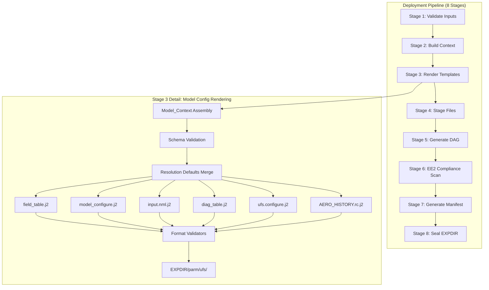

# Design Document: Templated Model Configs

## Overview

This document describes the technical design for converting static UFS model configuration files into Jinja2 templates rendered at deployment time. The system integrates as a sub-stage within the Deployment_Tool's Stage 3 (Render Templates) from the parent immutable-dag-workflow-modernization spec.

The design replaces 20+ static `field_table_*` variants, 7 `ufs.configure.*.IN` files, and 3 runtime shell generation scripts (`parsing_model_configure_FV3.sh`, `parsing_ufs_configure.sh`, `parsing_namelists_FV3.sh`) with 6 parameterized Jinja2 templates driven by a declarative `model` section in the Workflow_Configuration YAML.

Each rendered config lands in `<EXPDIR>/parm/ufs/` as an immutable artifact, eliminating runtime template resolution and ensuring bit-for-bit reproducibility across deployments.

## Architecture

### Integration with the 8-Stage Deployment Pipeline

The model config templating integrates into the existing Deployment_Tool pipeline at Stage 3:



### Rendering Flow

1. **Context Assembly** — The `model` section from the Workflow_Configuration YAML is extracted and merged with resolution-dependent defaults.
2. **Schema Validation** — Required keys are validated against the Model_Context schema; missing keys produce FATAL ERROR.
3. **Template Rendering** — Each `.j2` template under `dev/parm/ufs/` is rendered via the existing `TemplateRenderer` (wxflow/Jinja2).
4. **Format Validation** — Each rendered output is validated against its format-specific validator.
5. **Output Placement** — Validated files are written to `<EXPDIR>/parm/ufs/`.

## Components and Interfaces

### Component 1: Composable Component Architecture

**Traces to:** Requirement 10

The Workflow_Configuration YAML composes UFS components via nested includes. Each component declares its own `model` subsection, `families`, and `tasks`.

#### Directory Structure

```
dev/parm/components/
├── atmos.yaml        # Atmosphere (FV3) component
├── ocean.yaml        # Ocean (MOM6) component
├── ice.yaml          # Sea Ice (CICE6) component
├── wave.yaml         # Wave (WW3) component
└── gocart.yaml       # Aerosol (GOCART) component
```

#### Top-Level Workflow_Configuration with Component Includes

```yaml
# dev/parm/workflow/gfs_cycled.yaml (top-level)
suite:
  name: "gfs_v17"

components:
  - atmosphere
  - ocean
  - ice
  - wave
  - aerosol

model:
  resolution: "C384"
  physics_suite: "gfdl"
  coupling_mode: "s2swa"
  dt_atmos: 225
  output_grid: "gaussian_grid"
  output_fields: "standard"

  # Component-specific model sections merged from includes
  fv3: !INC dev/parm/components/atmos.yaml:model.fv3
  ocean: !INC dev/parm/components/ocean.yaml:model.ocean
  ice: !INC dev/parm/components/ice.yaml:model.ice
  wave: !INC dev/parm/components/wave.yaml:model.wave
  aerosol: !INC dev/parm/components/gocart.yaml:model.aerosol

  defaults:
    C48:
      npx: 49
      npy: 49
      layout: [1, 1]
      write_group: 1
      wrttask_per_group: 6
    C96:
      npx: 97
      npy: 97
      layout: [2, 2]
      write_group: 1
      wrttask_per_group: 24
    C384:
      npx: 385
      npy: 385
      layout: [6, 6]
      write_group: 2
      wrttask_per_group: 40
    C768:
      npx: 769
      npy: 769
      layout: [8, 12]
      write_group: 4
      wrttask_per_group: 80

families: !INC dev/parm/components/atmos.yaml:families
# Additional families merged from active components
```

#### Example Component YAML: `ocean.yaml`

```yaml
# dev/parm/components/ocean.yaml
model:
  ocean:
    resolution: "025"
    dt_ocean: 900
    tasks: 120
    output_dir: "./MOM6_OUTPUT"
    restart_dir: "./MOM6_RESTART"
    output_frequency_hours: 6

families:
  - path: "gfs/ocean"
    tasks:
      - name: "prep"
        trigger: "gfs/atmos/analysis/analcalc == complete"
        jjob: "JGLOBAL_OCEAN_PREP"
      - name: "post"
        trigger: "gfs/atmos/forecast/fcst == complete"
        jjob: "JGFS_OCEAN_POST"
```

#### Component Composition Resolution

When the Deployment_Tool processes the top-level YAML:

1. **Active component filtering** — Only components listed in `components:` are included.
2. **Model section merge** — Each component's `model.<component>` section is merged into the unified `model` dict.
3. **Family merge** — Each component's `families` are appended to the top-level families list.
4. **Cross-component dependency resolution** — Trigger references using fully qualified paths (e.g., `gfs/atmos/forecast/fcst == complete`) are resolved across component boundaries.
5. **Dangling reference removal** — If a component is excluded, any trigger references to its families are removed with a warning.

### Component 2: Template Design

**Traces to:** Requirements 1, 2, 3, 8

Each UFS model config file has a single Jinja2 template that replaces all static variants.

#### 2.1 `field_table.j2` — Tracer Configuration

Selects tracers based on `physics_suite`, `pbl_scheme`, and `progsigma`:

```jinja2
{# dev/parm/ufs/fv3/field_table.j2 #}
{# Traces to: Requirement 1 AC5-10, Requirement 6 AC1 #}




{# Base tracers present in all suites #}
# added by FRE: sphum must be present in atmos
# specific humidity for moist runs
 "TRACER", "atmos_mod", "sphum"
           "longname",     "specific humidity"
           "units",        "kg/kg"

       "profile_type", "fixed", "surface_value=3.e-6" /

       "profile_type", "fixed", "surface_value=1.e30" /

# prognostic cloud water mixing ratio
 "TRACER", "atmos_mod", "liq_wat"
           "longname",     "cloud water mixing ratio"
           "units",        "kg/kg"
       "profile_type", "fixed", "surface_value=1.e30" /

 "TRACER", "atmos_mod", "rainwat"
           "longname",     "rain mixing ratio"
           "units",        "kg/kg"
       "profile_type", "fixed", "surface_value=1.e30" /
 "TRACER", "atmos_mod", "ice_wat"
           "longname",     "cloud ice mixing ratio"
           "units",        "kg/kg"
       "profile_type", "fixed", "surface_value=1.e30" /
 "TRACER", "atmos_mod", "snowwat"
           "longname",     "snow mixing ratio"
           "units",        "kg/kg"
       "profile_type", "fixed", "surface_value=1.e30" /
 "TRACER", "atmos_mod", "graupel"
           "longname",     "graupel mixing ratio"
           "units",        "kg/kg"
       "profile_type", "fixed", "surface_value=1.e30" /


{# Thompson-specific: ice and rain number concentrations #}
 "TRACER", "atmos_mod", "ice_nc"
           "longname",     "cloud ice water number concentration"
           "units",        "/kg"
       "profile_type", "fixed", "surface_value=0.0" /
 "TRACER", "atmos_mod", "rain_nc"
           "longname",     "rain number concentration"
           "units",        "/kg"
       "profile_type", "fixed", "surface_value=0.0" /

{# Ozone tracer — all suites #}
 "TRACER", "atmos_mod", "o3mr"
           "longname",     "ozone mixing ratio"
           "units",        "kg/kg"
       "profile_type", "fixed", "surface_value=1.e30" /

{# TKE tracer for satmedmf PBL scheme #}
 "TRACER", "atmos_mod", "sgs_tke"
           "longname",     "subgrid scale turbulent kinetic energy"
           "units",        "m2/s2"
       "profile_type", "fixed", "surface_value=0.0" /


{# Prognostic sigma tracer #}
 "TRACER", "atmos_mod", "sigmab"
           "longname",     "sigma fraction"
           "units",        "fraction"
       "profile_type", "fixed", "surface_value=0.0" /


{# GFDL cloud amount tracer #}
 "TRACER", "atmos_mod", "cld_amt"
           "longname",     "cloud amount"
           "units",        "1"
       "profile_type", "fixed", "surface_value=1.e30" /

```

#### 2.2 `model_configure.j2` — FV3 Model Configuration

Renders key-value pairs from `model.fv3` context. Replaces `parsing_model_configure_FV3.sh` + `model_configure.IN`.

```jinja2
{# dev/parm/ufs/fv3/model_configure.j2 #}
{# Traces to: Requirement 1 AC3, Requirement 5 AC1 #}
print_esmf:          .true.
total_member:        1
PE_MEMBER01:         {{ model.fv3.total_tasks }}
start_year:          {{ model.start_date.year }}
start_month:         {{ model.start_date.month }}
start_day:           {{ model.start_date.day }}
start_hour:          {{ model.start_date.hour }}
start_minute:        0
start_second:        0
nhours_fcst:         ${FHMAX}
fhrot:               {{ model.fv3.fhrot | default(0) }}
dt_atmos:            {{ model.dt_atmos }}
atm_coupling_interval_sec: {{ model.dt_atmos }}
restart_interval:    {{ model.fv3.restart_interval }}
quilting:            {{ model.fv3.quilting | fortran_logical }}
quilting_restart:    {{ model.fv3.quilting_restart | default(model.fv3.quilting) | fortran_logical }}
write_groups:        {{ model.fv3.write_group }}
write_tasks_per_group: {{ model.fv3.wrttask_per_group }}
num_files:           {{ model.fv3.num_output_files | default(2) }}
filename_base:       'atm' 'sfc'
output_grid:         '{{ model.output_grid }}'
output_file:         '{{ model.fv3.output_filetype_atm }}' '{{ model.fv3.output_filetype_sfc }}'
imo:                 {{ model.fv3.imo }}
jmo:                 {{ model.fv3.jmo }}
output_fh:           {{ model.fv3.output_fh }}
iau_offset:          {{ model.fv3.iau_offset | default(0) }}
```

#### 2.3 `input.nml.j2` — Fortran Namelist

Renders Fortran namelist groups with proper `&group / end` formatting:

```jinja2
{# dev/parm/ufs/fv3/input.nml.j2 #}
{# Traces to: Requirement 1 AC4, Requirement 5 AC3 #}
&amip_interp_nml
  interp_oi_sst = .true.
  use_ncep_sst = .true.
  use_ncep_ice = .false.
  no_anom_sst = .false.
  data_set = 'reynolds_oi'
/

&atmos_model_nml
  blocksize = {{ model.fv3.blocksize | default(32) }}
  chksum_debug = .false.
  dycore_only = .false.
  ccpp_suite = '{{ model.fv3.ccpp_suite | default("FV3_GFS_v17_p8") }}'
/

&fv_core_nml
  layout = {{ model.fv3.layout[0] }},{{ model.fv3.layout[1] }}
  io_layout = {{ model.fv3.io_layout[0] }},{{ model.fv3.io_layout[1] }}
  npx = {{ model.fv3.npx }}
  npy = {{ model.fv3.npy }}
  npz = {{ model.fv3.npz }}
  ntiles = 6
  dt_atmos = {{ model.dt_atmos }}
  
  hydrostatic = .false.
  
  hydrostatic = .true.
  
  d2_bg_k1 = {{ model.fv3.d2_bg_k1 | default(0.20) }}
  d2_bg_k2 = {{ model.fv3.d2_bg_k2 | default(0.04) }}
  dz_min = {{ model.fv3.dz_min | default(6) }}
  n_sponge = {{ model.fv3.n_sponge | default(42) }}
  hord_mt = {{ model.fv3.hord_mt | default(5) }}
  hord_vt = {{ model.fv3.hord_vt | default(5) }}
  hord_tm = {{ model.fv3.hord_tm | default(5) }}
  hord_dp = {{ model.fv3.hord_dp | default(-5) }}
  nord = {{ model.fv3.nord | default(2) }}
  dddmp = {{ model.fv3.dddmp | default(0.1) }}
  d4_bg = {{ model.fv3.d4_bg | default(0.12) }}
/

&gfs_physics_nml
  imp_physics = {{ model.fv3.imp_physics }}
  dnats = {{ model.fv3.dnats | default(0) }}
  do_sat_adj = {{ model.fv3.do_sat_adj | default(false) | fortran_logical }}
  progsigma = {{ model.progsigma | default(true) | fortran_logical }}
  satmedmf = {{ (model.pbl_scheme == 'satmedmf') | fortran_logical }}
/
```

#### 2.4 `diag_table.j2` — Output Field Selection

Selects output fields based on `model.output_fields` and active components:

```jinja2
{# dev/parm/ufs/fv3/diag_table.j2 #}
{# Traces to: Requirement 1 AC1, Requirement 8 AC1 #}
"fv3_history",    0,  "hours",  1,  "hours",  "time"
"fv3_history2d",  0,  "hours",  1,  "hours",  "time"

"{{ model.ocean.output_dir }}/ocn%4yr%2mo%2dy%2hr%2mi", {{ model.ocean.output_frequency_hours }},  "hours",  1,  "hours",  "time",  {{ model.ocean.output_frequency_hours }},  "hours",  "{{ model.start_date.year }} {{ model.start_date.month }} {{ model.start_date.day }} {{ model.start_date.hour }} 0 0"


{# Atmosphere dynamic fields #}
"gfs_dyn",     "ucomp",       "ugrd",         "fv3_history",    "all",  .false.,  "none",  2
"gfs_dyn",     "vcomp",       "vgrd",         "fv3_history",    "all",  .false.,  "none",  2
"gfs_dyn",     "sphum",       "spfh",         "fv3_history",    "all",  .false.,  "none",  2
"gfs_dyn",     "temp",        "tmp",          "fv3_history",    "all",  .false.,  "none",  2
{# ... standard atmosphere fields ... #}


{# Ocean fields #}
"ocean_model", "SSH",        "SSH",       "{{ model.ocean.output_dir }}/ocn%4yr%2mo%2dy%2hr%2mi",  "all",  .true.,  "none",  2
"ocean_model", "SST",        "SST",       "{{ model.ocean.output_dir }}/ocn%4yr%2mo%2dy%2hr%2mi",  "all",  .true.,  "none",  2
{# ... additional ocean fields ... #}

```

#### 2.5 `ufs.configure.j2` — ESMF/NUOPC Coupling Configuration

Generates the coupling run sequence based on `coupling_mode` and active components:

```jinja2
{# dev/parm/ufs/ufs.configure.j2 #}
{# Traces to: Requirement 2, Requirement 8 AC2 #}
#############################################
####  NEMS Run-Time Configuration File  #####
#############################################

EARTH_component_list: {{ comp | upper }} 

EARTH_attributes::
  Verbosity = 0
  Diagnostic = 0
::


ATM_model:                      {{ model.fv3.atm_model | default('fv3') }}
ATM_petlist_bounds:             0 {{ model.fv3.total_tasks - 1 }}
ATM_omp_num_threads:            {{ model.fv3.omp_threads | default(1) }}



OCN_model:                      mom6
OCN_petlist_bounds:             {{ model.fv3.total_tasks }} {{ model.fv3.total_tasks + model.ocean.tasks - 1 }}
OCN_omp_num_threads:            {{ model.ocean.omp_threads | default(1) }}



ICE_model:                      cice6
ICE_petlist_bounds:             {{ model.fv3.total_tasks + model.ocean.tasks }} {{ model.fv3.total_tasks + model.ocean.tasks + model.ice.nprocs - 1 }}
ICE_omp_num_threads:            {{ model.ice.omp_threads | default(1) }}



WAV_model:                      ww3
WAV_petlist_bounds:             {{ pet_offset_wave }} {{ pet_offset_wave + model.wave.tasks - 1 }}
WAV_omp_num_threads:            {{ model.wave.omp_threads | default(1) }}



CHM_model:                      gocart
CHM_petlist_bounds:             0 {{ model.fv3.total_tasks - 1 }}
CHM_omp_num_threads:            {{ model.fv3.omp_threads | default(1) }}



MED_model:                      cmeps
MED_petlist_bounds:             0 {{ model.fv3.total_tasks - 1 }}
MED_omp_num_threads:            {{ model.fv3.omp_threads | default(1) }}


{# Run Sequence — coupling mode determines the sequence structure #}
runSeq::

  @{{ model.dt_atmos }}
    ATM
  @

  @{{ model.dt_atmos }}
    ATM -> CHM
    CHM -> ATM
    ATM
    CHM
  @

  @{{ model.coupling_interval_slow }}
    MED med_phases_prep_ocn
    MED med_phases_ocnalb_run
    MED -> OCN :remapMethod=redist
    OCN
    @{{ model.coupling_interval_fast }}
      MED med_phases_prep_atm
      MED med_phases_prep_ice
      MED -> ATM :remapMethod=redist
      MED -> ICE :remapMethod=redist
      ATM

      ATM -> CHM
      CHM
      CHM -> ATM

      ICE
      ATM -> MED :remapMethod=redist
      ICE -> MED :remapMethod=redist
      MED med_phases_post_atm
      MED med_phases_post_ice
    @
    OCN -> MED :remapMethod=redist
    MED med_phases_post_ocn
  @

  @{{ model.coupling_interval_slow }}
    MED med_phases_prep_ocn
    MED med_phases_ocnalb_run
    MED -> OCN :remapMethod=redist
    OCN
    @{{ model.coupling_interval_fast }}
      MED med_phases_prep_atm
      MED med_phases_prep_ice
      MED med_phases_prep_wav
      MED -> ATM :remapMethod=redist
      MED -> ICE :remapMethod=redist
      MED -> WAV :remapMethod=redist
      ATM

      ATM -> CHM
      CHM
      CHM -> ATM

      ICE
      WAV
      ATM -> MED :remapMethod=redist
      ICE -> MED :remapMethod=redist
      WAV -> MED :remapMethod=redist
      MED med_phases_post_atm
      MED med_phases_post_ice
      MED med_phases_post_wav
    @
    OCN -> MED :remapMethod=redist
    MED med_phases_post_ocn
  @

::
```

#### 2.6 `AERO_HISTORY.rc.j2` — GOCART Collections

Renders active collections and grid labels based on `model.aerosol`:

```jinja2
{# dev/parm/ufs/gocart/AERO_HISTORY.rc.j2 #}
{# Traces to: Requirement 3 #}
#######################################################################
#                 Create History List for Output
#######################################################################

VERSION: 1
EXPID:  gocart
EXPDSC: GOCART2g_diagnostics_at_{{ model.resolution | lower }}
EXPSRC: GEOSgcm-v10.16.0
Allow_Overwrite: .true.

COLLECTIONS: '{{ coll }}'
             

             ::

GRID_LABELS: {{ model.aerosol.grid_label }}
::

{{ model.aerosol.grid_label }}.GRID_TYPE: LatLon
{{ model.aerosol.grid_label }}.IM_WORLD: {{ model.aerosol.grid_im }}
{{ model.aerosol.grid_label }}.JM_WORLD: {{ model.aerosol.grid_jm }}
{{ model.aerosol.grid_label }}.POLE: PC
{{ model.aerosol.grid_label }}.DATELINE: DC
{{ model.aerosol.grid_label }}.LM: {{ model.fv3.npz }}




```

### Component 3: Model_Context Schema

**Traces to:** Requirement 4

## Data Models

### Model_Context Schema (Full YAML)

```yaml
model:
  # ─── Top-Level Keys ───────────────────────────────────────────────
  resolution: "C384"                    # Required: C48|C96|C384|C768|C1152
  physics_suite: "gfdl"                 # Required: gfdl|thompson|wsm6|zhaocarr
  coupling_mode: "s2swa"               # Required: atm|atmaero|s2s|s2sa|s2sw|s2swa|leapfrog_atm_wav
  dt_atmos: 225                         # Required: positive int (seconds)
  output_grid: "gaussian_grid"          # Required: gaussian_grid|regional_latlon|...
  output_fields: "standard"             # Required: standard|da|aod|aero
  pbl_scheme: "satmedmf"               # Optional: satmedmf|default (default: satmedmf)
  progsigma: true                       # Optional: bool (default: true)
  coupling_interval_slow: 1800          # Slow coupling interval (seconds)
  coupling_interval_fast: 225           # Fast coupling interval (seconds)
  active_components:                    # Derived from top-level `components:` list
    - atmosphere
    - ocean
    - ice
    - wave
    - aerosol

  # ─── model.fv3 ───────────────────────────────────────────────────
  fv3:
    npx: 385                            # Grid points per tile edge (x)
    npy: 385                            # Grid points per tile edge (y)
    npz: 127                            # Vertical levels
    layout: [6, 6]                      # [layout_x, layout_y]
    io_layout: [1, 1]                   # [io_layout_x, io_layout_y]
    quilting: true                       # Enable quilting for output
    write_group: 2                      # Number of write groups
    wrttask_per_group: 40               # Write tasks per group
    restart_interval: 12                # Hours between restart writes
    blocksize: 32                       # Physics block size
    total_tasks: 216                    # Total ATM PETs (layout_x * layout_y * 6)
    omp_threads: 1                      # OpenMP threads
    type: "nh"                          # nh (non-hydrostatic) or hydro
    imp_physics: 11                     # Microphysics: 99=ZhaoCarr, 6=WSM6, 8=Thompson, 11=GFDL
    ccpp_suite: "FV3_GFS_v17_p8"       # CCPP suite name
    fhrot: 0                            # Forecast hour rotation
    imo: 1536                           # Output grid longitude points
    jmo: 768                            # Output grid latitude points
    output_fh: "0 1 2 3 6 12"          # Output forecast hours
    iau_offset: 0                       # IAU offset hours
    output_filetype_atm: "netcdf"       # ATM output format
    output_filetype_sfc: "netcdf"       # SFC output format
    num_output_files: 2                 # Number of output file types
    quilting_restart: true              # Quilting for restart files
    d2_bg_k1: 0.20                      # Sponge layer parameter
    d2_bg_k2: 0.04                      # Sponge layer parameter
    dz_min: 6                           # Minimum layer thickness
    n_sponge: 42                        # Number of sponge layers
    hord_mt: 5                          # Horizontal advection scheme
    hord_vt: 5
    hord_tm: 5
    hord_dp: -5
    nord: 2                             # Divergence damping order
    dddmp: 0.1                          # Divergence damping coefficient
    d4_bg: 0.12                         # Background diffusion
    dnats: 1                            # Non-advected tracers (GFDL)
    do_sat_adj: true                    # Saturation adjustment (GFDL)

  # ─── model.ocean ─────────────────────────────────────────────────
  ocean:
    resolution: "025"                   # Ocean grid: 025|050|100|500
    dt_ocean: 900                       # Ocean timestep (seconds)
    tasks: 120                          # Ocean PET count
    omp_threads: 1                      # Ocean OpenMP threads
    output_dir: "./MOM6_OUTPUT"         # MOM6 output directory
    restart_dir: "./MOM6_RESTART"       # MOM6 restart directory
    output_frequency_hours: 6           # Ocean output frequency
    use_mommesh: true                   # Use MOM6 mesh file

  # ─── model.ice ───────────────────────────────────────────────────
  ice:
    resolution: "025"                   # Ice grid (matches ocean)
    nprocs: 48                          # Ice PET count
    omp_threads: 1                      # Ice OpenMP threads
    decomposition: "slenderX2"          # CICE decomposition method
    dt_ice: 900                         # Ice timestep (seconds)
    restart_interval: 6                 # Hours between ice restarts

  # ─── model.wave ──────────────────────────────────────────────────
  wave:
    resolution: "gwes_30m"              # Wave grid identifier
    tasks: 100                          # Wave PET count
    omp_threads: 1                      # Wave OpenMP threads
    mesh: "mesh.ww3.gwes_30m"           # WW3 mesh file
    dt_wave: 900                        # Wave timestep (seconds)
    output_frequency_hours: 6           # Wave output frequency

  # ─── model.aerosol ──────────────────────────────────────────────
  aerosol:
    emission_dataset: "qfed"            # qfed|gbbepx|none
    active_collections:                 # GOCART output collections
      - "inst_aod"
    grid_label: "PC720x361-DC"          # Output grid label
    grid_im: 720                        # Grid longitude dimension
    grid_jm: 361                        # Grid latitude dimension

  # ─── model.defaults ─────────────────────────────────────────────
  defaults:
    C48:
      npx: 49
      npy: 49
      layout: [1, 1]
      write_group: 1
      wrttask_per_group: 6
      imo: 192
      jmo: 94
    C96:
      npx: 97
      npy: 97
      layout: [2, 2]
      write_group: 1
      wrttask_per_group: 24
      imo: 384
      jmo: 190
    C384:
      npx: 385
      npy: 385
      layout: [6, 6]
      write_group: 2
      wrttask_per_group: 40
      imo: 1536
      jmo: 768
    C768:
      npx: 769
      npy: 769
      layout: [8, 12]
      write_group: 4
      wrttask_per_group: 80
      imo: 3072
      jmo: 1536
```

### Resolution Default Merge Logic

When the Deployment_Tool assembles the Model_Context:

1. Look up `model.resolution` in `model.defaults` (e.g., `C384`).
2. For each key in the defaults entry, set it in `model.fv3` only if not already explicitly provided.
3. Explicit `model.fv3` values always override defaults (Requirement 4 AC7).

```python
def merge_resolution_defaults(model_context: dict) -> dict:
    """Merge resolution-dependent defaults into model.fv3."""
    resolution = model_context['resolution']
    defaults = model_context.get('defaults', {}).get(resolution, {})
    fv3 = model_context.get('fv3', {})
    for key, value in defaults.items():
        if key not in fv3:
            fv3[key] = value
    model_context['fv3'] = fv3
    return model_context
```

### Component 4: Format Validators

**Traces to:** Requirement 7

Each rendered config file passes through a format-specific validator before being written to the EXPDIR.

#### 4.1 `model_configure` Validator

Format: One key-value pair per line. Values are string, integer, float, logical (`.true.`/`.false.`), or ISO-8601 date.

```python
class ModelConfigureValidator:
    """Validates FV3 model_configure key:value format."""

    VALID_LINE = re.compile(
        r'^(\w+):\s+(.+)$'
    )
    LOGICAL = re.compile(r'^\.(true|false)\.$', re.IGNORECASE)
    INTEGER = re.compile(r'^-?\d+$')
    FLOAT = re.compile(r'^-?\d+\.\d*$')

    def validate(self, content: str, filepath: str) -> list[str]:
        errors = []
        for lineno, line in enumerate(content.splitlines(), 1):
            line = line.strip()
            if not line or line.startswith('#'):
                continue
            match = self.VALID_LINE.match(line)
            if not match:
                errors.append(
                    f"{filepath}:{lineno}: Invalid key:value format: '{line}'"
                )
        return errors
```

#### 4.2 `input.nml` Validator (Fortran Namelist)

Format: `&group_name` opens a group, `/` closes it. Variables are `name = value` with Fortran types.

```python
class NamelistValidator:
    """Validates Fortran namelist syntax."""

    def validate(self, content: str, filepath: str) -> list[str]:
        errors = []
        in_group = False
        group_name = None
        for lineno, line in enumerate(content.splitlines(), 1):
            stripped = line.strip()
            if not stripped or stripped.startswith('!'):
                continue
            if stripped.startswith('&'):
                if in_group:
                    errors.append(
                        f"{filepath}:{lineno}: Nested group '{stripped}' "
                        f"inside unclosed group '&{group_name}'"
                    )
                group_name = stripped[1:]
                in_group = True
            elif stripped == '/':
                if not in_group:
                    errors.append(
                        f"{filepath}:{lineno}: Group terminator '/' "
                        f"without matching '&group'"
                    )
                in_group = False
                group_name = None
            elif in_group:
                # Validate variable assignment
                if '=' not in stripped and not stripped.startswith('!'):
                    errors.append(
                        f"{filepath}:{lineno}: Expected 'var = value' "
                        f"inside &{group_name}"
                    )
        if in_group:
            errors.append(
                f"{filepath}: Unclosed namelist group '&{group_name}'"
            )
        return errors
```

#### 4.3 `diag_table` Validator (FMS Format)

Format: File entries have 6 columns, field entries have 8 columns. Lines are comma-separated quoted strings and values.

```python
class DiagTableValidator:
    """Validates FMS diag_table format."""

    def validate(self, content: str, filepath: str) -> list[str]:
        errors = []
        lines = content.splitlines()
        for lineno, line in enumerate(lines, 1):
            stripped = line.strip()
            if not stripped or stripped.startswith('#'):
                continue
            # File entries: "name", freq, "units", format, "time_units", "long_name"
            # Field entries: "module", "field", "output", "file", "time", avg, "opts", pack
            parts = [p.strip() for p in stripped.split(',')]
            # Heuristic: field entries start with a quoted module name
            if stripped.startswith('"') and len(parts) >= 6:
                if len(parts) not in (6, 7, 8):
                    errors.append(
                        f"{filepath}:{lineno}: Expected 6-8 columns, "
                        f"got {len(parts)}"
                    )
        return errors
```

#### 4.4 `ufs.configure` Validator (ESMF Config)

Format: `label: value` attributes, `label::` opens a block, `::` closes it. `runSeq::` contains the coupling sequence.

```python
class ESMFConfigValidator:
    """Validates ESMF/NUOPC configuration syntax."""

    def validate(self, content: str, filepath: str) -> list[str]:
        errors = []
        block_stack = []
        for lineno, line in enumerate(content.splitlines(), 1):
            stripped = line.strip()
            if not stripped or stripped.startswith('#'):
                continue
            # Block opener: "label::" (not just "::")
            if stripped.endswith('::') and stripped != '::':
                block_name = stripped[:-2].strip()
                block_stack.append((block_name, lineno))
            elif stripped == '::':
                if not block_stack:
                    errors.append(
                        f"{filepath}:{lineno}: Closing '::' without "
                        f"matching block opener"
                    )
                else:
                    block_stack.pop()
            # Attribute line: "label: value" (outside blocks is fine)
        for block_name, open_line in block_stack:
            errors.append(
                f"{filepath}:{open_line}: Unclosed block '{block_name}::'"
            )
        return errors
```

#### 4.5 `field_table` Validator (FMS Field Table)

Format: Tracer blocks with `"TRACER", "module", "name"` header, attribute lines, terminated by `/`.

```python
class FieldTableValidator:
    """Validates FMS field_table format."""

    TRACER_HEADER = re.compile(
        r'^\s*"TRACER"\s*,\s*"(\w+)"\s*,\s*"(\w+)"'
    )

    def validate(self, content: str, filepath: str) -> list[str]:
        errors = []
        in_tracer = False
        tracer_name = None
        tracer_line = 0
        for lineno, line in enumerate(content.splitlines(), 1):
            stripped = line.strip()
            if not stripped or stripped.startswith('#'):
                continue
            header = self.TRACER_HEADER.match(stripped)
            if header:
                if in_tracer:
                    errors.append(
                        f"{filepath}:{lineno}: New tracer '{header.group(2)}' "
                        f"before closing '/' for '{tracer_name}' "
                        f"(opened line {tracer_line})"
                    )
                in_tracer = True
                tracer_name = header.group(2)
                tracer_line = lineno
            elif stripped.endswith('/'):
                if not in_tracer:
                    errors.append(
                        f"{filepath}:{lineno}: Tracer terminator '/' "
                        f"without matching TRACER header"
                    )
                in_tracer = False
                tracer_name = None
        if in_tracer:
            errors.append(
                f"{filepath}: Unclosed tracer block '{tracer_name}' "
                f"(opened line {tracer_line})"
            )
        return errors
```

### Component 5: atparse Migration

**Traces to:** Requirement 8

## atparse-to-Jinja2 Migration

The legacy `atparse` utility uses `@[VAR]` syntax for variable substitution. This is a simple text replacement with no conditionals, loops, or includes.

### Conversion Rules

| atparse Pattern | Jinja2 Equivalent | Notes |
|----------------|-------------------|-------|
| `@[VAR_NAME]` | `{{ var_name }}` | Variable names lowercased per Python convention |
| `@[MOM6_OUTPUT_DIR]` | `{{ model.ocean.output_dir }}` | Mapped to Model_Context path |
| `@[FHOUT_OCN]` | `{{ model.ocean.output_frequency_hours }}` | Mapped to semantic key |
| `@[SYEAR]` | `{{ model.start_date.year }}` | Date components from context |
| `@[inst_aod_freq]` | `{{ model.aerosol.frequencies.inst_aod }}` | Collection frequencies |

### Migration Script

A one-time conversion script handles the mechanical transformation:

```python
def atparse_to_jinja2(content: str, var_mapping: dict[str, str]) -> str:
    """Convert @[VAR] patterns to {{ jinja2_expr }}.

    Args:
        content: File content with @[VAR] patterns.
        var_mapping: Maps uppercase atparse names to Jinja2 expressions.

    Returns:
        Content with Jinja2 syntax.
    """
    def replace_match(match):
        var_name = match.group(1)
        if var_name in var_mapping:
            return '{{ ' + var_mapping[var_name] + ' }}'
        # Default: lowercase the variable name
        return '{{ ' + var_name.lower() + ' }}'

    return re.sub(r'@\[(\w+)\]', replace_match, content)
```

### Shell Variable Preservation

Variables that must expand at runtime (e.g., `${PDY}`, `${cyc}`, `${FHMAX}`) are preserved by the Template_Renderer's existing shell variable protection mechanism (regex: `\$\{[A-Z_][A-Z0-9_]*\}`). These pass through Jinja2 rendering untouched.

## Backward Compatibility

**Traces to:** Requirement 11

### Fallback Mechanism

During incremental migration, the Deployment_Tool supports a `template_overrides` list:

```yaml
model:
  template_overrides:
    # Files using new Jinja2 templates (explicit opt-in during migration)
    - field_table
    - model_configure
    # Files NOT listed here fall back to static copy
```

#### Resolution Logic

```python
def resolve_config_source(config_name: str, model_context: dict) -> tuple[str, str]:
    """Determine whether to render a template or copy a static file.

    Returns:
        Tuple of (method, path) where method is 'render' or 'copy'.
    """
    template_overrides = model_context.get('template_overrides', [])
    j2_path = f"dev/parm/ufs/fv3/{config_name}.j2"
    static_path = f"parm/ufs/fv3/{config_name}"

    if Path(j2_path).exists():
        if config_name not in template_overrides:
            # Template exists but not in overrides — warn and use template
            logger.warning(
                f"Both template and static file exist for '{config_name}'. "
                f"Using template; static file is deprecated."
            )
        return ('render', j2_path)
    elif Path(static_path).exists():
        return ('copy', static_path)
    else:
        raise TemplateRenderError(
            f"No template or static file found for '{config_name}'"
        )
```

### Byte Compatibility

Rendered configs must be byte-compatible with UFS model expectations:
- Fortran namelists: exact whitespace in `&group` / `/` delimiters
- diag_table: column alignment preserved via Jinja2 whitespace control (``)
- field_table: leading spaces in tracer attribute lines preserved exactly

## Error Handling

### Deployment-Time Errors

| Condition | Response |
|-----------|----------|
| Missing required `model` key | FATAL ERROR: "Missing required key 'model.fv3.npx' in Workflow_Configuration" |
| Unsupported `physics_suite` value | FATAL ERROR: "Unsupported physics_suite 'xyz' in field_table.j2. Supported: gfdl, thompson, wsm6, zhaocarr" |
| Unsupported `coupling_mode` value | FATAL ERROR: "Unsupported coupling_mode 'xyz' in ufs.configure.j2" |
| Format validation failure | FATAL ERROR: "Format validation failed for model_configure:15 — Invalid key:value format" |
| Undefined template variable | FATAL ERROR: "Undefined variable 'model.fv3.npx' in input.nml.j2:42" |
| Component YAML not found | FATAL ERROR: "Component YAML 'dev/parm/components/ocean.yaml' not found" |
| Circular component dependency | FATAL ERROR: "Circular dependency detected in component includes" |

### Runtime Errors (eliminated by design)

Since all config files are rendered at deployment time, the following runtime errors are eliminated:
- `atparse` variable not set → caught at deploy time by strict undefined
- Template file not found → caught at deploy time by searchpath resolution
- Invalid config format → caught at deploy time by format validators

## Testing Strategy

### Unit Tests

- **Model_Context schema validation**: Verify required keys, type checking, default merging
- **Resolution defaults merge**: Verify explicit values override defaults
- **Format validators**: Known-good and known-bad inputs for each format
- **atparse conversion**: Verify `@[VAR]` → `{{ var }}` mapping correctness
- **Component composition**: Verify merge logic for families and model sections

### Integration Tests

- **Full rendering pipeline**: Render all templates for each supported physics_suite × coupling_mode combination
- **Legacy equivalence**: Compare rendered output against legacy static files for each variant
- **Component add/remove**: Verify DAG validity when components are included/excluded
- **Fallback mechanism**: Verify static file copy when template_overrides excludes a file

### Property-Based Tests

Property-based testing is appropriate for this feature because:
- Template rendering is a pure function (context → rendered string)
- The input space is large (many combinations of physics_suite × pbl_scheme × progsigma × coupling_mode × resolution)
- Universal properties hold across all valid inputs (format validity, equivalence, composition)
- Cost is low (in-memory rendering, no external services)

**Library:** Python `hypothesis` (already present in the repository's `.hypothesis/` directory)

**Configuration:** Minimum 100 iterations per property test.

## File Structure (New/Modified)

```
dev/
├── parm/
│   ├── ufs/
│   │   ├── fv3/
│   │   │   ├── field_table.j2          # NEW: Replaces 20+ field_table_* variants
│   │   │   ├── model_configure.j2      # NEW: Replaces model_configure.IN + parsing script
│   │   │   ├── input.nml.j2            # NEW: Replaces parsing_namelists_FV3.sh
│   │   │   └── diag_table.j2           # NEW: Replaces diag_table + variants
│   │   ├── ufs.configure.j2            # NEW: Replaces 7 ufs.configure.*.IN files
│   │   └── gocart/
│   │       ├── AERO_HISTORY.rc.j2      # NEW: Replaces AERO_HISTORY.rc
│   │       ├── ExtData.j2              # NEW: Replaces ExtData.qfed/gbbepx/none
│   │       └── collections/            # NEW: Per-collection field definitions
│   │           ├── inst_aod.j2
│   │           ├── inst_du_ss.j2
│   │           └── ...
│   └── components/
│       ├── atmos.yaml                  # NEW: Atmosphere component definition
│       ├── ocean.yaml                  # NEW: Ocean component definition
│       ├── ice.yaml                    # NEW: Ice component definition
│       ├── wave.yaml                   # NEW: Wave component definition
│       └── gocart.yaml                 # NEW: Aerosol component definition
├── workflow/
│   └── deployment/
│       ├── model_config_renderer.py    # NEW: Model config rendering orchestration
│       └── validators/
│           ├── __init__.py             # NEW
│           ├── model_configure.py      # NEW: Key-value format validator
│           ├── namelist.py             # NEW: Fortran namelist validator
│           ├── diag_table.py           # NEW: FMS diag_table validator
│           ├── esmf_config.py          # NEW: ESMF config validator
│           └── field_table.py          # NEW: FMS field_table validator
└── test/
    └── test_model_configs/
        ├── test_field_table.py         # NEW: field_table rendering tests
        ├── test_model_configure.py     # NEW: model_configure rendering tests
        ├── test_input_nml.py           # NEW: input.nml rendering tests
        ├── test_ufs_configure.py       # NEW: ufs.configure rendering tests
        ├── test_validators.py          # NEW: Format validator tests
        ├── test_composition.py         # NEW: Component composition tests
        └── test_properties.py          # NEW: Property-based tests
```

### Files Deleted (after template validation)

| Path | Reason |
|------|--------|
| `parm/ufs/fv3/field_table_*` (20 files) | Replaced by `field_table.j2` |
| `parm/ufs/ufs.configure.*.IN` (7 files) | Replaced by `ufs.configure.j2` |
| `parm/ufs/gocart/ExtData.qfed` | Replaced by `ExtData.j2` |
| `parm/ufs/gocart/ExtData.gbbepx` | Replaced by `ExtData.j2` |
| `parm/ufs/gocart/ExtData.none` | Replaced by `ExtData.j2` |
| `parm/ufs/fv3/diag_table_aod` | Replaced by `diag_table.j2` |
| `parm/ufs/fv3/diag_table_da` | Replaced by `diag_table.j2` |
| `parm/ufs/fv3/diag_table.aero` | Replaced by `diag_table.j2` |

### Files Modified

| File | Change |
|------|--------|
| `ush/forecast_postdet.sh` | Remove calls to `parsing_model_configure_FV3.sh`, `parsing_ufs_configure.sh`, `parsing_namelists_FV3.sh`. Read pre-rendered configs from `${EXPDIR}/parm/ufs/`. |
| `scripts/exglobal_forecast.sh` | Remove runtime config generation. Copy pre-rendered files to `${DATA}/`. |
| `dev/parm/workflow/gfs_cycled.yaml` | Add `model:` section and `components:` list. |
| `dev/workflow/deployment/pipeline.py` | Add model config rendering sub-stage to Stage 3. |


## Correctness Properties

*A property is a characteristic or behavior that should hold true across all valid executions of a system — essentially, a formal statement about what the system should do. Properties serve as the bridge between human-readable specifications and machine-verifiable correctness guarantees.*

### Property 1: Template Equivalence (field_table)

*For any* supported combination of (physics_suite, pbl_scheme, progsigma), rendering `field_table.j2` with the corresponding Model_Context SHALL produce a tracer list identical in name, order, and attributes to the corresponding legacy static file (e.g., `field_table_gfdl_satmedmf_progsigma`).

**Validates: Requirements 1.5, 1.6, 1.7, 1.8, 1.10, 6.1**

### Property 2: Template Equivalence (ufs.configure)

*For any* supported coupling_mode and valid component task counts, rendering `ufs.configure.j2` with the corresponding Model_Context SHALL produce output functionally equivalent to what `atparse` would produce from the corresponding legacy `.IN` file given the same variable values.

**Validates: Requirements 2.2, 2.3, 2.4, 2.5, 2.6, 6.2, 8.4**

### Property 3: Format Validity

*For any* valid Model_Context (any supported resolution × physics_suite × coupling_mode × component set), every rendered UFS_Model_Config file SHALL pass its format-specific validator without errors:
- `model_configure` passes ModelConfigureValidator
- `input.nml` passes NamelistValidator
- `diag_table` passes DiagTableValidator
- `ufs.configure` passes ESMFConfigValidator
- `field_table` passes FieldTableValidator

**Validates: Requirements 7.1, 7.2, 7.3, 7.4, 7.5**

### Property 4: No Legacy atparse Tokens

*For any* valid Model_Context, no rendered UFS_Model_Config file SHALL contain the legacy `@[...]` atparse substitution pattern. All variable references must be resolved by Jinja2 at deployment time.

**Validates: Requirements 8.1, 8.2, 8.3**

### Property 5: Component Composition Validity

*For any* non-empty subset of supported components (atmosphere, ocean, ice, wave, aerosol), composing the corresponding component YAMLs SHALL produce:
1. A merged Model_Context containing exactly the union of each included component's `model.<component>` section
2. A valid DAG with no dangling trigger references
3. No FATAL ERROR for template variables belonging to excluded components

**Validates: Requirements 10.3, 10.4, 10.7, 10.9**

### Property 6: Schema Validation and Default Override

*For any* required key in the Model_Context schema, removing that key from the context SHALL cause the Template_Renderer to emit a FATAL ERROR identifying the missing key. Additionally, *for any* key present in both `model.fv3` (explicit) and `model.defaults[resolution]`, the merged context SHALL contain the explicit `model.fv3` value.

**Validates: Requirements 4.1, 4.5, 4.7**

### Property 7: Shell Variable Preservation

*For any* rendered UFS_Model_Config file, all `${VAR}` shell variable patterns (matching `\$\{[A-Z_][A-Z0-9_]*\}`) present in the source template SHALL appear verbatim in the rendered output, unmodified by Jinja2 resolution.

**Validates: Requirements 5.5, 11.4**

### Property 8: Manifest Completeness

*For any* valid deployment, every rendered UFS_Model_Config file SHALL appear in the EXPDIR `manifest.yaml` with a SHA-256 hash that matches the on-disk file content.

**Validates: Requirements 9.5, 3.5**

### Property 9: Fallback Resolution

*For any* UFS_Model_Config file name:
- If a `.j2` template exists, the template SHALL be rendered (regardless of `template_overrides`).
- If only a static file exists, the static file SHALL be copied verbatim.
- If both exist, the template SHALL be preferred and a deprecation warning SHALL be emitted.

**Validates: Requirements 11.1, 11.2, 11.3**
