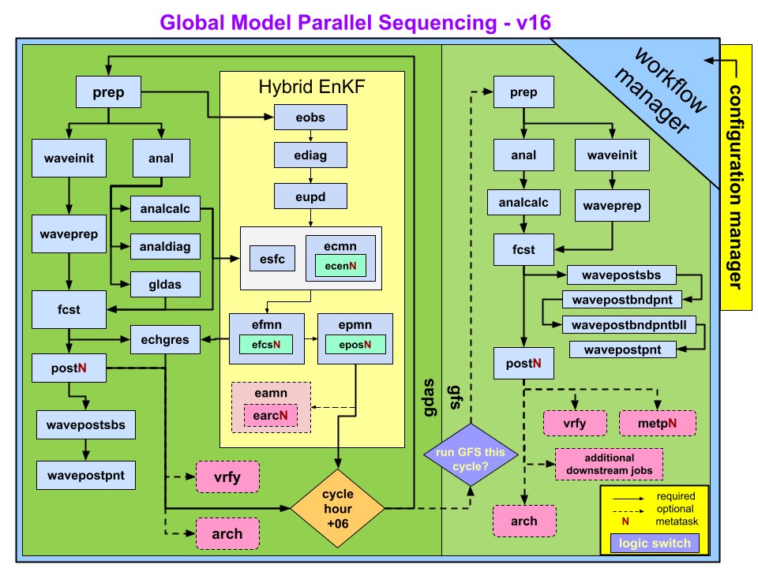

#################
GFS Configuration
#################

   Schematic flow chart for GFS v16 in operations

The sequence of jobs that are run for an end-to-end (analysis+forecast+post processing+verification) GFS configuration using the Global Workflow is shown above. The system utilizes a collection of scripts that perform the tasks for each step.

For any cycle the system consists of two suites -- the "gdas" suite which provides the initial guess fields, and the "gfs" suite which creates the initial conditions and forecast of the system.

An experimental run is different from operations in the following ways:

* Workflow manager: operations utilizes `ecFlow <https://www.ecmwf.int/en/learning/training/introduction-ecmwf-job-scheduler-ecflow>`__, while development currently utilizes `ROCOTO <https://github.com/christopherwharrop/rocoto/wiki/documentation>`__. Note, experiments can also be run using ecFlow on platforms with ecFlow servers established.

* Dump step is not run as it has already been completed during the real-time production runs and dump data is available in the global dump archive on supported machines.

* Addition steps in experimental mode:

  - archive (arch)

  - cleanup (cleanup)

Downstream jobs (e.g. awips, gempak, etc.) are not included in the diagram. Those jobs are not normally run in developmental tests.

=============================
Jobs in the GFS Configuration
=============================
+-------------------+-----------------------------------------------------------------------------------------------------------------------+
| JOB NAME          | PURPOSE                                                                                                               |
+===================+=======================================================================================================================+
| anal              | Runs the analysis. 1) Runs the atmospheric analysis (global_gsi) to produce analysis increments; 2) Update surface    |
|                   | guess file via global_cycle to create surface analysis on tiles.                                                      |
+-------------------+-----------------------------------------------------------------------------------------------------------------------+
| analcalc          | Adds the analysis increments to previous cycle’s forecasts to produce atmospheric analysis files. Produces surface    |
|                   | analysis file on Gaussian grid.                                                                                       |
+-------------------+-----------------------------------------------------------------------------------------------------------------------+
| analdiag          | Creates netCDF diagnostic files containing observation values, innovation (O-F), error, quality control, as well as   |
|                   | other analysis-related quantities (cnvstat, radstat, ozstat files).                                                   |
+-------------------+-----------------------------------------------------------------------------------------------------------------------+
| arch              | Archives select files from the deterministic model and cleans up older data.                                          |
+-------------------+-----------------------------------------------------------------------------------------------------------------------+
| earcN/eamn        | Archival script for EnKF: 1) Write select EnKF output to HPSS; 2) Copy select files to online archive; 3) Clean up    |
|                   | EnKF temporary run directories; 4) Remove "old" EnKF files from rotating directory.                                   |
+-------------------+-----------------------------------------------------------------------------------------------------------------------+
| ecenN/ecmn        | Recenter ensemble members around hi-res deterministic analysis.  GFS v16 recenters ensemble member analysis.          |
|                   | increments.                                                                                                           |
+-------------------+-----------------------------------------------------------------------------------------------------------------------+
| echgres           | Runs chgres on full-resolution forecast for EnKF recentering (ecen).                                                  |
+-------------------+-----------------------------------------------------------------------------------------------------------------------+
| ediag             | Same as analdiag but for ensemble members.                                                                            |
+-------------------+-----------------------------------------------------------------------------------------------------------------------+
| efcsN/efmn        | Run 9 hour forecast for each ensemble member. There are 80 ensemble members. Each efcs job sequentially processes 8   |
|                   | ensemble members, so there are 10 efcs jobs in total.                                                                 |
+-------------------+-----------------------------------------------------------------------------------------------------------------------+
| eobs              | Data selection for EnKF update (eupd).                                                                                |
+-------------------+-----------------------------------------------------------------------------------------------------------------------+
| eposN/epmn        | Generate ensemble mean atmospheric and surface forecast files. The ensemble spread is also computed for atmospheric   |
|                   | forecast files.                                                                                                       |
+-------------------+-----------------------------------------------------------------------------------------------------------------------+
| esfc              | Generate ensemble surface analyses on tiles.                                                                          |
+-------------------+-----------------------------------------------------------------------------------------------------------------------+
| eupd              | Perform EnKF update (i.e., generate ensemble member analyses).                                                        |
+-------------------+-----------------------------------------------------------------------------------------------------------------------+
| fcst              | Runs the forecast (with or without one-way waves).                                                                    |
+-------------------+-----------------------------------------------------------------------------------------------------------------------+
| metpN             | Runs MET/METplus verification via EMC_verif-global.                                                                   |
+-------------------+-----------------------------------------------------------------------------------------------------------------------+
| prep              | Runs the data preprocessing prior to the analysis (storm relocation if needed and generation of prepbufr file).       |
+-------------------+-----------------------------------------------------------------------------------------------------------------------+
| postN             | Runs the post processor.                                                                                              |
+-------------------+-----------------------------------------------------------------------------------------------------------------------+
| waveinit          | Runs wave initialization step.                                                                                        |
+-------------------+-----------------------------------------------------------------------------------------------------------------------+
| waveprep          | Runs wave prep step.                                                                                                  |
+-------------------+-----------------------------------------------------------------------------------------------------------------------+
| wavepostsbs       | Runs wave post-processing side-by-side.                                                                               |
+-------------------+-----------------------------------------------------------------------------------------------------------------------+
| wavepostbndpnt    | Runs wave post-processing for boundary points.                                                                        |
+-------------------+-----------------------------------------------------------------------------------------------------------------------+
| wavepostbndpntbll | Runs wave post-processing for boundary points bulletins.                                                              |
+-------------------+-----------------------------------------------------------------------------------------------------------------------+
| wavepostpnt       | Runs wave post-processing for points.                                                                                 |
+-------------------+-----------------------------------------------------------------------------------------------------------------------+
