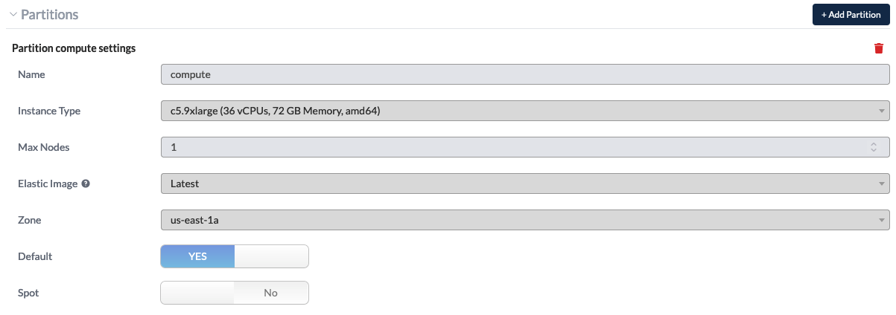

.. role:: red-text

########################################
Configuring NOAA Cloud Service Providers
########################################

The NOAA Cloud Service Providers (CSP) support the forecast-only
configurations for the global workflow. Once a suitable CSP instance
and cluster is defined/created, the global workflow may be executed as
on the other platforms discussed in the previous sections. In order
successfully execute the global-workflow, a suitable CSP cluster must
be created. Currently the global-workflow supports the following
instance and storage types as a function of CSP and forecast
resolution.

.. list-table::
   :widths: auto
   :header-rows: 1
   :align: center

   * - **Cloud Service Provider**
     - **Global Workflow Resolution**
     - **Global Workflow Application**
     - **Instance Type**
     - **Partition**
     - **File System**
   * - Amazon Web Services Parallel Works
     - C48
     - ``ATM``
     - ``c5.9xlarge (36 vCPUs, 72 GB Memory, amd64)``
     - ``compute``
     - ``/lustre``

Instructions regarding configuring the respective CSP instance and
cluster follows.

*********************
Login to the NOAA CSP
*********************

Log in to the `NOAA CSP <http://noaa.parallel.works/login>`_ and into
the resources configuration. The user should arrive at the following
screen.

Note that the ``Username or email`` query is case-sensitive. The user
will then be prompted for their respective RSA token key using the
same application use for the other RDHPCS machines (i.e., Hera, Jet,
etc.,).

*******************************
Configure the NOAA CSP Instance
*******************************

Once logged into the NOAA CSP, navigate to the :red-text:`RESOURCES` section
and click the ``+ Add Resource`` button in the upper-right corner as
illustrated below.

.. image:: _static/noaacsp_instance_1.png
   
Next, the mandatory attributes for the respective instance must be
defined as shown in the illustration below.

.. image:: _static/noaacsp_instance_2.png

The annotated attributes and their respective descriptions are as
follows.

1. A unique name for the instance. Best practices suggest one that is
   clear, concise, and relevant to the application.
2. A short description of the instance, i.e., ``This instance supports
   this <task name> task.``
3. Tag(s) describing and identifying the respective instance. These
   allow for improved bookkeeping, especially when a user has multiple
   or concurrent instance types.

Next, the cluster is defined as shown in the following illustration.

The NOAA Parallel Works initiative currently provides 2 CSPs for the
global-workflow; **AWS** (Amazon Web Services) and **Azure**
(Microsoft Azure). Existing clusters may also be modified. However
this is neither recommended or supported.

Finally, when satisfied with the CSP instance configure, click ``Add
Resource`` as illustrated below.

******************************
Configure the NOAA CSP Cluster
******************************

Navigate to the tab and locate the CSP instance configured in the
previous section and click on the link, `globalworkflowdemo` for this
example.

.. image:: _static/noaacsp_cluster_1.png

The respective CSP cluster maybe then be configured. The mandatory
configuration attributes are as follows.

- Availability zone;
- Disk size and storage type(s);
- Available compute and resource partitions.

The following image describes the general settings for the respective
cluster. These attributes are specific to the user and the respective
user's group allocation. The right-most panel provides a breakdown of
the costs related to the requested compute and storage
resources. While there is a space to place an SSH key here, RDHPCS
recommends adding any SSH keys under the respective user's
``Account➡Authentication instead``. This will allow you to connect
from another machine instead of using the Parallel Works web terminal.

	   
The following image describes the controller settings for a cluster
created for a C48 atmosphere forecast-only configuration. Here the
user must define the instance type (see the table above), the number
of image disks and the image disk sizes.

Next the partitions for the cluster may be defined. A partition
configuration for the aforementioned C48 atmosphere forecast-only
application is illustrated in the figure below. Note that the instance
type beneath ``Controller Settings`` and ``Partitions`` must be
identical. Other configurations are not supported by the
global-workflow team. Once the partitions are configured, click the
``+ Add Partition`` button in the upper-right corner.

For the storage do be allocated for the global-workflow application it
is suggested that the ``Mount Point`` be ``/lustre``. Once the storage
has been configured, click the ``+ Add Attached Storage`` button in
the upper-right corner. This is illustrated in the following image.

Finally, the following illustrates a JSON version of the cluster
configuration created from the steps above. When opening issues
related to the NOAA CSP global-workflow applications please include
the JSON content.

**************************
Using the NOAA CSP Cluster
**************************

To activate the cluster, click the button circled in
:red-text:red. The cluster status is denoted by the color-coded button
on the right. The amount of time required to start the cluster is
variable and not immediate and may take several minutes for the
cluster to become.

For instances where a NOAA CSP cluster does not initialize, useful
output can be found beneath the ``Logs`` section beneath the
``Provision`` tab as illustrated below. Once again, when opening
issues related to the NOAA CSP cluster initialization please include
this information.

***************************
Running the Global Workflow
***************************

The global-workflow configuration currently requires that all initial
conditions, observations, and fixed-files, are staged in the
appropriate paths prior to running the global-workflow. As suggested
above, it is strongly recommended the the user configure their
respective experiments to use the ``/lustre`` file system for the
``EXPDIR`` and ``ROTDIR`` contents. The ``/contrib`` file system is
suitable for compiling and linking the workflow components required of
the global-workflow.

The software stack supporting the ``develop`` branch of the
global-workflow is provided for the user and is located beneath
``/contrib/global-workflow/spack-stack``. The modules required for the
global-workflow execution may be loaded as follows.

.. code-block:: bash

   user@host:$ module unuse /opt/cray/craype/default/modulefiles
   user@host:$ module unuse /opt/cray/modulefiles
   user@host:$ module use /contrib/emc_static/spack-stack/miniconda/modulefiles/miniconda
   user@host:$ module load py39_4.12.0
   user@host:$ module load rocoto/1.3.3

The execution of the global-workflow should now follow the same steps
as those for the RDHPCS on-premise hosts.

