.. _aws_setup:

#####################
Build AWS EC2 Cluster
#####################
.. warning::

   These instructions are only necessary if you wish to set up your own AWS instance to run global workflow. Anyone using an existing HPC cluster can skip this section.

The global workflow can be run in Amazon Web Services using their HPC platform product AWS Parallelcluster. There are some pre-requisites. First the user will need two software packages, the AWS Parallelcluster client version 3.13.2 and Hashicorp Packer 1.15. It is recommended that you install these on a small Amazon Linux 2 EC2 utility host (t3.micro or similar). The utility host should have connectivity in the same subnet that you are planning to use for your AWS Parallelcluster. Take note that all of our activities occur in the AWS region us-east-1. This WILL not work properly in another region (i.e. us-east-2 or us-west-1).

.. warning::

	To proceed you will need to have an paid AWS account. Free accounts will not be able to proceed past building the cluster.

=============================
Create a utility AWS instance
=============================
First create a utility instance to bootstrap cluster creation.

https://us-east-1.console.aws.amazon.com/ec2/home

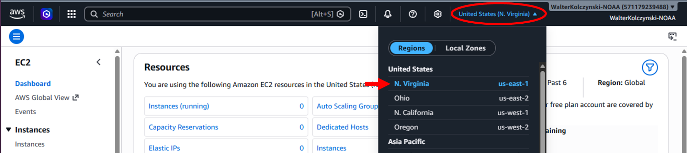

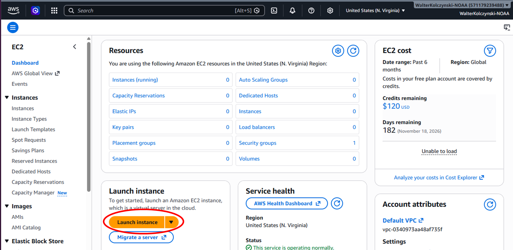

Fill in the "Launch an instance" form with the following:

* Name and tags: Whatever you want (GW_Bootstrap is used in this documentation)

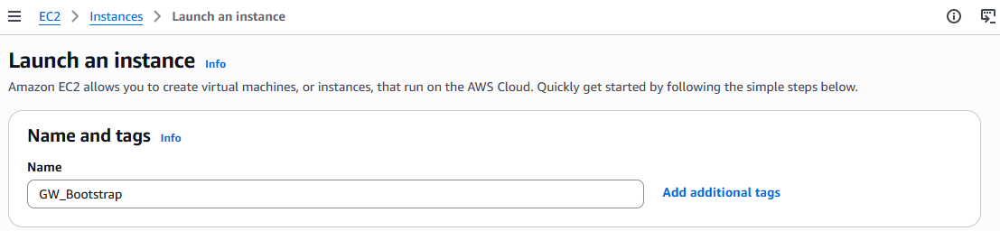

* Application and OS Image:
	* AMI: Amazon Linux
	* Architecture: 64-bit (x86)

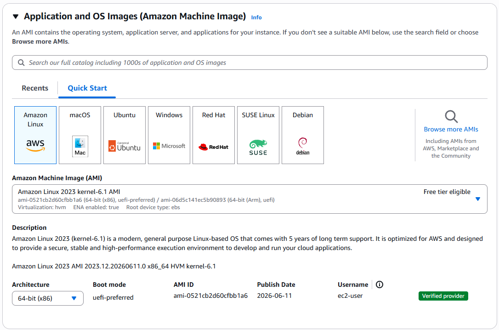

* Instance type: t3.micro
* Key pair: Click “Create new key pair”
	* Give the key a name and click "Create key pair"
	* This only needs to be done once. In the future, the keypair should appear in the drop-down.

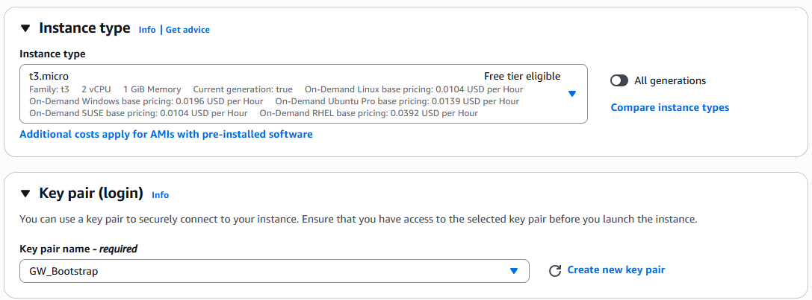

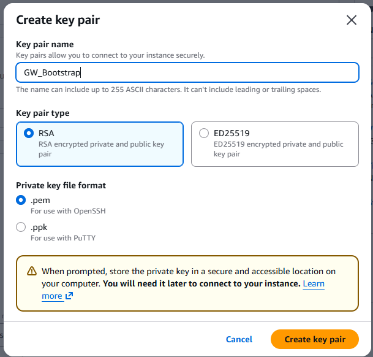

* Network settings: Leave as defaults
* Configure storage
	* 1x 8 GiB gp3
	* File system: None

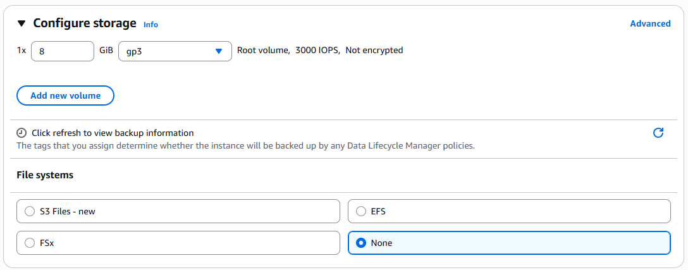

* Advanced details: Leave as defaults

When you have filled in all the settings, launch the instance using the sidebar on the right (or at the bottom, if using a narrow window):

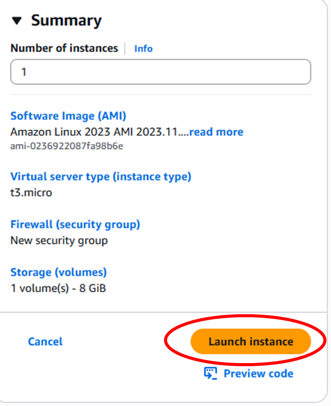

You should then get a success message with the instance ID, which links to the instance page.

Click on the instance to bring up the instance page, this will show the public IP for the instance.

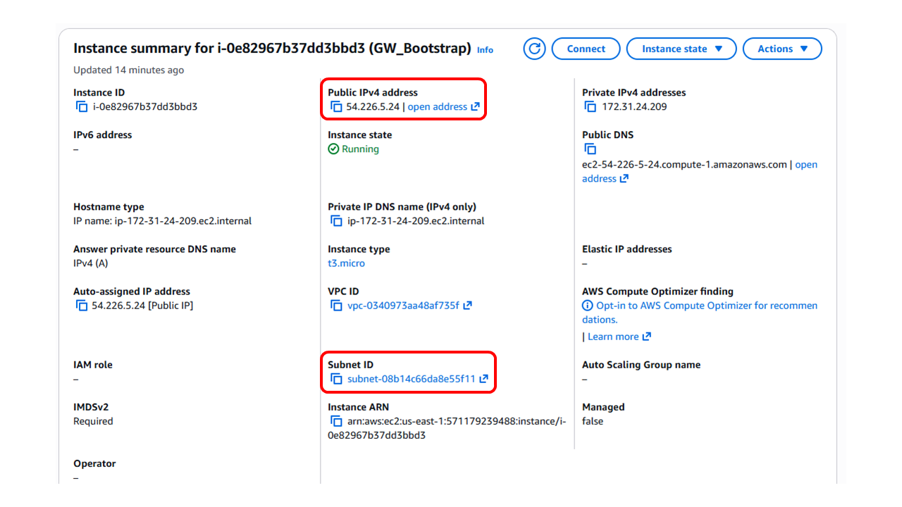

Note the public IP and the subnet, we will be using it in the next step.

===========================================
Connect to Bootstrap Instance and Build AMI
===========================================

Now it is time to connect to the boostrap instance to prepare and build the cluster image.

First, copy the key file that was downloaded in the previous step somewhere convienent. Then, use ssh to connect to the instance using the key file and the public IP with the username "ec2-user":

.. code-block:: bash

	ssh -i "/path/to/GW_Bootstrap.pem" ec2-user@<public_ip>

Now that we are into the bootstrap instance, we need to install Packer and Parallelcluster

Directions on installing Hashicorp Packer and AWS Parallelcluster can both be found here:

https://developer.hashicorp.com/packer/install

.. code-block:: bash

	sudo yum install -y yum-utils shadow-utils
	sudo yum-config-manager --add-repo https://rpm.releases.hashicorp.com/AmazonLinux/hashicorp.repo
	sudo yum install packer

Note: it is required to use the Amazon EC2 plugin in conjunction with Packer

This can be installed by issuing the following command with Packer:

.. code-block:: bash

	packer plugins install github.com/hashicorp/amazon
	sudo yum install python-pip git

https://docs.aws.amazon.com/parallelcluster/latest/ug/install-v3-pip.html

It is recommended to set the version specific to 3.13.2

.. code-block:: bash

	pip install aws-parallelcluster##3.13.2

Once the utility host has the appropriate build tools now the baseline image can be built.

Download the configuration file templates from Github located in the following repository:

https://github.com/NOAA-EPIC/global-workflow-AWS

.. code-block:: bash

	git clone https://github.com/NOAA-EPIC/global-workflow-AWS.git
	cd global-workflow-AWS

Update the parameter ``subnet_id`` in the configuration file ``build_da_cluster.pkr.hcl`` with the subnet id saved previously.

It is also recommended that the screen command be installed on your utility EC2 host to ensure the terminal does not time out during the lengthy build process. This can be done using the command.

.. code-block:: bash

	sudo yum install screen

Once installed, start a screen by simply issuing the command “screen”. Once the current terminal is attached to a screen (this can be verified by issuing the command ``screen -ls``) now use packer to build the initial baseline image.

Before we begin, ensure your terminal session has valid AWS CLI credentials in order to run packer in AWS. To learn more about this check out the following resources…

https://docs.aws.amazon.com/cli/v1/userguide/cli-chap-authentication.html

.. code-block:: bash

	aws login --remote

Copy the authentication link to a local browser, choose the correct account, then copy resulting code back to terminal.

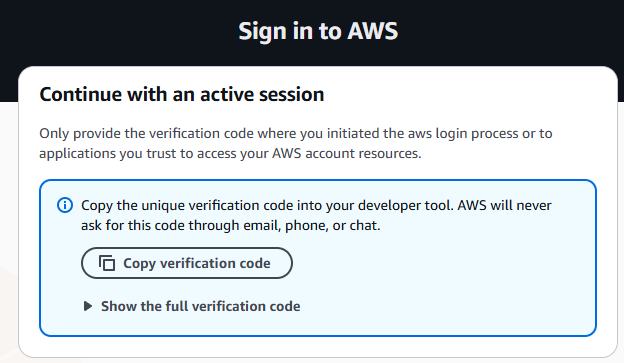

Once the terminal session has been properly authenticated, you are now ready to build the initial baseline image. This can be accomplished by issuing the commands:

First set the environment variable to create a logfile

.. code-block:: bash

	export PACKER_LOG_PATH="packer.log"

Then set the environment variable to ensure the logfile is easily readable

.. code-block:: bash

	export PACKER_NO_COLOR=1

Now begin building the initial image using the following command…

.. code-block:: bash

	packer build build_da_cluster.pkr.hcl

This process will take almost 2 hours to complete. It is recommended that you detach from the building screen (ctrl-A + ctrl-D) and simply follow the build through the `packer.log` logfile.

Once the build is complete you should see an AMI listed under your Amazon Machine Images. Take note of the AMI ID as this will be used in the AWS Parallelcluster configuration.

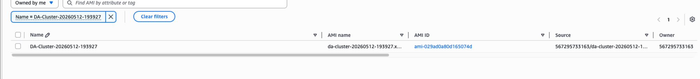

===================================
Create Persistent Lustre Filesystem
===================================
You will also need to create a large persistent lustre file system to hold all of the code and data. This file system will be mounted by the cluster for use during operation and will persist even if the cluster is shut down until it is separately destroyed.

<Insert instructions here>

================================
Building the AWS Parallelcluster
================================
Now that the initial base image build is complete, the cluster can be initialized using the AWS Parallelcluster yaml configuration file ``da_hpc.yaml` from the GW AWS repo. Update the “CustomAmi” option with the AMI ID previously generated by the Packer build process.

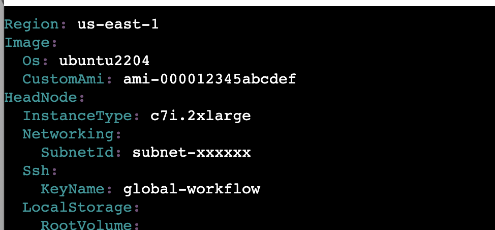

Also update the subnet IDs and the ``FileSystemId`` for the lustre system you created. Note that once again the AWS cloud region us-east-1 is being used and is recommended. Once the yaml has the appropriate configuration values the cluster can be created using the AWS Parallelcluster CLI tool. Issue the command below to create the initial cluster.

.. code-block:: bash

	pcluster create-cluster --region us-east-1 --cluster name <your cluster name> --cluster configuration <cluster configuration yaml name>

This process should take about 20 minutes to complete. You can view the status of your cluster through the AWS Parallelcluster CLI tool by issuing the following command:

.. code-block:: bash

	pcluster list-clusters --region us-east-1

The results should list the cluster status as CREATE_COMPLETE once the operation has successfully completed.

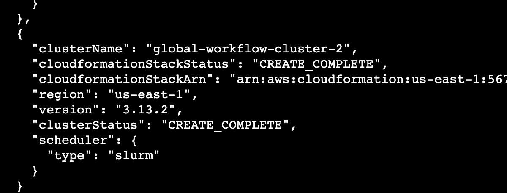
