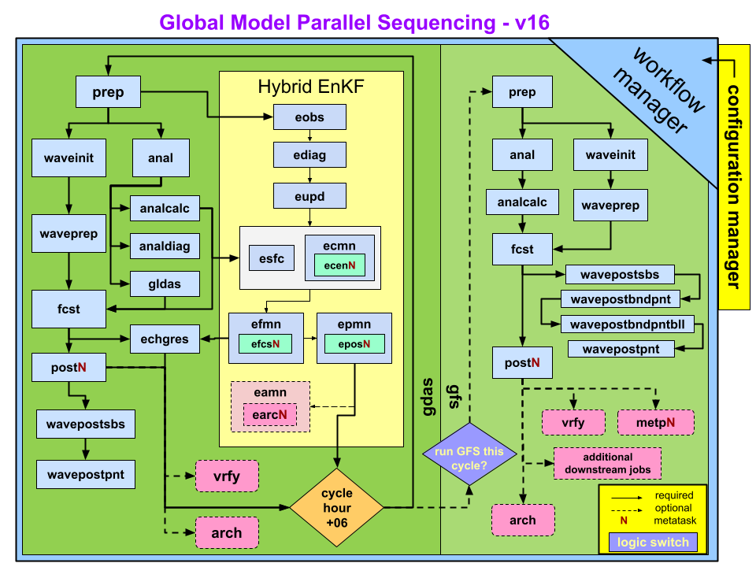

##########################################
Global Forecast System (GFS) Configuration
##########################################

.. _GFS_v16_flowchart:

   Schematic flow chart for GFS v16 in operations

The sequence of jobs executed in the GFS v16 configuration's end-to-end workflow covering analysis, forecast, post processing, and verification, is shown in :numref:`GFS_v16_flowchart`. Each of these steps is carried out by a set of workflow scripts.

For each cycle, the system runs two phases:

* **gfs** phase, which generates the initial conditions (ICs) and runs the forecast
* **gdas** phase, which provides the initial guess fields for the next cycle

=================================
Jobs run in the GFS Configuration
=================================

The GFS configuration in the GW is organized into a series of jobs that run in a defined sequence for each cycle. These jobs handle everything from preparing input data to running the forecast and generating post processed products. Each job is executed by a workflow manager (rocoto or ecFlow) and corresponds to a specific script within the workflow. Although the exact list of jobs varies depending on whether you are running gdas, gfs, or a specialized experiment, the major categories of jobs include:

1. **Preprocessing Jobs**:

These jobs prepare all required inputs before analysis or forecasting begins and examples include:

  - **prep**: runs data preprocessing prior to the analysis
  - **stage_ic**: stages the initial conditions needed to start the forecast
  - **waveinit/waveprep**: wave model initialization and preprocessing (when waves are enabled)

2. **Analysis Jobs (gdas phase)**:
These jobs perform data assimilation to produce the best estimate of the atmosphere at the cycle time and examples include:

  - **anal**: runs the atmospheric analysis (GSI) to produce analysis increments and update the surface guess
  - **analcalc**: adds the analysis increments to the previous cycle's forecast to produce the atmospheric analysis files
  - **analdiag**: creates netCDF diagnostic files (observation values, innovations, errors, QC)
  - **EnKF jobs (eobs, eupd, ecenN, esfc, efcs)**: Ensemble Kalman Filter (ENKF) data assimilation (when running cycled with an ensemble)
  - **updatebc**: updates background fields for the next cycle

3. **Forecast Jobs (gfs phase)**:
These jobs run the UFS-WM to produce the forecast and these jobs include:

  - **fcst**: main forecast model integration
  - **atmupp**: runs UPP on model output

4. **Post processing Jobs**:
These jobs generate downstream products used for verification, graphics, or distribution and examples include:

  - **atmos_prod**: regrids atmosphere forecast to lat-lon grids
  - **wave post jobs (wavepostsbs, wavepostpnt, wavepostbndpnt, wavepostbndpntbll)**: wave post-processing
  - **metp**: MET/METplus verification via EMC_verif-global
  - **awips / gempak**: downstream AWIPS and GEMPAK products (operations only; not normally run in experiments)

5. **Archiving and Cleanup Jobs (Experimental Mode Only)**:
These jobs are run only in development mode and examples include:

  - **arch_vrfy**: archives verification products
  - **arch_tars**: archives tarred workflow outputs (e.g., logs, restarts)
  - **cleanup**: removes temporary or intermediate files

A **comprehensive list of jobs run in the GFS configuration** is listed in the following table.
+---------------------+-----------------------------------------------------------------------------------------------------------------------+
| JOB NAME            | PURPOSE                                                                                                               |
+=====================+=======================================================================================================================+
| fetch               | Fetch initial conditions from HPSS                                                                                    |
+---------------------+-----------------------------------------------------------------------------------------------------------------------+
| fetchatmanlbias     | Fetch atmosphere observation bias from HPSS
+---------------------+-----------------------------------------------------------------------------------------------------------------------+
| stage_ic            | Stage initial conditions in COM
+---------------------+-----------------------------------------------------------------------------------------------------------------------+
| prep_sfc            | Prepare surface observations for DA
+---------------------+-----------------------------------------------------------------------------------------------------------------------+
| prep                | Prepare atmosphere observations for DA
+---------------------+-----------------------------------------------------------------------------------------------------------------------+
| prepatmanlbias      | Prepare atmosphere observation bias for DA
+---------------------+-----------------------------------------------------------------------------------------------------------------------+
| anal                | Runs GSI analysis for atmosphere
+---------------------+-----------------------------------------------------------------------------------------------------------------------+
| sfcanl_gcycle       | Runs surface analysis
| esfc_gcycle         |
+---------------------+-----------------------------------------------------------------------------------------------------------------------+
| sfcanl_regrid       | Regrids surface analysis
| esfc_regrid         |
+---------------------+-----------------------------------------------------------------------------------------------------------------------+
| analcalc            | Add the analysis increments to previous cycle’s forecasts to produce atmospheric analysis files. Produces surface     |
|                     | analysis file on Gaussian grid                                                                                        |
+---------------------+-----------------------------------------------------------------------------------------------------------------------+
| atmanlupp           | Create grib files on gaussian grid for atmosphere analysis
+---------------------+-----------------------------------------------------------------------------------------------------------------------+
| atmanlprod          | Regrid atmosphere analysis grib files to lat-lon grids
+---------------------+-----------------------------------------------------------------------------------------------------------------------+
| analdiag            | Create netCDF diagnostic files containing observation values, innovation (O-F), error, quality control, as well as    |
| ediag               | other analysis-related quantities (cnvstat.tar, radstat.tar, ozstat.tar files)                                        |
+---------------------+-----------------------------------------------------------------------------------------------------------------------+
| eobs                | Data selection for EnKF update
+---------------------+-----------------------------------------------------------------------------------------------------------------------+
| echgres             | Regrid forecast to ensemble resolution for EnKF recentering
+---------------------+-----------------------------------------------------------------------------------------------------------------------+
| ecen                | Recenter ensemble around analysis
+---------------------+-----------------------------------------------------------------------------------------------------------------------+
| eupd                | Perform EnKF update
+---------------------+-----------------------------------------------------------------------------------------------------------------------+
| verfozn             | Extract and validate data for the ozone monitor DA package
+---------------------+-----------------------------------------------------------------------------------------------------------------------+
| verfrad             | Extract and validate data for the radiation monitor DA package
+---------------------+-----------------------------------------------------------------------------------------------------------------------+
| vminmon             | Extract and validate GSI normalization diagnostic
+---------------------+-----------------------------------------------------------------------------------------------------------------------+
| fit2obs             | Verfies analysis against observations
+---------------------+-----------------------------------------------------------------------------------------------------------------------+
| anlstat             | Produce summary performance statistics for analysis
+---------------------+-----------------------------------------------------------------------------------------------------------------------+
| atmanlinit          | Initialize JEDI-based atmosphere data assimilation
| atmensanlinit       |
+---------------------+-----------------------------------------------------------------------------------------------------------------------+
| atmanlvar           | Run JEDI-based atmosphere variational assimilation
+---------------------+-----------------------------------------------------------------------------------------------------------------------+
| atmanlfv3inc        | Calculate JEDI-based atmosphere analysis increment
+---------------------+-----------------------------------------------------------------------------------------------------------------------+
| atmanlfinal         | Complete JEDI-based atmosphere analysis by copying results back to COM
+---------------------+-----------------------------------------------------------------------------------------------------------------------+
| atmensanlobs        | Data selection for EnKF update using JEDI
+---------------------+-----------------------------------------------------------------------------------------------------------------------+
| atmensanlsol        | Run JEDI LETKF in solver mode
+---------------------+-----------------------------------------------------------------------------------------------------------------------+
| atmensanlletkf      | Run JEDI-based LETKF
+---------------------+-----------------------------------------------------------------------------------------------------------------------+
| atmensanlfv3inc     | Create FV3 ensemble increments (JEDI-based)
+---------------------+-----------------------------------------------------------------------------------------------------------------------+
| atmensanlfinal      | Finalize JEDI-based analysis by copying outputs to COM
+---------------------+-----------------------------------------------------------------------------------------------------------------------+
| ecen_fv3jedi        | Recenter ensemble around analysis using JEDI
+---------------------+-----------------------------------------------------------------------------------------------------------------------+
| analcalc_fv3jedi    | Add the JEDI-based analysis increments to previous cycle’s forecasts to produce atmospheric analysis files
+---------------------+-----------------------------------------------------------------------------------------------------------------------+
| aerosol_init        | Prepares aerosol inputs
+---------------------+-----------------------------------------------------------------------------------------------------------------------+
| aeroanlgenb         | Generate background error covariances for aerosol data assimilation
+---------------------+-----------------------------------------------------------------------------------------------------------------------+
| aeroanlinit         | Initialize aerosol data assimilation (JEDI-based)
+---------------------+-----------------------------------------------------------------------------------------------------------------------+
| aeroanlvar          | Run aerosol variational assimilation (JEDI-based)
+---------------------+-----------------------------------------------------------------------------------------------------------------------+
| aeroanlfinal        | Complete aerosol analysis by copying results back to COM (JEDI-based)
+---------------------+-----------------------------------------------------------------------------------------------------------------------+
| snowanl             | Run snow analysis (JEDI-based)
| esnowanl            |
+---------------------+-----------------------------------------------------------------------------------------------------------------------+
| prepoceanobs        | Prepare ocean observations for data assimilation (JEDI-based)
+---------------------+-----------------------------------------------------------------------------------------------------------------------+
| marinebmatinit      | Initialize background error covariance for marine data assimilation (JEDI-based)
+---------------------+-----------------------------------------------------------------------------------------------------------------------+
| marinebmat          | Update background error covariance for marine data assimilation (JEDI-based)
+---------------------+-----------------------------------------------------------------------------------------------------------------------+
| marineanlinit       | Initialize marine data assimilation (JEDI-based)
+---------------------+-----------------------------------------------------------------------------------------------------------------------+
| marineanlletkf      | Run LETKF phase of marine data assimilation (JEDI-based)
+---------------------+-----------------------------------------------------------------------------------------------------------------------+
| marineanlvar        | Run variational phase of marine data assimilation (JEDI-based)
+---------------------+-----------------------------------------------------------------------------------------------------------------------+
| marineanlecen       | Recenter ensemble around marine analysis (JEDI-based)
+---------------------+-----------------------------------------------------------------------------------------------------------------------+
| marineanlchkpt      | Insert sea ice analysis into restart or creates MOM6 IAU increment
+---------------------+-----------------------------------------------------------------------------------------------------------------------+
| marineanlfinal      | Complete marine analysis by copying results back to COM (JEDI-based)
+---------------------+-----------------------------------------------------------------------------------------------------------------------+
| waveinit            | Create wave model definition files
+---------------------+-----------------------------------------------------------------------------------------------------------------------+
| waveprep            | Prepares wave inputs
+---------------------+-----------------------------------------------------------------------------------------------------------------------+
| fcst                | Run forecast
| efcs                |
+---------------------+-----------------------------------------------------------------------------------------------------------------------+
| atmupp              | Create grib files on gaussian grid for atmosphere forecast
| epos                |
+---------------------+-----------------------------------------------------------------------------------------------------------------------+
| goesupp             | Create grib files on gaussian grid for special GOES variables for FAA
+---------------------+-----------------------------------------------------------------------------------------------------------------------+
| atmos_prod          | Regrid atmosphere forecast grib files to lat-lon grids
+---------------------+-----------------------------------------------------------------------------------------------------------------------+
| ocean_prod          | Regrid ocean forecast
+---------------------+-----------------------------------------------------------------------------------------------------------------------+
| ice_prod            | Regrid ice forecast
+---------------------+-----------------------------------------------------------------------------------------------------------------------+
| wavepostsbs         | Create gridded wave output from forecast
+---------------------+-----------------------------------------------------------------------------------------------------------------------+
| wavepostpnt         | Create wave forecast output and bulletins at specific points (e.g. buoys)
+---------------------+-----------------------------------------------------------------------------------------------------------------------+
| wavepostbndpnt      | Create wave forecast output at specific points in boundary waters
+---------------------+-----------------------------------------------------------------------------------------------------------------------+
| wavepostbndpntbll   | Create bulletins for wave forecast output in boundary waters
+---------------------+-----------------------------------------------------------------------------------------------------------------------+
| wavegempak          | Create gempak files for wave grids
+---------------------+-----------------------------------------------------------------------------------------------------------------------+
| waveawipsgridded    | Create AWIPS products for gridded wave output
+---------------------+-----------------------------------------------------------------------------------------------------------------------+
| waveawipsbulls      | Create AWIPS products for wave bulletins
+---------------------+-----------------------------------------------------------------------------------------------------------------------+
| postsnd             | Produce forecast model soundings at select locations
+---------------------+-----------------------------------------------------------------------------------------------------------------------+
| fbwind              | Create aviation products for Hawai'i and other Pacific locations
+---------------------+-----------------------------------------------------------------------------------------------------------------------+
| awips_20km_1p0deg   | Regrid forecasts to 20-km and 1-deg AWIPS grids
+---------------------+-----------------------------------------------------------------------------------------------------------------------+
| npoess_pgrb2_0p5deg | Generate grib files with simluated NPOESS variables
+---------------------+-----------------------------------------------------------------------------------------------------------------------+
| gempak              | Converts atmosphere forecast output to gempak format
+---------------------+-----------------------------------------------------------------------------------------------------------------------+
| gempakmeta          | Create gempak meta files for atmosphere gempak files
+---------------------+-----------------------------------------------------------------------------------------------------------------------+
| gempakmetancdc      | Create gempak meta files for atmosphere gempak over North America
+---------------------+-----------------------------------------------------------------------------------------------------------------------+
| gempakncdcupapgif   | Generate gempak skew-T diagrams
+---------------------+-----------------------------------------------------------------------------------------------------------------------+
| gempakpgrb2spec     | Generate gempak files for simulated NPOESS products
+---------------------+-----------------------------------------------------------------------------------------------------------------------+
| tracker             | Run tropical cyclone tracker on forecast
+---------------------+-----------------------------------------------------------------------------------------------------------------------+
| genesis             | Run tropical cyclone genesis
+---------------------+-----------------------------------------------------------------------------------------------------------------------+
| genesis_fsu         | Run tropical cyclone genesis using FSU method
+---------------------+-----------------------------------------------------------------------------------------------------------------------+
| metp                | Run forecast verification using MET-Plus
+---------------------+-----------------------------------------------------------------------------------------------------------------------+
| arch_vrfy           | Archive select files from the deterministic model and cleans up older data
+---------------------+-----------------------------------------------------------------------------------------------------------------------+
| arch_tars           | Back up the COM data structure
+---------------------+-----------------------------------------------------------------------------------------------------------------------+
| globus_arch         | Send the tarballs generated by arch_tars to HPSS via globus
| globus_earc         |
+---------------------+-----------------------------------------------------------------------------------------------------------------------+
| earc_vrfy           | Archive grib files for ensemble mean verification
+---------------------+-----------------------------------------------------------------------------------------------------------------------+
| earc_tars           | Archive ensemble member restarts into tarballs
+---------------------+-----------------------------------------------------------------------------------------------------------------------+
| cleanup             | Remove data from COM that is no longer needed
+---------------------+-----------------------------------------------------------------------------------------------------------------------+

============================================
Experimental vs Operational Runs: A Snapshot
============================================

Experimental run is different from operational runs in the following ways:

* **Workflow manager**:

  - Operations use `ecFlow <https://www.ecmwf.int/en/learning/training/introduction-ecmwf-job-scheduler-ecflow>`__, whereas development use `ROCOTO <https://github.com/christopherwharrop/rocoto/wiki/documentation>`__.

.. note::

   Experiments can also be run with ecFlow if the platform has an ecFlow server.

* **Dump step**:

  - Not run in experiments but in real-time production. Dump data already exists in GDA on supported platforms.

* **Additional steps** in experimental mode:

  - **arch_vrfy**
  - **arch_tars**
  - **cleanup**

.. note::

   Downstream production jobs (e.g., **AWIPS**, **GEMPAK**) are not included in :numref:`GFS_v16_flowchart` because these jobs are not normally run in developmental setups.

^^^^^^^^^^^^^^^^^^^
For New Users
^^^^^^^^^^^^^^^^^^^
.. note::

  - Operational systems include many additional downstream jobs that are not run in development mode.
  - The workflow manager (ROCOTO or ecFlow) determines job dependencies and ensures each job runs only when its prerequisites are complete.
  - The exact job list for your experiment is defined in the workflow XML (ROCOTO) or suite definition (ecFlow)
